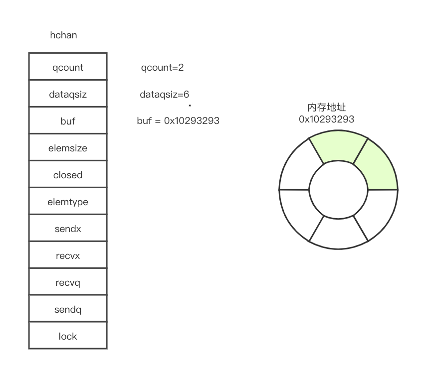
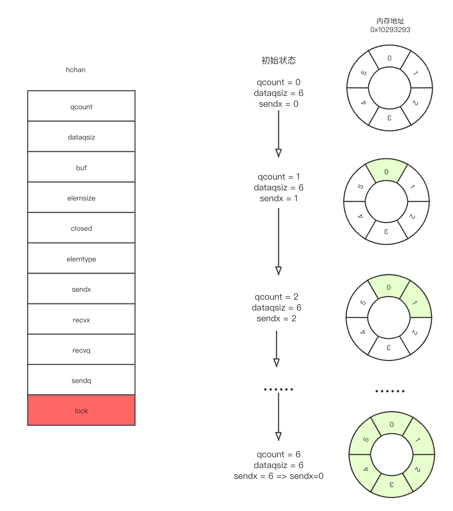
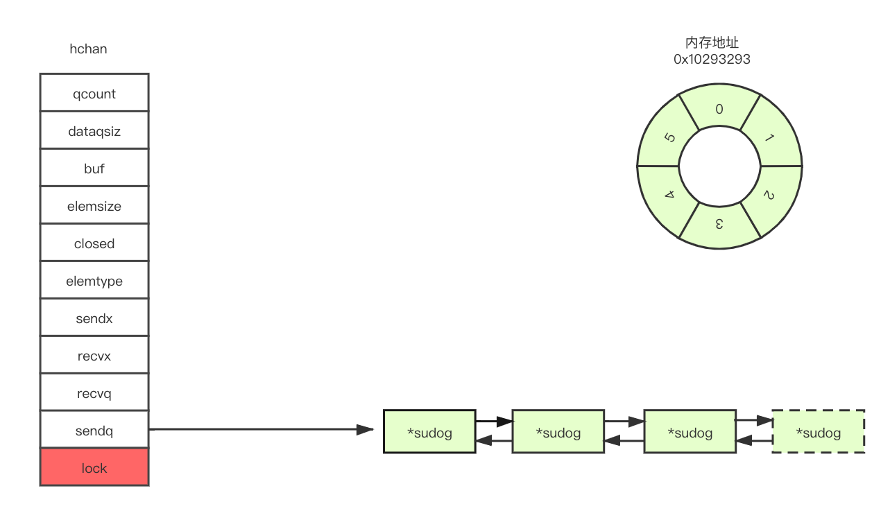
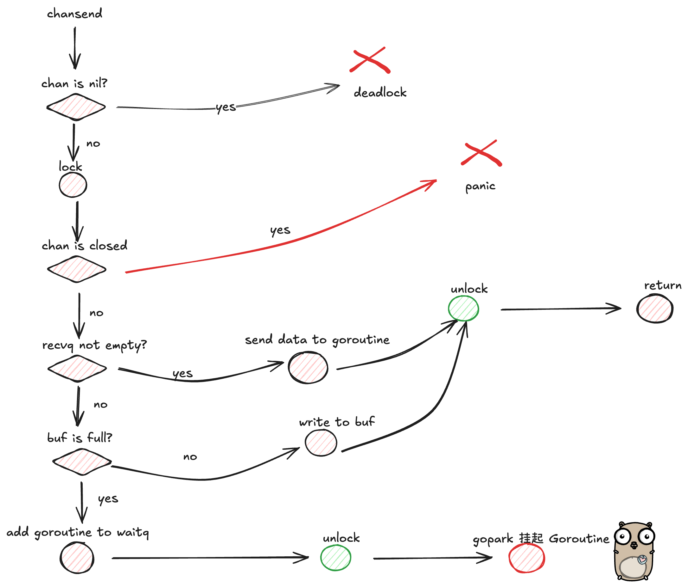

# Channel解析


基于 go1.22.6 源码解析 channel 底层源码

# 1、内部数据结构

所在位置`/usr/local/go/src/runtime/chan.go`

```go
type hchan struct {
	qcount   uint           // 当前channel中存在元素的数量
	dataqsiz uint           // 当前channel环形队列的容量（buffered channel 的大小）
	buf      unsafe.Pointer // 环形队列的指针（存储元素的地方）
	elemsize uint16			// channel中每个元素的大小
	closed   uint32			// 表示 channel 是否已关闭
	elemtype *_type // channel中元素类型
	sendx    uint   // 环形队列的发送索引
	recvx    uint   // 环形队列的接收索引
	recvq    waitq  // 等待接收的 goroutine 队列
	sendq    waitq  // 等待发送的 goroutine 队列

	// lock protects all fields in hchan, as well as several
	// fields in sudogs blocked on this channel.
	//
	// Do not change another G's status while holding this lock
	// (in particular, do not ready a G), as this can deadlock
	// with stack shrinking.
	lock mutex
}

type waitq struct {
	first *sudog	// 队列头部
	last  *sudog	// 队列尾部
}
// sudog 是一个 伪g，表示等待列表中的 g，用于包装协程的节点
// 一个 g 可以出现在多个等待列表中，因此一个 g 可能有多个 sudog；
// 并且很多gs可能在等待同一个同步对象，因此一个对象可能有很多sudog。
type sudog struct {
	// The following fields are protected by the hchan.lock of the
	// channel this sudog is blocking on. shrinkstack depends on
	// this for sudogs involved in channel ops.
	g *g	// 协程
	next *sudog // 队列中的下一个节点
	prev *sudog // 队列中的上一个节点
	elem unsafe.Pointer // data element (may point to stack)
    ...
    c        *hchan // 标识与当前sudog交互的channel
}
```



# 2、构造函数

```go
func makechan(t *chantype, size int) *hchan {
	elem := t.Elem

	// compiler checks this but be safe.
	if elem.Size_ >= 1<<16 {
		throw("makechan: invalid channel element type")
	}
	if hchanSize%maxAlign != 0 || elem.Align_ > maxAlign {
		throw("makechan: bad alignment")
	}

	mem, overflow := math.MulUintptr(elem.Size_, uintptr(size))
	if overflow || mem > maxAlloc-hchanSize || size < 0 {
		panic(plainError("makechan: size out of range"))
	}

	// Hchan does not contain pointers interesting for GC when elements stored in buf do not contain pointers.
	// buf points into the same allocation, elemtype is persistent.
	// SudoG's are referenced from their owning thread so they can't be collected.
	// TODO(dvyukov,rlh): Rethink when collector can move allocated objects.
	var c *hchan
	switch {
	case mem == 0:
		// Queue or element size is zero.
		c = (*hchan)(mallocgc(hchanSize, nil, true))
		// Race detector uses this location for synchronization.
		c.buf = c.raceaddr()
	case elem.PtrBytes == 0:
		// Elements do not contain pointers.
		// Allocate hchan and buf in one call.
		c = (*hchan)(mallocgc(hchanSize+mem, nil, true))
		c.buf = add(unsafe.Pointer(c), hchanSize)
	default:
		// Elements contain pointers.
		c = new(hchan)
		c.buf = mallocgc(mem, elem, true)
	}

	c.elemsize = uint16(elem.Size_)
	c.elemtype = elem
	c.dataqsiz = uint(size)
	lockInit(&c.lock, lockRankHchan)

	if debugChan {
		print("makechan: chan=", c, "; elemsize=", elem.Size_, "; dataqsiz=", size, "\n")
	}
	return c
}
```

1）校验元素大小和内存对齐，检查元素的对齐需求是否超过通道支持的最大对齐（8 字节）。

2）校验内存需求是否超限

- `mem = elem.Size_ * uintptr(size)`：计算环形队列总的内存需求；`overflow`：检查是否发生整数溢出
- `overflow`：如果内存溢出，抛出异常。
- `mem > maxAlloc-hchanSize`：如果总内存需求超过可分配的最大值，抛出异常。
- `size < 0`：如果通道的容量是负数，抛出异常。

3）按照三种格式分配内存，三种方式都指定了分配的内存不包含指针，避免 gc 扫描这块内存：

- 1、无缓冲通道：仅分配 hchanSize
- 2、有缓冲的 struct 类型：同时分配 `hchanSize` 和环形缓冲区的内存，优化分配性能，并且调整 chan 的 buf 指向 mem 的起始位置；此时两者是连续的，在一块连续的内存中；其中 `mallocgc` 参数 nil 表示内存中不包含指针，GC 不需要扫描这块内存，如果缓冲区中存储的元素包含指针，则会传递元素类型信息（非 nil）。
- 3、有缓冲的指针类型：分别分配 `hchanSize` 和环形缓冲区的内存。两者无需连续，`mallocgc` 参数需要指定元素类型，比如这里的`c.buf = mallocgc(mem, elem, true)`。

4）对 channel 的其余字段进行初始化，包括元素类型大小、元素类型、容量以及锁的初始化。

## 2.1 内存对齐说明：

```go
maxAlign = 8
hchanSize = unsafe.Sizeof(hchan{}) + uintptr(-int(unsafe.Sizeof(hchan{}))&(maxAlign-1))
if hchanSize%maxAlign != 0 || elem.Align_ > maxAlign {
    throw("makechan: bad alignment")
}
```

1. **maxAlign = 8**:

- - 最大对齐值，通道的结构体需要对齐到 8 字节的边界。
  - 这是 Go 中的通用内存对齐策略，针对 64 位架构。

1. **unsafe.Sizeof(hchan{})**:

- - 计算 `hchan` 结构体的大小。
  - 这部分是未对齐的大小。

1. **对齐计算**：

- - `uintptr(-int(unsafe.Sizeof(hchan{})) & (maxAlign-1))`是用于对齐的位操作。
  - 它确保 `hchanSize`是` maxAlign` 的倍数。

假设`unsafe.Sizeof(hchan{})=70`，则`uintptr(-int(unsafe.Sizeof(hchan{}))&(maxAlign-1)) = -70 & 7`

1. **-70 的二进制表示（以补码形式表示）：**

```powershell
原码（70）：     0000 0000 0000 0000 0000 0000 0100 0110
反码（取反）：    1111 1111 1111 1111 1111 1111 1011 1001
补码（+1）：     1111 1111 1111 1111 1111 1111 1011 1010（即 -70）
```

1. **掩码（7 的二进制）：**

```shell
0000 0000 0000 0000 0000 0000 0000 0111
```

1. **按位与：**

```shell
1111 1111 1111 1111 1111 1111 1011 1010
&
0000 0000 0000 0000 0000 0000 0000 0111
---------------------------------------
0000 0000 0000 0000 0000 0000 0000 0010
```

结果为 2，表示需要补齐 **2 字节**。对齐后的 `hchanSize` 是 72，是 **8 的整数倍**，符合对齐要求。

# 3、写操作


```go
//go:nosplit
func chansend1(c *hchan, elem unsafe.Pointer) {
    chansend(c, elem, true, getcallerpc())
}

func chansend(c *hchan, ep unsafe.Pointer, block bool, callerpc uintptr) bool {
    // 异常case1:通道未初始化，往里写会被挂起，死锁
    if c == nil {
        if !block {
            return false
        }
        gopark(nil, nil, waitReasonChanSendNilChan, traceBlockForever, 2)
        throw("unreachable")
    }

    if debugChan {
        print("chansend: chan=", c, "\n")
    }

    if raceenabled {
        racereadpc(c.raceaddr(), callerpc, abi.FuncPCABIInternal(chansend))
    }

    // Fast path: check for failed non-blocking operation without acquiring the lock.
    if !block && c.closed == 0 && full(c) {
        return false
    }

    var t0 int64
    if blockprofilerate > 0 {
        t0 = cputicks()
    }

    lock(&c.lock)
    // 异常case2:往关闭了的通道中写，panic
    if c.closed != 0 {
        unlock(&c.lock)
        panic(plainError("send on closed channel"))
    }
    // 正常case1: 等待接收的 goroutine 队列不为空
    if sg := c.recvq.dequeue(); sg != nil {
        // Found a waiting receiver. We pass the value we want to send
        // directly to the receiver, bypassing the channel buffer (if any).
        send(c, sg, ep, func() { unlock(&c.lock) }, 3)
        return true
    }
    // 正常case2: 缓冲区还有空间，找到sendx所在位置将数据发送
    if c.qcount < c.dataqsiz {
        // Space is available in the channel buffer. Enqueue the element to send.
        qp := chanbuf(c, c.sendx)
        if raceenabled {
            racenotify(c, c.sendx, nil)
        }
        typedmemmove(c.elemtype, qp, ep)
        c.sendx++
        if c.sendx == c.dataqsiz {
            c.sendx = 0
        }
        c.qcount++
        unlock(&c.lock)
        return true
    }
    // 正常case3: 此时说明没有等待接收的g，缓冲区也没有空间（或无缓冲channel），非阻塞模式直接返回
    if !block {
        unlock(&c.lock)
        return false
    }
    // 正常case4: 进入阻塞模式，gopark让出协程的调度权
    // Block on the channel. Some receiver will complete our operation for us.
    gp := getg()	// 从线程的局部存储TLS中获取当前g的指针
    mysg := acquireSudog()  // 准备一个伪g，代表处于等待列表中的 g
    mysg.releasetime = 0
    if t0 != 0 {
        mysg.releasetime = -1
    }
    // No stack splits between assigning elem and enqueuing mysg
    // on gp.waiting where copystack can find it.
    mysg.elem = ep
    mysg.waitlink = nil
    mysg.g = gp
    mysg.isSelect = false
    mysg.c = c
    gp.waiting = mysg
    gp.param = nil
    c.sendq.enqueue(mysg)
    // Signal to anyone trying to shrink our stack that we're about
    // to park on a channel. The window between when this G's status
    // changes and when we set gp.activeStackChans is not safe for
    // stack shrinking.
    gp.parkingOnChan.Store(true)
    gopark(chanparkcommit, unsafe.Pointer(&c.lock), waitReasonChanSend, traceBlockChanSend, 2)
    // Ensure the value being sent is kept alive until the
    // receiver copies it out. The sudog has a pointer to the
    // stack object, but sudogs aren't considered as roots of the
    // stack tracer.
    KeepAlive(ep)  // 主要功能是确保一个变量在调用点之前不会被 GC 回收
    

    // someone woke us up.
    if mysg != gp.waiting {
        throw("G waiting list is corrupted")
    }
    gp.waiting = nil
    gp.activeStackChans = false
    closed := !mysg.success
    gp.param = nil
    if mysg.releasetime > 0 {
        blockevent(mysg.releasetime-t0, 2)
    }
    mysg.c = nil
    releaseSudog(mysg)
    if closed {
        if c.closed == 0 {
            throw("chansend: spurious wakeup")
        }
        panic(plainError("send on closed channel"))
    }
    return true
}
```




阻塞发送：



## 3.1 参数解释：

- **c \*hchan**：指向通道的内部结构。
- **ep unsafe.Pointer**：待发送的数据地址。
- **block bool**：是否阻塞发送操作：

- - true：阻塞操作直到数据发送成功。
  - false：非阻塞操作，如果无法发送立即返回。

- **callerpc uintptr**：调用者的程序计数器（用于竞态检测）。

## 3.2 整体流程

1）对于未初始化的 chan

- 非阻塞模式直接返回 false。
- 阻塞模式调用 gopark 将当前 Goroutine 永久挂起（因为对 nil 通道的发送无法完成）。

2）如果启用了竞态检测，记录对通道的读取操作，用于后续分析。

3）非阻塞模式的快速路径

- **非阻塞模式**：

- - 如果通道未关闭（c.closed == 0）且缓冲区已满（`full(c)`），直接返回 false，表示发送失败。

- **优化点**：

- - 通过快速路径避免锁竞争，提高性能。

4）如果启用了性能分析（`blockprofilerate > 0`），记录当前 CPU 时间戳（`cputicks()`），以便后续分析阻塞时间。

5）加锁

6）对已关闭的 channel 写入，会触发 panic

7）如果接收队列中存在等待接收的 Goroutine（`recvq` 非空），调用 `send` 将数据直接发送给接收 Goroutine，跳过通道缓冲区，直接完成发送操作。

8）如果缓冲区未满（`c.qcount < c.dataqsiz`）：

- - 将数据写入缓冲区（`chanbuf(c, c.sendx)` 指向缓冲区的发送位置）
  - 更新发送索引（`c.sendx`），并维护环形队列
  - 增加元素计数（`c.qcount++`）
  - 解锁并返回 true，表示发送成功

9）非阻塞模式，且无法发送（接收队列为空，缓冲区已满），解锁并返回 false

10）接下来进入，阻塞模式，阻塞住。

- **将当前 Goroutine 挂起**：

- - 获取一个 sudog（代表当前 Goroutine 的调度数据结构），完成指针指向，建立 sudog、goroutine、channel 之间的指向关系
  - 将当前 Goroutine 放入通道的发送队列（sendq），插入队尾。
  - 调用 gopark 挂起 Goroutine，等待接收方唤醒。

11）倘若协程从 park 中被唤醒，则回收 sudog（sudog能被唤醒，其对应的元素必然已经被读协程取走）；

12）唤醒后检查，若通道关闭，则 panic




### 3.2.1 send 函数

```go
func send(c *hchan, sg *sudog, ep unsafe.Pointer, unlockf func(), skip int) {
	if raceenabled {
		if c.dataqsiz == 0 {
			racesync(c, sg)
		} else {
			// Pretend we go through the buffer, even though
			// we copy directly. Note that we need to increment
			// the head/tail locations only when raceenabled.
			racenotify(c, c.recvx, nil)
			racenotify(c, c.recvx, sg)
			c.recvx++
			if c.recvx == c.dataqsiz {
				c.recvx = 0
			}
			c.sendx = c.recvx // c.sendx = (c.sendx+1) % c.dataqsiz
		}
	}
	if sg.elem != nil {
		sendDirect(c.elemtype, sg, ep)
		sg.elem = nil
	}
	gp := sg.g
	unlockf()
	gp.param = unsafe.Pointer(sg)
	sg.success = true
	if sg.releasetime != 0 {
		sg.releasetime = cputicks()
	}
	goready(gp, skip+1)
}
```

参数解释：

- **c \*hchan**：通道。
- **sg \*sudog**：接收 Goroutine 的调度结构。
- **ep unsafe.Pointer**：待发送数据的地址。
- **unlockf func()**：释放锁的回调函数。
- **skip int**：调用堆栈深度（用于调试）。

1）如果开启了竞态检测，记录缓冲区的读写操作

2）如果接收 Goroutine 的 elem 字段不为 nil，将数据直接复制到接收方

3）解锁后，调用 goready 唤醒接收 Goroutine 并标记操作成功


```go
func sendDirect(t *_type, sg *sudog, src unsafe.Pointer) {
	// src is on our stack, dst is a slot on another stack.

	// Once we read sg.elem out of sg, it will no longer
	// be updated if the destination's stack gets copied (shrunk).
	// So make sure that no preemption points can happen between read & use.
	// 读取目标地址
    dst := sg.elem
    // 写屏障，通知 GC 监视目标位置的数据写入，以防止垃圾回收期间的数据丢失或不一致
	typeBitsBulkBarrier(t, uintptr(dst), uintptr(src), t.Size_)
	// No need for cgo write barrier checks because dst is always
	// Go memory.
    // 将数据从 src（发送方的栈位置）复制到 dst（接收方的栈位置）。
	memmove(dst, src, t.Size_)
}
```

`sendDirect` 是 Go runtime 中用于实现**无缓冲通道**（unbuffered channel）或**缓冲为空的通道**中的直接发送操作的低级函数。这种直接发送操作的特点是发送方和接收方的 goroutine 必须协作配合，数据从一个 goroutine 的栈上直接移动到另一个 goroutine 的栈上。

在 goroutine 的栈之间直接操作内存，需要保证数据一致性和安全性，尤其是：

1. **防止数据竞争：**
   避免因为 goroutine 栈被移动或被预占（如在垃圾回收或 goroutine 调度中）而导致的数据不一致。
2. **保证垃圾回收（GC）的正确性：**
   因为 GC 假设只有当前 goroutine 会写入自己的栈，而此函数打破了这一假设，因此需要引入**写屏障**。

**为什么需要特殊处理？**

在无缓冲通道或缓冲为空的情况下：

- 发送和接收 goroutine 需要直接交换数据，直接在两个栈之间移动数据比通过中间缓冲区（如堆分配）更高效，减少了内存分配和回收的开销。特别是对于无缓冲通道（直接点对点传递数据）来说，直接拷贝是最快的方式。
- 此操作涉及直接操作两个 goroutine 的栈，这种行为对垃圾回收器（GC）来说是特殊的，因为 GC 假设每个 goroutine 的栈只由该 goroutine 自己写入。

在 **`sendDirect`** 中，**`dst`** 是目标 goroutine 的栈上的地址。为了避免其他函数操作目标栈并导致地址不稳定，Go 运行时采取了一些严格的措施。这些措施包括防止栈的动态调整（如伸缩或移动）影响当前的操作。以下是可能导致栈伸缩的情况，以及为什么 **`sendDirect`** 是安全的：

1. **栈的动态调整**

Go 运行时支持 goroutine 栈的动态调整（增长或收缩），但这种调整通常在以下情况下发生：

- **栈不足**：当 goroutine 分配的栈空间不足时，运行时会触发栈增长。
- **垃圾回收**：垃圾回收期间可能会移动栈以压缩内存。

在 **`sendDirect`** 中，**`dst`** 的地址通过 **`sudog.elem`** 获取。如果目标栈在操作期间发生了动态调整，那么之前获取的 **`dst`** 地址可能会失效。

**解决方案：** **`sendDirect`** 的设计保证在获取 **`dst`** 地址后，确保操作不可中断（没有抢占点），直到数据拷贝完成。这避免了在栈调整过程中使用无效地址。

2. **其他函数是否会操作 `dst` 的栈？**

- 通常，只有运行时或目标 goroutine 自己会操作目标栈。常见函数调用不会直接影响目标栈上的数据。
- 在 sendDirect 中，跨栈写操作是明确设计的一部分，并通过写屏障和内存管理屏障（如 **`typeBitsBulkBarrier`**）确保栈地址的正确性。

3. **为何其他函数不会导致问题？**

- **隔离性**：Go 的 goroutine 栈是独立的，普通函数调用只能操作调用 goroutine 的栈，无法直接操作其他 goroutine 的栈。

- **抢占安全性**：Go 运行时在跨栈操作期间禁用了可能导致栈移动的抢占点，确保栈在操作期间保持稳定。

- **写屏障机制**：写屏障（`typeBitsBulkBarrier`等）和内存管理逻辑确保即使垃圾回收发生，也可以正确追踪和更新目标地址。

  


### 3.2.2 KeepLive 函数说明

栈对象的存活 在 Goroutine 的栈上分配的对象（如局部变量），可能会在程序逻辑中引用到，但如果这些引用只存在于一些运行时数据结构（如 `sudog`）中，GC 可能会错误地将其回收。KeepAlive 明确告知 GC，这个变量必须存活到 KeepAlive 调用的位置。

在通道的发送逻辑中，`ep` 是一个指向待发送数据的指针。如果这个指针指向的是一个栈上的局部变量，GC 可能会在发送完成前回收这个变量。`sudog` 不被视为 GC 的根对象（root），这是因为`sudog`用于临时存储信息（如当前等待的通道）。虽然它包含了指向 `ep` 的指针，然而，GC 不会扫描 `sudog`，因此不会认为 `ep` 是活跃的对象。

需要手动通过 `KeepAlive` 确保 `ep` 的生命周期。

# 4、读操作

两种从 channel 中接收数据的方式，都是会去调用 chanrecv 函数

```go
i <- ch
i, ok <- ch // 带通道判断
//go:nosplit
func chanrecv1(c *hchan, elem unsafe.Pointer) {
	chanrecv(c, elem, true)
}

//go:nosplit
func chanrecv2(c *hchan, elem unsafe.Pointer) (received bool) {
	_, received = chanrecv(c, elem, true)
	return
}
// chanrecv receives on channel c and writes the received data to ep.
// ep may be nil, in which case received data is ignored.
// If block == false and no elements are available, returns (false, false).
// Otherwise, if c is closed, zeros *ep and returns (true, false).
// Otherwise, fills in *ep with an element and returns (true, true).
// A non-nil ep must point to the heap or the caller's stack.
func chanrecv(c *hchan, ep unsafe.Pointer, block bool) (selected, received bool) {
	
	if debugChan {
		print("chanrecv: chan=", c, "\n")
	}

	if c == nil {
		if !block {
			return
		}
		gopark(nil, nil, waitReasonChanReceiveNilChan, traceBlockForever, 2)
		throw("unreachable")
	}

	// Fast path: check for failed non-blocking operation without acquiring the lock.
	if !block && empty(c) {
		// After observing that the channel is not ready for receiving, we observe whether the
		// channel is closed.
		//
		// Reordering of these checks could lead to incorrect behavior when racing with a close.
		// For example, if the channel was open and not empty, was closed, and then drained,
		// reordered reads could incorrectly indicate "open and empty". To prevent reordering,
		// we use atomic loads for both checks, and rely on emptying and closing to happen in
		// separate critical sections under the same lock.  This assumption fails when closing
		// an unbuffered channel with a blocked send, but that is an error condition anyway.
		if atomic.Load(&c.closed) == 0 {
			// Because a channel cannot be reopened, the later observation of the channel
			// being not closed implies that it was also not closed at the moment of the
			// first observation. We behave as if we observed the channel at that moment
			// and report that the receive cannot proceed.
			return
		}
		// The channel is irreversibly closed. Re-check whether the channel has any pending data
		// to receive, which could have arrived between the empty and closed checks above.
		// Sequential consistency is also required here, when racing with such a send.
        // 再次检查是否为空
        // 有场景：可能因为在判断通道关闭的同时有另一个g往通道发送了数据，如果此时没有检查直接返回就会漏掉通道中的数据
		if empty(c) {
			// The channel is irreversibly closed and empty.不可逆转的关闭且为空
			if raceenabled {
				raceacquire(c.raceaddr())
			}
			if ep != nil {
				typedmemclr(c.elemtype, ep)
			}
			return true, false
		}
	}

	var t0 int64
	if blockprofilerate > 0 {
		t0 = cputicks()
	}

	lock(&c.lock)

	if c.closed != 0 {
		if c.qcount == 0 {
			if raceenabled {
				raceacquire(c.raceaddr())
			}
			unlock(&c.lock)
			if ep != nil {
				typedmemclr(c.elemtype, ep)
			}
			return true, false
		}
		// The channel has been closed, but the channel's buffer have data.
	} else {
		// Just found waiting sender with not closed.
		if sg := c.sendq.dequeue(); sg != nil {
			// Found a waiting sender. If buffer is size 0, receive value
			// directly from sender. Otherwise, receive from head of queue
			// and add sender's value to the tail of the queue (both map to
			// the same buffer slot because the queue is full).
			recv(c, sg, ep, func() { unlock(&c.lock) }, 3)
			return true, true
		}
	}

	if c.qcount > 0 {
		// Receive directly from queue
		qp := chanbuf(c, c.recvx)
		if raceenabled {
			racenotify(c, c.recvx, nil)
		}
		if ep != nil {
			typedmemmove(c.elemtype, ep, qp)
		}
		typedmemclr(c.elemtype, qp)
		c.recvx++
		if c.recvx == c.dataqsiz {
			c.recvx = 0
		}
		c.qcount--
		unlock(&c.lock)
		return true, true
	}

	if !block {
		unlock(&c.lock)
		return false, false
	}

	// no sender available: block on this channel.
	gp := getg()
	mysg := acquireSudog()
	mysg.releasetime = 0
	if t0 != 0 {
		mysg.releasetime = -1
	}
	// No stack splits between assigning elem and enqueuing mysg
	// on gp.waiting where copystack can find it.
	mysg.elem = ep
	mysg.waitlink = nil
	gp.waiting = mysg
	mysg.g = gp
	mysg.isSelect = false
	mysg.c = c
	gp.param = nil
	c.recvq.enqueue(mysg)
	// Signal to anyone trying to shrink our stack that we're about
	// to park on a channel. The window between when this G's status
	// changes and when we set gp.activeStackChans is not safe for
	// stack shrinking.
	gp.parkingOnChan.Store(true)
	gopark(chanparkcommit, unsafe.Pointer(&c.lock), waitReasonChanReceive, traceBlockChanRecv, 2)

	// someone woke us up
	if mysg != gp.waiting {
		throw("G waiting list is corrupted")
	}
	gp.waiting = nil
	gp.activeStackChans = false
	if mysg.releasetime > 0 {
		blockevent(mysg.releasetime-t0, 2)
	}
	success := mysg.success
	gp.param = nil
	mysg.c = nil
	releaseSudog(mysg)
	return true, success
}
```


## 4.1 参数解释

`c *hchan`: 指向目标 channel 的指针。

`ep unsafe.Pointer`: 接收数据的地址指针。如果为 nil，表示忽略接收到的数据。

`block bool`: 表示是否允许阻塞。如果为 false，表示非阻塞模式。`v <- ch`和`v, ok <- ch`两种都是阻塞的，对于使用select语句从channel中接收数据时，调用的是`runtime.selectnbrecv`，selectnbrecv表示非阻塞接收。selectnbrecv的实现也是调用的`runtime.chanrecv`，只是传参的时候`block=false`。因此这个block参数主要是区分是否是`select receive`。

返回值：

`selected bool`: 表示当前通道的接收操作是否被成功选择执行。在多路选择场景下，用于标识当前通道是否是被选中执行的通道操作。

`received bool`: 是否成功接收到值。当通道已关闭且无数据可接收时，返回 `false`。


## 4.2 整体流程

1）如果通道为空，非阻塞模式直接返回，阻塞模式会调用 gopark 出让调度权，陷入死锁。fatal error: all goroutines are asleep - deadlock!

2）进入非阻塞模式的快速路径判断，先判断 chan 是否为空，为空进入以下逻辑处理

- 加原子锁判断是否已关闭，若未关闭，此时 chan 状态是未关闭且为空，返回 （false，false）
- 加原子锁判断是否已关闭，若已关闭，则再次判断是否为空，若为空，此时状态是已关闭且为空，则返回 (true, false)，并将接收缓冲区清零。不为空则继续下面的逻辑，表示缓存区有数据，尽管 chan 已经被关闭，仍然要处理

3）如果启用了性能分析，记录当前时间戳 t0，用于后续计算阻塞时间。

4）加锁

5）如果 channel 已关闭且缓冲区为空：

- 解锁。
- 如果 ep 不为空，将目标内存清零。
- 返回 (true, false)。

6）未关闭，检查是否有等待发送的 goroutine，有则调用 recv 函数从发送方直接接收数据，解锁并返回 (true, true)。

7）如果缓冲区有数据：

- 计算出下一个接收位置 qp。
- 如果 ep 不为 nil，将数据移动到接收地址。
- 清空缓冲区位置，更新索引和计数。
- 解锁并返回 (true, true)。

8）如果是非阻塞模式，但此时没有数据，也没有等待的发送者，直接返回 (false, false)

9）阻塞模式将当前 goroutine 加入等待队列：

- 当前 goroutine获取一个 sudog。
- 设置 sudog 的字段（例如目标地址、关联的 goroutine 等）。
- 将 sudog 加入 recvq 队列。
- 调用 gopark 出让调度权

10）被唤醒后：检查 `sudog` 是否仍然与当前 goroutine 关联。从 `sudog` 中提取结果并释放资源，返回接收结果


### 4.2.1 recv 函数

```go
func recv(c *hchan, sg *sudog, ep unsafe.Pointer, unlockf func(), skip int) {
	if c.dataqsiz == 0 {
		if raceenabled {
			racesync(c, sg)
		}
		if ep != nil {
			// copy data from sender
			recvDirect(c.elemtype, sg, ep)
		}
	} else {
		// Queue is full. Take the item at the
		// head of the queue. Make the sender enqueue
		// its item at the tail of the queue. Since the
		// queue is full, those are both the same slot.
		qp := chanbuf(c, c.recvx)
		if raceenabled {
			racenotify(c, c.recvx, nil)
			racenotify(c, c.recvx, sg)
		}
		// copy data from queue to receiver
		if ep != nil {
			typedmemmove(c.elemtype, ep, qp)
		}
		// copy data from sender to queue
		typedmemmove(c.elemtype, qp, sg.elem)
		c.recvx++
		if c.recvx == c.dataqsiz {
			c.recvx = 0
		}
		c.sendx = c.recvx // c.sendx = (c.sendx+1) % c.dataqsiz
	}
	sg.elem = nil
	gp := sg.g
	unlockf()
	gp.param = unsafe.Pointer(sg)
	sg.success = true
	if sg.releasetime != 0 {
		sg.releasetime = cputicks()
	}
	goready(gp, skip+1)
}
```

参数：

1. `c *hchan`: 目标 channel，调用该函数时，c 已经加锁
2. `sg *sudog`: 表示等待发送的 goroutine 的 sudog，sg 已经从 channel 的发送队列中移除（dequeue）
3. `ep unsafe.Pointer`: 表示接收方的目标内存地址，如果为 nil，则表示忽略接收到的值
4. `unlockf func()`: 解锁函数，用于在操作完成后释放锁
5. `skip int:` 跟踪调用栈的深度，用于调度相关的调用（如 goready）

整体流程：

调用该函数的时候，从等待发送队列中取出一个 g，说明如果是带缓冲带的 chan，此时缓冲区一定是满的

1）如果`c.dataqsiz == 0`，属于**无缓冲** channle，通过 `recvDirect` 跨栈直接发送数据，无需操作缓冲区

2）如果`c.dataqsiz > 0`：表示这是一个**有缓冲 channel，**需要从缓冲区中获取值，并将发送方的数据写入缓冲区

1. `chanbuf`：计算缓冲区中当前接收位置的地址
2. `racenotify`：通知竞态检测器，当前接收和发送位置即将发生操作
3. ep 不为空，从缓冲区当前接收位置 qp 复制数据到接收方地址 ep
4. 从发送方的 sg.elem 中复制数据到缓冲区当前接收位置 qp
5. 更新接收索引 recvx 和发送索引 sendx，如果到达缓冲区末尾，循环回到开头，由于此时缓冲区已满，recvx 和 sendx 指向同一个位置

3）`sg.elem = nil `清除 sg 中的元素引用，避免内存泄漏，获取发送方 goroutine 的指针 gp，调用解锁函数 unlockf，释放对 channel 的锁

4）将 sg 设置为发送方 goroutine 的参数（param），标记 sg.success = true，调用 goready 唤醒发送者，将发送 goroutine 标记为可运行状态。


总结：recv 的主要逻辑

1. 无缓冲 channel：数据直接通过`recvDirect`从发送方传递给接收方。直接内存拷贝（`typedmemmove`）优化数据传递
2. 有缓冲 channel：从缓冲区中获取接收方的数据，将发送方的数据放入缓冲区的尾部，更新缓冲区的状态索引
3. 唤醒发送方：将发送方 goroutine 标记为可运行状态，使其恢复执行


```go
func recvDirect(t *_type, sg *sudog, dst unsafe.Pointer) {
    // dst is on our stack or the heap, src is on another stack.
    // The channel is locked, so src will not move during this
    // operation.
    src := sg.elem
    typeBitsBulkBarrier(t, uintptr(dst), uintptr(src), t.Size_)
    memmove(dst, src, t.Size_)
}
```

`recvDirect` 同 `sendDirect`，直接垮栈交换数据，怎么实现的？

1、`sg.elem` 是发送方 goroutine 的栈上的一个地址，指向发送方准备好的数据。通道在运行时会将发送 goroutine 的数据位置存储到 **`sudog.elem`** 中。chan 的加锁保证了发送方的 sudog.elem 不会在拷贝期间被修改或移动。

2、通过写屏障保证确保 GC 在扫描对象时不会遗漏或误判引用：

- 因为 `src` 和 `dst` 可能分别位于不同的栈或堆上，并且跨栈写入是特殊情况，运行时需要调用 **`typeBitsBulkBarrier`** 来通知 GC：

- - 数据的来源（**`**src**`**）和目标（**`dst`**）。
  - 数据的大小和类型（**`t.Size_`**）。

- 这可以确保在 GC 扫描时正确处理栈与堆之间的内存引用。

3、`memmove`是一个底层的内存拷贝函数，用于将指定大小的数据从 **`src`** 复制到 **`dst`**。这里直接将发送方的内存数据从 **`sg.elem`**（发送方栈上的数据）复制到接收方的存储位置 **`dst`**。


# 5、关闭 chan

## 5.1 关键入口与执行路径

```go
close(ch)

func walkExpr(n ir.Node, init *ir.Nodes) ir.Node {
    ....
    case ir.OCLEAR:
		n := n.(*ir.UnaryExpr)
		return walkClear(n)

	case ir.OCLOSE:
		n := n.(*ir.UnaryExpr)
		return walkClose(n, init)

	case ir.OMAKECHAN:
		n := n.(*ir.MakeExpr)
		return walkMakeChan(n, init)

	case ir.OMAKEMAP:
		n := n.(*ir.MakeExpr)
		return walkMakeMap(n, init)

	case ir.OMAKESLICE:
		n := n.(*ir.MakeExpr)
		return walkMakeSlice(n, init)
    ...
}
```

在编译器编译期间，节点类型为 `OLCLOSE`，在`go/src/cmd/compile/internal/walk/expr.go`中处理该节点的函数是`go/src/cmd/compile/internal/walk/builtin.go` 中的 `walkClose` 函数，可以看到会被编译器处理为调用运行时函数 `closechan`

```go
// walkClose walks an OCLOSE node.
func walkClose(n *ir.UnaryExpr, init *ir.Nodes) ir.Node {
	// cannot use chanfn - closechan takes any, not chan any
	fn := typecheck.LookupRuntime("closechan", n.X.Type())
	return mkcall1(fn, nil, init, n.X)
}
```


## 5.2 流程

```go
func closechan(c *hchan) {
    if c == nil {
        panic(plainError("close of nil channel"))
    }

    lock(&c.lock)
    if c.closed != 0 {
        unlock(&c.lock)
        panic(plainError("close of closed channel"))
    }

    if raceenabled {
        callerpc := getcallerpc()
        racewritepc(c.raceaddr(), callerpc, abi.FuncPCABIInternal(closechan))
        racerelease(c.raceaddr())
    }

    c.closed = 1

    var glist gList

    // release all readers
    for {
        sg := c.recvq.dequeue()
        if sg == nil {
            break
        }
        if sg.elem != nil {
            typedmemclr(c.elemtype, sg.elem)
            sg.elem = nil
        }
        if sg.releasetime != 0 {
            sg.releasetime = cputicks()
        }
        gp := sg.g
        gp.param = unsafe.Pointer(sg)
        sg.success = false
        if raceenabled {
            raceacquireg(gp, c.raceaddr())
        }
        glist.push(gp)
    }

    // release all writers (they will panic)
    for {
        sg := c.sendq.dequeue()
        if sg == nil {
            break
        }
        sg.elem = nil
        if sg.releasetime != 0 {
            sg.releasetime = cputicks()
        }
        gp := sg.g
        gp.param = unsafe.Pointer(sg)
        sg.success = false
        if raceenabled {
            raceacquireg(gp, c.raceaddr())
        }
        glist.push(gp)
    }
    unlock(&c.lock)

    // Ready all Gs now that we've dropped the channel lock.
    for !glist.empty() {
        gp := glist.pop()
        gp.schedlink = 0
        goready(gp, 3)
    }
}
```

1）关闭未被初始化的 chan，会触发 panic

2）加锁

3）判断是否已被关闭，若关闭已经被关闭的 chan，触发 panic，解锁

4）关闭 chan，c.closed 赋值为 1

5）将接收队列中的所有 g 使用 typedmemclr 将 elem 的内存区域清零，添加到 glist，后续通过 goready 唤醒

6）将发送队列中的所有 g 也添加到 glist

7）解锁

8）唤醒 glist 中的所有 g


# 6、其他补充知识

## 6.1 sudog

```go
type sudog struct {
    g           *g
    next        *sudog
    prev        *sudog
    elem        unsafe.Pointer
    acquiretime int64
    releasetime int64
    ticket      uint32
    isSelect    bool
    success     bool
    waiters     uint16
    parent      *sudog
    waitlink    *sudog
    waittail    *sudog
    c           *hchan
}
```

sudog 是 Go runtime 中的一个核心结构体，用于管理 goroutine 在 channel 操作中的等待状态。sudog 是 channel 的底层实现的一部分，通过它可以记录哪些 goroutines 正在等待操作，如何调度它们，以及相关的元信息。

以下是 sudog 结构体各字段的详细说明：

1. g *g

- 含义：指向正在等待操作的 goroutine 的结构体。
- 作用：sudog 是与 goroutine 紧密关联的。通过这个字段可以找到具体的 goroutine，完成调度、唤醒等操作。

1. next *sudog 和 prev *sudog

- 含义：形成一个双向链表，next 指向下一个等待的 sudog，prev 指向上一个。
- 作用：维护等待队列，特别是在 channel 的发送和接收操作中，存储所有等待的 goroutines。

1. elem unsafe.Pointer 

- 含义：指向需要被发送或接收的数据的地址。
- 作用：在 channel 操作中，用于保存发送数据或者接收数据的目标地址（通常是一个变量指针）。
- 场景：发送方会将数据存放到 elem 指向的地址中，接收方从 elem 指向的地址读取数据。

1. acquiretime int64 和 releasetime int64 

- 含义：分别记录 sudog 被添加到等待队列的时间和从队列中移除的时间。
- 作用：
- acquiretime：记录 goroutine 开始等待时的时间戳（纳秒）。
- releasetime：记录 goroutine 被唤醒时的时间戳。
- 用途：可以用来调试、性能分析或检测 goroutine 是否被长时间阻塞。

1. ticket uint32 

- 含义：一个标识，用来排序或调度。
- 作用：可以帮助实现公平调度，特别是在竞争激烈的情况下，决定哪个 goroutine 优先被唤醒。

1. isSelect bool 

- 含义：标记该 sudog 是否与 select 语句关联。
- 作用：
- 如果 goroutine 是通过 select 语句阻塞的，这个标志会被设置为 true。
- 特殊处理 select 的唤醒逻辑。

1. success bool 

- 含义：记录当前操作是否成功。
- 作用：在某些情况下，用于判断发送或接收操作是否完成（例如与 select 配合时）。

1. waiters uint16 

- 含义：表示当前 goroutine 关联的等待者数量。
- 作用：在调试和性能分析中可以用来检查 goroutine 是否有过多的依赖或等待者。

1. parent *sudog

- 含义：指向父级 sudog。
- 作用：构建一个层级结构，用于管理嵌套的等待关系。
- 场景：在某些复杂场景中，用来描述多层等待。

1. waitlink *sudog 和 waittail *sudog

- 含义：
- waitlink：链表中的下一个等待节点。
- waittail：链表的尾部节点。
- 作用：维护一个链表，用于描述当前 sudog 的等待子集。

1. c *hchan

- 含义：指向与该 sudog 关联的 channel。
- 作用：标明该 sudog 当前在哪个 channel 上进行操作（发送或接收）。
- 场景：调度或唤醒时需要通过这个字段找到对应的 channel。

总体作用：

•场景：sudog 的主要用途是管理 goroutine 在 channel 上的阻塞操作。无论是发送还是接收操作，如果 channel 满或空，goroutine 就会通过一个 sudog 结构体被挂起到 channel 的等待队列中。

•操作：

•	如果是发送操作，数据会存储在 elem 指向的地址中。

•	如果是接收操作，数据会从 elem 指向的地址读取。

•恢复：当条件满足时（如 channel 有空间或有数据），runtime 会唤醒队列中的 sudog，对应的 goroutine 继续运行。


## 6.2 chanrecv 与 chansend 的快速路径判断


```go
// chanrecv
if !block && empty(c) {
    // 1、加锁的目的是：避免在读取channel状态的同时有另一个G正在关闭该通道，导致数据不一致
    // 2、而加原子锁的原因是：1、相比锁操作，更轻量级，适合在快速路径中使用，尽量减少开销
    //                    2、通道关闭是单向的，只能从未关闭->关闭，且数据状态变更很少
    if atomic.Load(&c.closed) == 0 {
        return
    }
    // 再次检查是否为空
    // 有场景：可能因为在判断通道关闭的同时有另一个g往通道发送了数据，如果此时没有检查直接返回就会漏掉通道中的数据
    if empty(c) {
        // The channel is irreversibly closed and empty.不可逆转的关闭且为空
        if raceenabled {
            raceacquire(c.raceaddr())
        }
        if ep != nil {
            typedmemclr(c.elemtype, ep)
        }
        return true, false
    }
}

// chansend
if !block && c.closed == 0 && full(c) {
    return false
}
```


**chanrecv 和 chansend 的区别**

通道的发送（**`chansend`**）和接收（**`chanrecv`**）逻辑中对关闭状态的处理逻辑不同：

- 接收（**`chanrecv`**）：

- - 接收操作需要非常精准地判断通道的状态，因为接收需要知道：

1. 1. 1. 通道是否已经关闭。
      2. 通道是否还有数据。

- - 如果通道已经关闭且没有数据，接收操作会返回默认值。
  - 因为关闭通道和接收数据可能是并发发生的，假设先判断通道是否为空，再判断是否关闭，如果顺序错乱，可能会错误地报告通道“未关闭但为空”，导致逻辑错误因此必须通过 **原子操作**（**`**atomic.Load**`**）来确保读取到的状态是准确的。

- **发送（**`chansend`）：

- - 发送操作只需要判断通道是否关闭。
  - 如果通道关闭，发送会直接失败。
  - 发送和关闭通道之间虽然也可能是并发的，但 Go 设计里，这种场景是更简单的，因为通道关闭是一个单向操作（只能从未关闭到关闭），不会反复变化。如果在判断时，**`c.closed`** 的值刚好从未关闭（**`0`**）变成了关闭（**`1`**），快速路径可能会错误地判断通道“未关闭”，进入后续逻辑，**但没关系**，因为后续逻辑会再次获取锁并检查通道状态。在这种设计中，快速路径的判断只是一种“优化”，并不是最终的结果。

因此，在发送场景中，对 **`c.closed`** 的判断不需要像接收那样那么严格。


## 6.3 阻塞模式与 非阻塞模式

```go
func chansend(c *hchan, ep unsafe.Pointer, block bool, callerpc uintptr) bool {}
func chanrecv(c *hchan, ep unsafe.Pointer, block bool) (selected, received bool) {}
```

非阻塞模式下，通过 `block` 参数设置为 false 实现，在函数处理过程中：

（1） 所有需要使得当前 goroutine 被挂起和进入死锁的操作，在非阻塞模式下都会返回 false；

（2）所有能立即完成读取/写入操作的条件下，非阻塞模式下会返回 true。


同样的，对于 select 关键字，在多路复用分支中，有 defalut 分支的情况下，会被编译器优化为调用运行时 selectnbsend 和 selectnbrecv 函数，而该函数底层仍然是调用 chansend 和 chanrecv，只不过是传递 `block=false`，表示非阻塞模式。具体可见 [select 的底层实现](https://www.yuque.com/power-l5h2z/fhqphz/laoqgdi063845ule)。

```go
// compiler implements
//
//	select {
//	case c <- v:
//		... foo
//	default:
//		... bar
//	}
//
// as
//
//	if selectnbsend(c, v) {
//		... foo
//	} else {
//		... bar
//	}
func selectnbsend(c *hchan, elem unsafe.Pointer) (selected bool) {
	return chansend(c, elem, false, getcallerpc())
}

// compiler implements
//
//	select {
//	case v, ok = <-c:
//		... foo
//	default:
//		... bar
//	}
//
// as
//
//	if selected, ok = selectnbrecv(&v, c); selected {
//		... foo
//	} else {
//		... bar
//	}
func selectnbrecv(elem unsafe.Pointer, c *hchan) (selected, received bool) {
	return chanrecv(c, elem, false)
}
```
