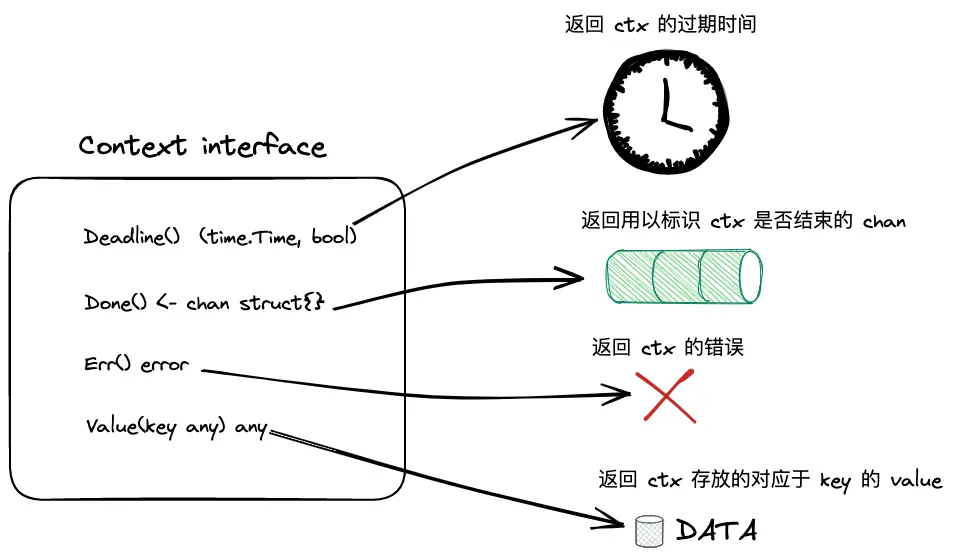
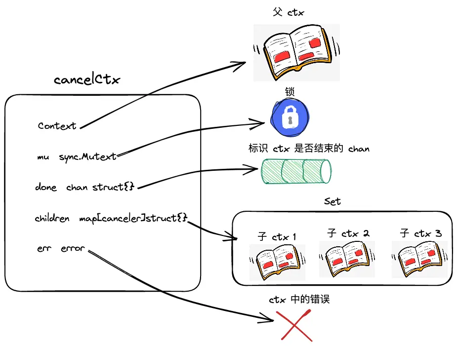
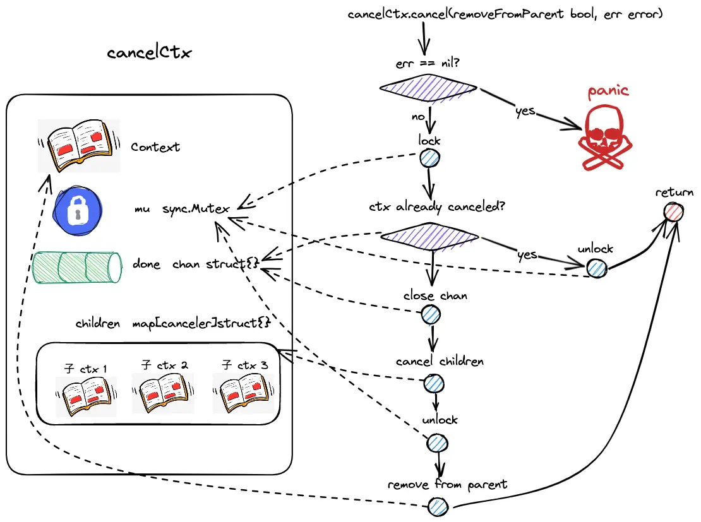
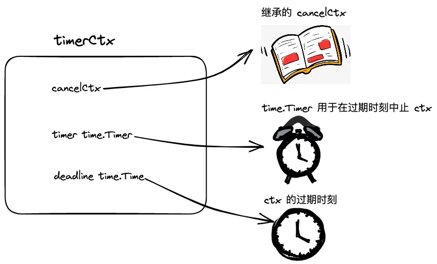

# Context


坐好扶好马上揭晓、内容劲爆有点重要

# 1、使用方式

主要用于追踪 `goroutine`，达到控制它们的作用，一个`goroutine`开启后，要么等他自己结束，要么等外界通知它结束。对于后台监控类的`goroutine`，如果没有外界通知它结束的话会一直运行下去，可以通过`chan+select`控制，但是这种方式无法处理`goroutine`中开`goroutine`的情况，可能会有多个嵌套的`goroutine`，不可能写那么多的`case <-stop`。

使用`context`比较好，`context.Background() `返回一个空的Context，这个空的Context一般用于整个Context树的根节点。然后我们使用`context.WithCancel(parent)`函数，创建一个可取消的子Context，然后当作参数传给goroutine使用，这样就可以使用这个子Context跟踪这个goroutine。

在goroutine中，使用select调用`<-ctx.Done()`判断是否要结束，如果接受到值的话，就可以返回结束goroutine了；如果接收不到，就会继续进行监控。

那么是如何发送结束指令的呢？这就是示例中的 cancel 函数啦，它是我们调用`context.WithCancel(parent)`函数生成子Context的时候返回的，第二个返回值就是这个取消函数，它是CancelFunc类型的。我们调用它就可以发出取消指令，然后我们的监控 goroutine 就会收到信号，就会返回结束。

```go
// 使用chan+select
func main() {
	stop := make(chan bool)

	go func() {
		for {
			select {
			case <-stop:
				fmt.Println("监控退出，停止了...")
				return
			default:
				fmt.Println("goroutine监控中...")
				time.Sleep(2 * time.Second)
			}
		}
	}()

	time.Sleep(10 * time.Second)
	fmt.Println("可以了，通知监控停止")
	stop<- true
	//为了检测监控过是否停止，如果没有监控输出，就表示停止了
	time.Sleep(5 * time.Second)

}

// 使用context
func main() {
	ctx, cancel := context.WithCancel(context.Background())
	go watch(ctx,"【监控1】")
	go watch(ctx,"【监控2】")
	go watch(ctx,"【监控3】")

	time.Sleep(10 * time.Second)
	fmt.Println("可以了，通知监控停止")
	cancel()
	//为了检测监控过是否停止，如果没有监控输出，就表示停止了
	time.Sleep(5 * time.Second)
}

func watch(ctx context.Context, name string) {
	for {
		select {
		case <-ctx.Done():
			fmt.Println(name,"监控退出，停止了...")
			return
		default:
			fmt.Println(name,"goroutine监控中...")
			time.Sleep(2 * time.Second)
		}
	}
}
```

# 2、底层实现（go 1.22）

## 2.1 Context 内部数据结构：



```go
type Context interface {
    Deadline() (deadline time.Time, ok bool)
    Done() <-chan struct{}
    Err() error
    Value(key any) any
}
```

（1）Deadline：返回 context 的过期时间；

（2）Done：返回 context 中的 channel；

（3）Err：返回错误；

```go
// 当context 取消时，由 [Context.Err] 返回 Canceled
var Canceled = errors.New("context canceled")

// 当context 超时，由 [Context.Err] 返回 DeadlineExceeded
var DeadlineExceeded error = deadlineExceededError{}

type deadlineExceededError struct{}
// 实现 Error 接口
func (deadlineExceededError) Error() string   { return "context deadline exceeded" }
```

（4）Value：返回 context 中的对应 key 的值.


## 2.2 emptyCtx 空实现

```go
func (emptyCtx) Deadline() (deadline time.Time, ok bool) {
	return
}
// 返回一个 nil，用户无论往 nil 中写入或者读取数据，均会陷入阻塞
func (emptyCtx) Done() <-chan struct{} {
	return nil
}

func (emptyCtx) Err() error {
	return nil
}

func (emptyCtx) Value(key any) any {
	return nil
}

type backgroundCtx struct{ emptyCtx }
type todoCtx struct{ emptyCtx }
func Background() Context {
	return backgroundCtx{}
}
func TODO() Context {
	return todoCtx{}
}
```

可以看到平常使用的 `context.Background()`实际是返回一个 context 接口的空实现。TODO() 也是如此。

## 2.3 cancelCtx 实现

平常我们大多数都是使用 带 cancel 的 context 

比如：

```go
ctx, cancel := context.WithCancel(context.Background())
```

在调用内部其实是调用了 withCancel 函数返回一个 cancelCtx 结构体对象，而该对象是实现了 Context 接口的。

```go
type CancelFunc func()
func WithCancel(parent Context) (ctx Context, cancel CancelFunc) {
	c := withCancel(parent)
	return c, func() { c.cancel(true, Canceled, nil) }
}

func withCancel(parent Context) *cancelCtx {
	if parent == nil {
		panic("cannot create context from nil parent")
	}
	c := &cancelCtx{}
	c.propagateCancel(parent, c)
	return c
}
```

在看 `c.propagateCancel(parent, c)`方法实现之前，先看看 `cancelCtx`这个结构体的内部数据结构是怎样的。

### 2.3.1 内部数据接口定义



CancelCtx 可以被取消。取消时，它还会取消其所有子 Context。

```go
type cancelCtx struct {
    Context
    mu       sync.Mutex            // protects following fields
    done     atomic.Value          // of chan struct{}, created lazily, closed by first cancel call
    children map[canceler]struct{} // set to nil by the first cancel call
    err      error                 // set to non-nil by the first cancel call
    cause    error                 // set to non-nil by the first cancel call
}

// cancelCtx同时实现了canceler接口
// A canceler is a context type that can be canceled directly. The
// implementations are *cancelCtx and *timerCtx.
type canceler interface {
	cancel(removeFromParent bool, err,cause error)
	Done() <-chan struct{}
}
```

1、内置了一个 Context，作为其父 Context，cancelCtx 必然为某个 Context 的子 Context

2、mutex，加锁获取并发场景的资源

3、children：一个 map，指向 cancelCtx 的所有子 context；key 是一个实现了 canceler 接口的实现类。该 map 保存着从该 context 延伸下去的子节点，每一个子节点都是一个实现了canceler 接口的实现类，再看看 canceler 接口的实现方法，这些是暴露给子 context 的方法，父context 仅仅要求 子context 实现这两个方法即可，子context 有具体的其他方法可由子context 做对应的增加。保持职责内聚，仅关注自己需要关注的部分即可，也是为了避免暴露过多的方法给父context，造成错误调用。


继续看 `c.propagateCancel(parent, c)`方法实现，用来将父 context 的取消事件传递给子 context，其中参数中的 child 是一个 canceler 接口，cancelCtx 也实现了该接口，因此可以作为参数传递进来。

在函数内部

```go
// 函数的作用是确保当父上下文（parent）被取消时，子上下文（child）也能被相应地取消
func (c *cancelCtx) propagateCancel(parent Context, child canceler) {
    c.Context = parent   // 给 父Context 赋值

    done := parent.Done()
    // 1、父 Context永远不会取消，比如emptyCtx，直接返回
    if done == nil {
        return // parent is never canceled
    }

    // 2、select 监听 done 通道是否有值，有值代表父Context已经被取消，
    // 此时作为该 父 Context的子Context也应该被取消，同时，该子Context的后代Context也应该被取消
    // 也就是调用 child.cancel 方法进行取消，从这里能够看到 Context是有父子关系的
    select {
        case <-done:
            // parent is already canceled
            child.cancel(false, parent.Err(), Cause(parent))
            return
        default:
        }
    // 3、判断 parent 最内层的cancelCtx是否是go自己内部实现的cancelCtx
    // 如果是，则把 child 添加到该 cancelCtx 的 child 中
    if p, ok := parentCancelCtx(parent); ok {
        // parent is a *cancelCtx, or derives from one.
        p.mu.Lock() // 访问共享资源 p.children map结构，加锁
        if p.err != nil {
            // parent has already been canceled
            child.cancel(false, p.err, p.cause)
        } else {
            if p.children == nil {
                // 懒加载
                p.children = make(map[canceler]struct{})
            }
            p.children[child] = struct{}{}
        }
        p.mu.Unlock()
        return
    }
    // 4、是否实现了AfterFunc方法
    if a, ok := parent.(afterFuncer); ok {
        // parent implements an AfterFunc method.
        c.mu.Lock()
        stop := a.AfterFunc(func() {
            child.cancel(false, parent.Err(), Cause(parent))
        })
        c.Context = stopCtx{
            Context: parent,
            stop:    stop,
        }
        c.mu.Unlock()
        return
    }
    
    //5、如果不是go自己内部实现的cancelCtx则另外起一个协程，一直监听父context是否关闭，如果关闭则关闭child
    goroutines.Add(1)
    go func() {
        select {
            case <-parent.Done():
            child.cancel(false, parent.Err(), Cause(parent))
            case <-child.Done():
            }
    }()
}

// cancelCtxKey 是 cancelCtx 返回自身的键
var cancelCtxKey int
// 该方法主要是根据cancelCtxKey查找parent最底层的cancelCtx
func parentCancelCtx(parent Context) (*cancelCtx, bool) {
    done := parent.Done()
    if done == closedchan || done == nil {
        return nil, false
    }
    p, ok := parent.Value(&cancelCtxKey).(*cancelCtx)
    if !ok {
        return nil, false
    }
    pdone, _ := p.done.Load().(chan struct{})
    if pdone != done {
        return nil, false
    }
    return p, true
}
```


### 2.3.2 cancelCtx 实现 Context 接口的四个方法：

```go
// 1、key 等于 特定值cancelCtxKey，返回cancelCtx自身的指针
// 2、否则，根据父context来取值
func (c *cancelCtx) Value(key any) any {
	if key == &cancelCtxKey {
		return c
	}
	return value(c.Context, key)
}

func value(c Context, key any) any {
	for {
		switch ctx := c.(type) {
		case *valueCtx:
			if key == ctx.key {
				return ctx.val
			}
			c = ctx.Context
		case *cancelCtx:
			if key == &cancelCtxKey {
				return c
			}
			c = ctx.Context
		case withoutCancelCtx:
			if key == &cancelCtxKey {
				// This implements Cause(ctx) == nil
				// when ctx is created using WithoutCancel.
				return nil
			}
			c = ctx.c
		case *timerCtx:
			if key == &cancelCtxKey {
				return &ctx.cancelCtx
			}
			c = ctx.Context
		case backgroundCtx, todoCtx:
			return nil
		default:
			return c.Value(key)
		}
	}
}

//（1）基于 atomic 包，读取 cancelCtx 中的 chan；倘若已存在，则直接返回；
//（2）加锁后，再次检查 chan 是否存在，若存在则返回；（double check）
//（3）不存在，则初始化 chan 存储到 aotmic.Value 当中，并返回（懒加载机制）
func (c *cancelCtx) Done() <-chan struct{} {
	d := c.done.Load() // done是 atomic 包
	if d != nil {
		return d.(chan struct{})
	}
	c.mu.Lock()
	defer c.mu.Unlock()
	d = c.done.Load()
	if d == nil {
		d = make(chan struct{})
		c.done.Store(d)
	}
	return d.(chan struct{})
}

// 加锁赋值给err，解锁返回
func (c *cancelCtx) Err() error {
	c.mu.Lock()
	err := c.err
	c.mu.Unlock()
	return err
}

Deadline方法：
直接复用父Context的Deadline方法。
```


### 2.3.3 cancelCtx.cancel方法



```go
// cancel closes c.done, cancels each of c's children, and, if
// removeFromParent is true, removes c from its parent's children.
// cancel sets c.cause to cause if this is the first time c is canceled.
func (c *cancelCtx) cancel(removeFromParent bool, err, cause error) {
	if err == nil {
		panic("context: internal error: missing cancel error")
	}
    // 兼容老版本，以前版本不需要传 cause，仅传err
	if cause == nil {
		cause = err
	}
	c.mu.Lock()
	if c.err != nil {
		c.mu.Unlock()
		return // already canceled
	}
	c.err = err
	c.cause = cause
	d, _ := c.done.Load().(chan struct{})
	if d == nil {
		c.done.Store(closedchan)
	} else {
		close(d)
	}
	for child := range c.children {
		// NOTE: acquiring the child's lock while holding parent's lock.
		child.cancel(false, err, cause)
	}
	c.children = nil
	c.mu.Unlock()

	if removeFromParent {
		removeChild(c.Context, c)
	}
}

// removeChild removes a context from its parent.
func removeChild(parent Context, child canceler) {
	if s, ok := parent.(stopCtx); ok {
		s.stop()
		return
	}
	p, ok := parentCancelCtx(parent)
	if !ok {
		return
	}
	p.mu.Lock()
	if p.children != nil {
		delete(p.children, child)
	}
	p.mu.Unlock()
}
```

（1）该方法有三个入参，第一个 removeFromParent 是一个 bool 值，表示当前 context 是否需要从父 context 的 children map 集合中删除；第二个 err 是 cancel 后需要展示的错误信息；第三个 cause 同 err，在第一次cancel 调用时被设置。

（2）校验传进来的 err 是否为空，若为空则 panic

（3）加锁

（4）判断 cancelCtx 自身的 err 是否为 nil，若不为 nil，表示已经被 cancel 了，解锁返回

（5）给 cancelCtx 的 err 和 cause 赋值，处理 cancelCtx 的 channel，若 channel 此前未初始化，则直接注入一个 closedChan，否则关闭该 channel；

（6）遍历当前 cancelCtx 的 children map 集合，依次将 children context 都进行 cancel；将当前 cancelCtx 的 children 字段置为 nil；这里是一个递归调用，在获取 child contxet 锁的同时也持有 parent context 的锁

（7）解锁

（8）如果 removeFromParent 为 true，调用 removeChild 方法，先判断是否是 cancelCtx，不是则直接返回（因为只有 cancelCtx 才有 children map）；把当前 cancelCtx 从其父 context 的 children map 中 delete；操作共享资源加锁


## 2.4 timerCtx：




```go
// 内嵌了一个 cancelCtx，用来实现 Done 和 Err 方法，并通过停止计时器然后委托给cancelCtx.cancel 来实现取消
type timerCtx struct {
	cancelCtx
	timer *time.Timer // Under cancelCtx.mu.

	deadline time.Time
}
```

timerCtx 在 cancelCtx 基础上又做了一层封装，除了继承 cancelCtx 的能力之外，新增了一个 time.Timer 用于定时终止 context；另外新增了一个 deadline 字段用于判断 timerCtx 的过期时间.


来看初始化一个带截止时间的 Context ：

```go
// 创建
timeout, c := context.WithTimeout(context.Background(), 10*time.Minute)

func WithTimeout(parent Context, timeout time.Duration) (Context, CancelFunc) {
	return WithDeadline(parent, time.Now().Add(timeout))
}

func WithDeadline(parent Context, d time.Time) (Context, CancelFunc) {
	return WithDeadlineCause(parent, d, nil)
}

func WithDeadlineCause(parent Context, d time.Time, cause error) (Context, CancelFunc) {
	if parent == nil {
		panic("cannot create context from nil parent")
	}
	if cur, ok := parent.Deadline(); ok && cur.Before(d) {
		// The current deadline is already sooner than the new one.
		return WithCancel(parent)
	}
	c := &timerCtx{
		deadline: d,
	}
	c.cancelCtx.propagateCancel(parent, c)
	dur := time.Until(d)
	if dur <= 0 {
		c.cancel(true, DeadlineExceeded, cause) // deadline has already passed
		return c, func() { c.cancel(false, Canceled, nil) }
	}
	c.mu.Lock()
	defer c.mu.Unlock()
	if c.err == nil {
		c.timer = time.AfterFunc(dur, func() {
			c.cancel(true, DeadlineExceeded, cause)
		})
	}
	return c, func() { c.cancel(true, Canceled, nil) }
}
```

1）parent == nil 报错

2）如果父 Context 的截止时间早于当前 Context，返回一个 cancelCtx

3）初始化 timeCtx，并将 parent 的 cancel 事件同步到子 Context

4）判断是否到达截止时间，若是，则取消该 timeCtx

5）加锁

6）启动 time.Timer，并规定好到达截止时间时，调用 cancel 方法取消 Context，并返回超时错误

7）解锁，返回 timerCtx 和一个可取消的 func


```go
func (c *timerCtx) Deadline() (deadline time.Time, ok bool) {
	return c.deadline, true
}

// 借助cancelCtx的cancel方法，然后取消定时器
func (c *timerCtx) cancel(removeFromParent bool, err, cause error) {
	c.cancelCtx.cancel(false, err, cause)
	if removeFromParent {
		// Remove this timerCtx from its parent cancelCtx's children.
		removeChild(c.cancelCtx.Context, c)
	}
	c.mu.Lock()
	if c.timer != nil {
		c.timer.Stop()
		c.timer = nil
	}
	c.mu.Unlock()
}
```


## 2.5 valueCtx

valueCtx 携带一个 key-value 键值对，其他的 context 接口方法都委托给内嵌的 Context

```go
type valueCtx struct {
	Context
	key, val any
}
```


```go
type ContextKey string
// 定义键
const key ContextKey = "userID"
// 创建一个带值的上下文
ctxWithValue := context.WithValue(context.Background(), key, "12345")
```

WithValue：

```go
func WithValue(parent Context, key, val any) Context {
	if parent == nil {
		panic("cannot create context from nil parent")
	}
	if key == nil {
		panic("nil key")
	}
	if !reflectlite.TypeOf(key).Comparable() {
		panic("key is not comparable")
	}
	return &valueCtx{parent, key, val}
}
```


valueCtx.Value 方法：

```go
func (c *valueCtx) Value(key any) any {
	if c.key == key {
		return c.val
	}
	return value(c.Context, key)
}

func value(c Context, key any) any {
	for {
		switch ctx := c.(type) {
		case *valueCtx:
			if key == ctx.key {
				return ctx.val
			}
			c = ctx.Context
		case *cancelCtx:
			if key == &cancelCtxKey {
				return c
			}
			c = ctx.Context
		case withoutCancelCtx:
			if key == &cancelCtxKey {
				// This implements Cause(ctx) == nil
				// when ctx is created using WithoutCancel.
				return nil
			}
			c = ctx.c
		case *timerCtx:
			if key == &cancelCtxKey {
				return &ctx.cancelCtx
			}
			c = ctx.Context
		case backgroundCtx, todoCtx:
			return nil
		default:
			return c.Value(key)
		}
	}
}
```

1）如果当前 valueCtx 的 key 等于传入的 key，返回其 value

2）不等于，则向上往父 Context 查找


valueCtx 使用注意：

1. **`context.WithValue`** 的值是不可变的，如果需要修改值，必须创建新的上下文。
2. 不建议在上下文中存储过大的数据，如结构体或切片。
3. 不要滥用 **`WithValue**`**，过多的键值对可能导致上下文混乱。不支持基于 k 的去重，相同 k 可能重复存在，并基于起点的不同，返回不同的 v。仅用于在请求范围内传递元数据，例如：用户 ID、请求跟踪 ID 等
4. 使用自定义类型作为键，并且是可比较的

- 避免使用基础类型（如 **`string`** 或 **`int`**）作为键，容易引发冲突。
- 使用自定义类型（例如 **`type ContextKey string`**）确保键在上下文中是唯一的，避免与其他包的键冲突。

1. 基于 k 寻找 v 的过程是线性的，时间复杂度 O(N)
