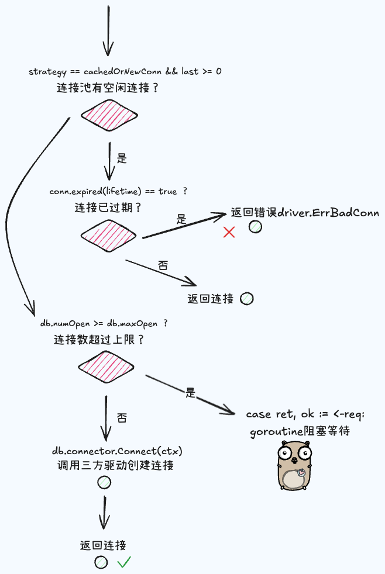

# database/sql

学习 go 语言通用的结构化查询流程框架 -- 标准库 database/sql
# 一、抽象接口定义

标准库 database/sql 定义了 go 语言通用的结构化查询流程框架，其对接的数据库类型是灵活多变的，如 mysql、sqlite、oracle 等. 因此**在 database/sql 中，与具体数据库交互的细节内容统一托付给一个抽象的数据库驱动模块，在其中声明好一套适用于各类关系型数据库的统一规范，将各个关键节点定义成抽象的 interface，由具体类型的数据库完成数据库驱动模块的实现**，然后将其注入到 database/sql 的大框架之中.

database/sql 关于数据库驱动模块下各核心 interface 主要包括：

- **Connector：抽象的数据库连接器**，需要具备创建数据库连接以及返回从属的数据库驱动的能力
- **Driver：抽象的数据库驱动**，具备创建数据库连接的能力
- **Conn：抽象的数据库连接**，具备预处理 sql 以及开启事务的能力
- **Tx：抽象的事务**，具备提交和回滚的能力
- **Statement：抽象的请求预处理状态**. 具备实际执行 sql 并返回执行结果的能力
- **Result/Row**：**抽象的 sql 执行结果**


## 1、 抽象接口

由具体的数据库类型提供具体的实现版本

```go
// 抽象的数据库连接器
type Connector interface {
    // 获取一个数据库连接
    Connect(context.Context) (Conn, error)
    // 获取数据库驱动
    Driver() Driver
}

// 抽象的数据库连接
type Conn interface {
    // 预处理 sql
    Prepare(query string) (Stmt, error)

    // 关闭连接   
    Close() error

    // 开启事务
    Begin() (Tx, error)
}

// 抽象的请求预处理状态接口
type Stmt interface {
    // 关闭
    Close() error

    // 返回 sql 中存在的可变参数数量
    NumInput() int

    // 执行操作类型的 sql
    Exec(args []Value) (Result, error)

    // 执行查询类型的 sql
    Query(args []Value) (Rows, error)
}

// 抽象的执行结果接口
type Result interface {
    // 最后一笔插入数据的主键
    LastInsertId() (int64, error)

    // 操作影响的行数
    RowsAffected() (int64, error)
}
type Rows interface {
    // 返回所有列名
    Columns() []string

    // 关闭 rows 迭代器
    Close() error

    // 遍历
    Next(dest []Value) error
}

// 抽象的事务接口
type Tx interface {
    // 提交事务
    Commit() error
    // 回滚事务
    Rollback() error
}

// 抽象的数据库驱动
type Driver interface {
    // 开启一个新的数据库连接
    Open(name string) (Conn, error)
}
```


## 2、创建数据库实例

先看下 db 实例的结构体字段：

```go
type DB struct {
	// Total time waited for new connections.记录等待新连接的总时长,主要用于统计和调优连接池的性能
	waitDuration atomic.Int64

	connector driver.Connector	// 用于创建新连接的 Connector 对象,通常由数据库驱动实现
	
	numClosed atomic.Uint64	// 用于记录数据库连接池中已经关闭的连接数。Stmt.openStmt 会检查这个字段，以清理关闭的连接。

	mu           sync.Mutex    
	freeConn     []*driverConn // 连接池中的空闲连接 ordered by returnedAt oldest to newest
	connRequests connRequestSet	// 存储等待的连接请求
	numOpen      int // 表示当前打开（包括正在打开和已打开）的连接数
	
	openerCh          chan struct{}		// 通知连接池需要打开新连接,是一个不携带数据的通道，通常用于实现信号通知机制
	closed            bool				// db 实例是否已关闭
	dep               map[finalCloser]depSet	// 存储依赖于 finalCloser 类型的对象，管理对象之间的依赖关系，确保在关闭时正确清理资源
	lastPut           map[*driverConn]string // 最后一次将连接放入连接池时的堆栈信息；debug only
	maxIdleCount      int                    // 设置空闲连接池的最大连接数，为零表示使用默认值，如果为负数则表示不允许空闲连接
	maxOpen           int                    // 允许的最大打开连接数，<= 0 表示不限制最大连接数
	maxLifetime       time.Duration          // 连接的最大生命周期
	maxIdleTime       time.Duration          // 连接在空闲状态下的最长存活时间
	cleanerCh         chan struct{}
	waitCount         int64 // 请求连接时的等待次数
	maxIdleClosed     int64 // 因空闲连接超出最大数目而关闭的连接数
	maxIdleTimeClosed int64 // 因空闲时间过长而被关闭的连接数
	maxLifetimeClosed int64 // 因连接生命周期到期而被关闭的连接数

	stop func() 	// 关闭连接池时调用，用于清理相关资源并停止连接创建操作
}
```


以一个例子开始对 database/sql 的源码解读

```go
import (
    "context"
    "database/sql"
    "testing"


    // 注册 mysql 数据库驱动
    _ "github.com/go-sql-driver/mysql"
)


type user struct {
    UserID int64
}


func Test_sql(t *testing.T) {
    // 创建 db 实例
    db, err := sql.Open("mysql", "username:passpord@(ip:port)/database")
    if err != nil {
        t.Error(err)
        return
    }
    
    // 执行 sql
    ctx := context.Background()
    row := db.QueryRowContext(ctx, "SELECT user_id FROM user WHERE id = 1")
    if row.Err() != nil {
        t.Error(err)
        return
    }


    // 解析结果
    var u user
    if err = row.Scan(&u.UserID); err != nil {
        t.Error(err)
        return
    }
    t.Log(u.UserID)
}
```


从 `sql.Open()` 函数开始，`sql.Open` 不会立即建立与数据库的连接。连接是在实际需要时创建的，例如首次执行查询/或者调用 `DB.Ping`

```go
var driversMu sync.RWMutex // 全局变量，读写锁
//go:linkname drivers
var drivers = make(map[string]driver.Driver)

func Open(driverName, dataSourceName string) (*DB, error) {
	driversMu.RLock()
	driveri, ok := drivers[driverName]
	driversMu.RUnlock()
	if !ok {
		return nil, fmt.Errorf("sql: unknown driver %q (forgotten import?)", driverName)
	}

	if driverCtx, ok := driveri.(driver.DriverContext); ok {
		connector, err := driverCtx.OpenConnector(dataSourceName)
		if err != nil {
			return nil, err
		}
		return OpenDB(connector), nil
	}

	return OpenDB(dsnConnector{dsn: dataSourceName, driver: driveri}), nil
}


```

具体执行流程：

1、加读写锁访问全局资源 `drivers map`，从中取出对应的驱动器实现类，各个不同的数据库有其对应的实现类，通过 `Register` 函数注册到 database/sql 的基础框架中。

2、若对应的驱动实现了连接器对象 `Connector` ，则获取并创建 db 实例

3、调用 OpenDB 函数，开始创建 db 实例

> Register 函数：
>
> ```GO
> func Register(name string, driver driver.Driver) {
> 	driversMu.Lock()
> 	defer driversMu.Unlock()
> 	if driver == nil {
> 		panic("sql: Register driver is nil")
> 	}
> 	if _, dup := drivers[name]; dup {
> 		panic("sql: Register called twice for driver " + name)
> 	}
> 	drivers[name] = driver
> }
> ```

其中 driver.DriverContext 也是一个接口类型，具体为:

```go
type DriverContext interface {
	// OpenConnector must parse the name in the same format that Driver.Open
	// parses the name parameter.
	OpenConnector(name string) (Connector, error)
}
```


接着看 OpenDB 函数的实现：

```GO
var connectionRequestQueueSize = 1000000
// OpenDB may just validate its arguments without creating a connection
// to the database. To verify that the data source name is valid, call
// [DB.Ping].
func OpenDB(c driver.Connector) *DB {
	ctx, cancel := context.WithCancel(context.Background())
	db := &DB{
		connector: c,
		openerCh:  make(chan struct{}, connectionRequestQueueSize),
		lastPut:   make(map[*driverConn]string),
		stop:      cancel,
	}

	go db.connectionOpener(ctx)

	return db
}

func (db *DB) connectionOpener(ctx context.Context) {
	for {
		select {
		case <-ctx.Done():
			return
        //  等待新的连接请求到达 openerCh 通道。
		case <-db.openerCh:
			db.openNewConnection(ctx)
		}
	}
}
```

1、创建 DB 实例

`connector`: 实现了 `driver.Connector` 接口，用于创建数据库连接。

`openerCh`: 一个缓冲通道，作为连接请求的等待队列。容量由 `connectionRequestQueueSize` 定义，决定了最多可以同时等待的连接请求数

`lastPut`: 记录最后一次放回池中的连接，用于调试或监控。

`connRequests`: 用于管理连接请求，每个请求与唯一的 ID 关联。

`stop`: 通过 `context.CancelFunc` 控制 `connectionOpener` 的停止。

2、启动一个 connectionOpener 协程，注入 ctx，以此来控制该协程的生命周期


在 connectionOpener 协程中，通过 for select 循环监听 done 和 db.openerCh 通道，以此来打开一个新连接，其具体实现为：

```GO
func (db *DB) openNewConnection(ctx context.Context) {
	// maybeOpenNewConnections has already executed db.numOpen++ before it sent
	// on db.openerCh. This function must execute db.numOpen-- if the
	// connection fails or is closed before returning.
	ci, err := db.connector.Connect(ctx)	// 创建一个底层数据库连接
	db.mu.Lock()
	defer db.mu.Unlock()
	if db.closed {
		if err == nil {
			ci.Close()
		}
		db.numOpen--
		return
	}
	if err != nil {
		db.numOpen--
		db.putConnDBLocked(nil, err)
		db.maybeOpenNewConnections()
		return
	}
	dc := &driverConn{
		db:         db,
		createdAt:  nowFunc(),
		returnedAt: nowFunc(),
		ci:         ci,
	}
	if db.putConnDBLocked(dc, err) {
		db.addDepLocked(dc, dc)
	} else {
		db.numOpen--
		ci.Close()
	}
}
```

1）`db.connector.Connect(ctx)` 创建一个底层数据库连接

2）加锁

3）判断 db 实例是否已关闭，即使创建连接成功，也将其关闭，并且将 db 实例的连接打开数减一

4）db 实例未关闭但是连接创建未成功，调用 `putConnDBLocked` 记录错误，尝试触发新的连接创建（通过 `maybeOpenNewConnections`）

5）连接创建成功，将新创建的连接封装为 `driverConn`，包含了元信息（如创建时间）

6）调用 `putConnDBLocked` 尝试将连接放入空闲池中，成功则更新连接的依赖关系；如果放入失败（可能是空闲池已满或其他原因），关闭连接并减少计数


通过 `maybeOpenNewConnections` 函数不断地对连接请求进行创建，直至全部满足

```go
// If there are connRequests and the connection limit hasn't been reached,
// then tell the connectionOpener to open new connections.
func (db *DB) maybeOpenNewConnections() {
	numRequests := db.connRequests.Len()
	if db.maxOpen > 0 {
		numCanOpen := db.maxOpen - db.numOpen
		if numRequests > numCanOpen {
			numRequests = numCanOpen
		}
	}
	for numRequests > 0 {
		db.numOpen++ // optimistically
		numRequests--
		if db.closed {
			return
		}
		db.openerCh <- struct{}{}	// 在 openNewConnections 函数监听，获取一个新连接
	}
}
```


### 2.1 连接池的管理


#### 2.1.1 连接的表达形式


一条连接是怎么表达的？数据库驱动连接通过如下结构包装了一层，添加了创建时间，锁保护机制等，它负责管理连接的生命周期，包括重置、关闭等操作。

```go
// driverConn wraps a driver.Conn with a mutex, to
// be held during all calls into the Conn. (including any calls onto
// interfaces returned via that Conn, such as calls on Tx, Stmt,
// Result, Rows)
type driverConn struct {
    db        *DB
    createdAt time.Time

    sync.Mutex  // guards following
    ci          driver.Conn
    needReset   bool // The connection session should be reset before use if true.
    closed      bool
    finalClosed bool // ci.Close has been called
    openStmt    map[*driverStmt]bool

    // guarded by db.mu
    inUse      bool
    returnedAt time.Time // Time the connection was created or returned.
    onPut      []func()  // code (with db.mu held) run when conn is next returned
    dbmuClosed bool      // same as closed, but guarded by db.mu, for removeClosedStmtLocked
}
```

`ci driver.Conn`: 实际的数据库连接，满足 driver.Conn 接口

`needReset bool`: 标志：如果为 true，表示连接需要在使用前重置

`closed bool`: 标志：表示此连接是否已关闭

`finalClosed bool`: 标志：表示底层连接的 Close 方法是否已被调用

`openStmt map[*driveStmt]bool`: 当前连接上是否有打开的语句

`inUse bool`: 标志：该连接是否正在被使用

`returnedAt time.Time`: 连接被创建或返回的时间

`onPut []func()`: 当连接被返回时执行的代码（持有 db.mu 锁时）

`dbmuClosed bool`: 与 closed 类似，但由 db.mu 锁保护，避免并发访问


#### 2.1.2 put放入连接池

那么连接是怎么被放入连接池的？连接池是怎么管理的？

`putConnDBLocked` 函数主要用于管理数据库连接池的行为。它的主要作用是处理一个连接请求（connRequest），或者将一个数据库连接（driverConn）放入空闲连接池中。如果既没有满足连接请求，也没有将连接放入空闲池，它将返回 false。

```go
// Satisfy a connRequest or put the driverConn in the idle pool and return true
// or return false.
// putConnDBLocked will satisfy a connRequest if there is one, or it will
// return the *driverConn to the freeConn list if err == nil and the idle
// connection limit will not be exceeded.
// If err != nil, the value of dc is ignored.
// If err == nil, then dc must not equal nil.
// If a connRequest was fulfilled or the *driverConn was placed in the
// freeConn list, then true is returned, otherwise false is returned.
func (db *DB) putConnDBLocked(dc *driverConn, err error) bool {
    // 检查 db 是否已关闭
	if db.closed {
		return false
	}
    // 检查是否超过 db 允许打开的最大连接数
	if db.maxOpen > 0 && db.numOpen > db.maxOpen {
		return false
	}
    // 从连接请求队列中随机取一个连接请求，若成功取到则标记 dc 连接已被使用，并通过 chan 发送给连接请求等待方
	if req, ok := db.connRequests.TakeRandom(); ok {
		if err == nil {
			dc.inUse = true
		}
		req <- connRequest{
			conn: dc,
			err:  err,
		}
		return true
	} else if err == nil && !db.closed {
		if db.maxIdleConnsLocked() > len(db.freeConn) {
			db.freeConn = append(db.freeConn, dc)
			db.startCleanerLocked()
			return true
		}
		db.maxIdleClosed++
	}
	return false
}

// connRequestSet is a set of chan connRequest that's
// optimized for:
//
//   - adding an element
//   - removing an element (only by the caller who added it)
//   - taking (get + delete) a random element
//
// We previously used a map for this but the take of a random element
// was expensive, making mapiters. This type avoids a map entirely
// and just uses a slice.
type connRequestSet struct {
	// s are the elements in the set.
	s []connRequestAndIndex
}

type connRequestAndIndex struct {
	// req is the element in the set.
	req chan connRequest

	// curIdx points to the current location of this element in
	// connRequestSet.s. It gets set to -1 upon removal.
	curIdx *int
}
```

1）优先处理等待的连接请求，往通道中发送连接给等待者

2）如果没有等待的连接请求，并且 `err == nil`（连接有效）且数据库未关闭；

检查空闲连接池（`db.freeConn`）是否未满：

- 调用 `db.maxIdleConnsLocked()` 获取允许的最大空闲连接数。
- 如果空闲池未满，将 `dc` 放入 `db.freeConn`，并启动连接清理器（`startCleanerLocked`），以确保空闲连接在过期时被清理。
- 返回 `true` 表示连接已成功放入空闲池。

如果空闲池已满：

- 增加 `db.maxIdleClosed` 计数，表示因空闲池已满而被关闭的连接数量。


#### 2.1.3 清理空闲连接

`startCleanerLocked` 定时清理空闲连接：

```go
// startCleanerLocked starts connectionCleaner if needed.
func (db *DB) startCleanerLocked() {
	if (db.maxLifetime > 0 || db.maxIdleTime > 0) && db.numOpen > 0 && db.cleanerCh == nil {
		db.cleanerCh = make(chan struct{}, 1)
		go db.connectionCleaner(db.shortestIdleTimeLocked())
	}
}

func (db *DB) shortestIdleTimeLocked() time.Duration {
	if db.maxIdleTime <= 0 {
		return db.maxLifetime
	}
	if db.maxLifetime <= 0 {
		return db.maxIdleTime
	}
	return min(db.maxIdleTime, db.maxLifetime)
}

func (db *DB) connectionCleaner(d time.Duration) {
	const minInterval = time.Second

	if d < minInterval {
		d = minInterval
	}
	t := time.NewTimer(d)

	for {
		select {
		case <-t.C:
		case <-db.cleanerCh: // maxLifetime was changed or db was closed.
		}

		db.mu.Lock()
		// 再次获取清理间隔时间
		d = db.shortestIdleTimeLocked()
    // 数据库实例关闭或者打开连接数等于0或者清理间隔时间小于等于0，则停止清理操作，解锁返回
		if db.closed || db.numOpen == 0 || d <= 0 {
			db.cleanerCh = nil
			db.mu.Unlock()
			return
		}

		d, closing := db.connectionCleanerRunLocked(d)
		db.mu.Unlock()
		for _, c := range closing {
			c.Close()
		}

		if d < minInterval {
			d = minInterval
		}

		if !t.Stop() {
			select {
			case <-t.C:
			default:
			}
		}
		t.Reset(d)
	}
}
```

1、如果数据库的最大连接生命周期 (maxLifetime) 或最大空闲时间 (maxIdleTime) 大于零，并且当前打开的连接数大于零，则启动一个清理 goroutine 来定期检查和清理连接池中的空闲连接。`db.cleanerCh == nil`：表示没有正在运行的清理 goroutine，防止重复启动。

2、启动一个新的 `goroutine db.connectionCleaner`，并传入一个清理间隔时间。清理间隔由 `shortestIdleTimeLocked` 方法计算得出，返回值是 `maxIdleTime` 和 `maxLifetime` 中较短的一个。

3、for select 阻塞等待清理时间到达，或连接池被关闭或者 maxLifetime 设置发生变化

4、再次获取清理间隔时间，如果数据库实例关闭或者打开连接数等于0或者清理间隔时间小于等于0，则停止清理操作，解锁返回

5、调用 `connectionCleanerRunLocked` 函数执行实际的连接清理逻辑，返回更新后的清理时间和关闭的连接列表。

6、解锁

7、调用具体的实现类的释放连接函数，设置 dirverConn 的各类标识符

8、重新设置时间间隔 d 定时器


`connectionCleanerRunLocked` 具体操作连接池释放的函数，函数名带 locked的都是需要持有锁调用的，该函数返回更新后的清理时间和关闭的连接列表。

```go
// connectionCleanerRunLocked removes connections that should be closed from
// freeConn and returns them along side an updated duration to the next check
// if a quicker check is required to ensure connections are checked appropriately.
func (db *DB) connectionCleanerRunLocked(d time.Duration) (time.Duration, []*driverConn) {
	var idleClosing int64
	var closing []*driverConn
	if db.maxIdleTime > 0 {
		// As freeConn is ordered by returnedAt process
		// in reverse order to minimise the work needed.
		idleSince := nowFunc().Add(-db.maxIdleTime)
		last := len(db.freeConn) - 1
		for i := last; i >= 0; i-- {
			c := db.freeConn[i]
			if c.returnedAt.Before(idleSince) {
				i++
				closing = db.freeConn[:i:i]
				db.freeConn = db.freeConn[i:]
				idleClosing = int64(len(closing))
				db.maxIdleTimeClosed += idleClosing
				break
			}
		}

		if len(db.freeConn) > 0 {
			c := db.freeConn[0]
			if d2 := c.returnedAt.Sub(idleSince); d2 < d {
				// Ensure idle connections are cleaned up as soon as
				// possible.
				d = d2
			}
		}
	}

	if db.maxLifetime > 0 {
		expiredSince := nowFunc().Add(-db.maxLifetime)
		for i := 0; i < len(db.freeConn); i++ {
			c := db.freeConn[i]
			if c.createdAt.Before(expiredSince) {
				closing = append(closing, c)

				last := len(db.freeConn) - 1
				// Use slow delete as order is required to ensure
				// connections are reused least idle time first.
				copy(db.freeConn[i:], db.freeConn[i+1:])
				db.freeConn[last] = nil
				db.freeConn = db.freeConn[:last]
				i--
			} else if d2 := c.createdAt.Sub(expiredSince); d2 < d {
				// Prevent connections sitting the freeConn when they
				// have expired by updating our next deadline d.
				d = d2
			}
		}
		db.maxLifetimeClosed += int64(len(closing)) - idleClosing
	}

	return d, closing
}
```

1、清理因到达最大空闲时间的连接

​	`idleSince := nowFunc().Add(-db.maxIdleTime)`：用当前时间 - 最大空闲时长，得到从这个时间点以前的创建的连接都是到达了最大空闲时间的。


在临界点左边创建的连接都是到达了最大空闲时间的，for 循环倒叙遍历是因为 `freeConn` 是按照连接的返回时间排好序的，只需要找到第一个到达最大空闲时间的连接即可，往前所有的连接都是到达了最大空闲时间，能够有效减少遍历检查的连接数。

截断 `db.freeConn = db.freeConn[i:]`, i位置往后的是还有效的。

累加因到达最大空闲时间而关闭的连接


2、清理因到达最大生命周期的连接 (处理方式可学习)

​	`expiredSince := nowFunc().Add(-db.maxLifetime)`:计算出应该被清理的最早过期时间点

​	如果当前连接的创建时间早于 expiredSince，表示该连接已经过期，应该被清理。

	- 将其加入 closing 列表。
	- 使用慢删除方法：将 i 后面的连接向前移动，确保连接池中的连接顺序不被打乱, `copy(db.freeConn[i:], db.freeConn[i+1:])` 其第一个参数是 src
	- 最后一个元素去掉引用，并更新切片 `freeConn`
	- 因为删除了一个元素，所以索引 i 回退，以便继续检查当前索引位置的新元素

3、更新清理时间间隔 d

当空闲连接的空闲时间接近 maxIdleTime，或者过期连接接近 maxLifetime 时，d 会被更新为更短的时间。这意味着清理操作会提前进行，而不是等待原定的时间间隔。

这样做的好处是：如果 d 没有被更新，而是始终保持原值，则可能会导致连接池中的某些连接即将达到 maxIdleTime 或 maxLifetime 时，清理操作仍然延迟进行，造成连接池中可能还存在无用的连接。通过动态调整 d，即使下次清理的时间间隔没有到达，系统也会根据当前空闲连接或过期连接的情况，及时触发清理操作，避免资源浪费和不必要的连接占用。


## 3、执行请求流程

### 3.1、执行入口

```go
func (db *DB) QueryRowContext(ctx context.Context, query string, args ...any) *Row {
	rows, err := db.QueryContext(ctx, query, args...)
	return &Row{rows: rows, err: err}
}

func (db *DB) QueryContext(ctx context.Context, query string, args ...any) (*Rows, error) {
	var rows *Rows
	var err error

	err = db.retry(func(strategy connReuseStrategy) error {
		rows, err = db.query(ctx, query, args, strategy)
		return err
	})

	return rows, err
}

// maxBadConnRetries is the number of maximum retries if the driver returns
// driver.ErrBadConn to signal a broken connection before forcing a new
// connection to be opened.
const maxBadConnRetries = 2
const (
	// alwaysNewConn forces a new connection to the database.
	alwaysNewConn connReuseStrategy = iota
	// cachedOrNewConn returns a cached connection, if available, else waits
	// for one to become available (if MaxOpenConns has been reached) or
	// creates a new database connection.
	cachedOrNewConn
)
func (db *DB) retry(fn func(strategy connReuseStrategy) error) error {
	for i := int64(0); i < maxBadConnRetries; i++ {
		err := fn(cachedOrNewConn)
		// retry if err is driver.ErrBadConn
		if err == nil || !errors.Is(err, driver.ErrBadConn) {
			return err
		}
	}

	return fn(alwaysNewConn)
}
```


1、连接过期而导致发生偶发性的 ErrBadConn 错误，针对这种错误，可以采用重试的方式来提高请求的成功率。连续遇到两次 ErrBadConn 之后，会将策略调整为不采用连接池直接新建连接的方式，再兜底执行一次请求。

2、实际调用 `db.query` 方法进行查询

在 `db.query` 方法中根据不同策略获取数据库连接，调用 `db.conn` 方法，调用 `db.queryDC` 方法执行 sql 查询

```go
func (db *DB) query(ctx context.Context, query string, args []any, strategy connReuseStrategy) (*Rows, error) {
	dc, err := db.conn(ctx, strategy)
	if err != nil {
		return nil, err
	}

	return db.queryDC(ctx, nil, dc, dc.releaseConn, query, args)
}
```


### 3.2 获取数据库连接

```go
// conn returns a newly-opened or cached *driverConn.
func (db *DB) conn(ctx context.Context, strategy connReuseStrategy) (*driverConn, error) {
	db.mu.Lock()
	if db.closed {
		db.mu.Unlock()
		return nil, errDBClosed
	}
	// Check if the context is expired.
	select {
	default:
	case <-ctx.Done():
		db.mu.Unlock()
		return nil, ctx.Err()
	}
	lifetime := db.maxLifetime

	// Prefer a free connection, if possible.
	last := len(db.freeConn) - 1
	if strategy == cachedOrNewConn && last >= 0 {
		// Reuse the lowest idle time connection so we can close
		// connections which remain idle as soon as possible.
		conn := db.freeConn[last]
		db.freeConn = db.freeConn[:last]
		conn.inUse = true
		if conn.expired(lifetime) {
			db.maxLifetimeClosed++
			db.mu.Unlock()
			conn.Close()
			return nil, driver.ErrBadConn
		}
		db.mu.Unlock()

		// Reset the session if required.
		if err := conn.resetSession(ctx); errors.Is(err, driver.ErrBadConn) {
			conn.Close()
			return nil, err
		}

		return conn, nil
	}

	// Out of free connections or we were asked not to use one. If we're not
	// allowed to open any more connections, make a request and wait.
	if db.maxOpen > 0 && db.numOpen >= db.maxOpen {
		// Make the connRequest channel. It's buffered so that the
		// connectionOpener doesn't block while waiting for the req to be read.
		req := make(chan connRequest, 1)
		delHandle := db.connRequests.Add(req)
		db.waitCount++
		db.mu.Unlock()

		waitStart := nowFunc()

		// Timeout the connection request with the context.
		select {
		case <-ctx.Done():
			// Remove the connection request and ensure no value has been sent
			// on it after removing.
			db.mu.Lock()
			deleted := db.connRequests.Delete(delHandle)
			db.mu.Unlock()

			db.waitDuration.Add(int64(time.Since(waitStart)))

			// If we failed to delete it, that means either the DB was closed or
			// something else grabbed it and is about to send on it.
			if !deleted {
				// TODO(bradfitz): rather than this best effort select, we
				// should probably start a goroutine to read from req. This best
				// effort select existed before the change to check 'deleted'.
				// But if we know for sure it wasn't deleted and a sender is
				// outstanding, we should probably block on req (in a new
				// goroutine) to get the connection back.
				select {
				default:
				case ret, ok := <-req:
					if ok && ret.conn != nil {
						db.putConn(ret.conn, ret.err, false)
					}
				}
			}
			return nil, ctx.Err()
		case ret, ok := <-req:
			db.waitDuration.Add(int64(time.Since(waitStart)))

			if !ok {
				return nil, errDBClosed
			}
			// Only check if the connection is expired if the strategy is cachedOrNewConns.
			// If we require a new connection, just re-use the connection without looking
			// at the expiry time. If it is expired, it will be checked when it is placed
			// back into the connection pool.
			// This prioritizes giving a valid connection to a client over the exact connection
			// lifetime, which could expire exactly after this point anyway.
			if strategy == cachedOrNewConn && ret.err == nil && ret.conn.expired(lifetime) {
				db.mu.Lock()
				db.maxLifetimeClosed++
				db.mu.Unlock()
				ret.conn.Close()
				return nil, driver.ErrBadConn
			}
			if ret.conn == nil {
				return nil, ret.err
			}

			// Reset the session if required.
			if err := ret.conn.resetSession(ctx); errors.Is(err, driver.ErrBadConn) {
				ret.conn.Close()
				return nil, err
			}
			return ret.conn, ret.err
		}
	}

	db.numOpen++ // optimistically
	db.mu.Unlock()
	ci, err := db.connector.Connect(ctx)
	if err != nil {
		db.mu.Lock()
		db.numOpen-- // correct for earlier optimism
		db.maybeOpenNewConnections()
		db.mu.Unlock()
		return nil, err
	}
	db.mu.Lock()
	dc := &driverConn{
		db:         db,
		createdAt:  nowFunc(),
		returnedAt: nowFunc(),
		ci:         ci,
		inUse:      true,
	}
	db.addDepLocked(dc, dc)
	db.mu.Unlock()
	return dc, nil
}
```

大体流程：

1、若采用从连接池中复用连接的策略并且连接有空闲连接，则优先获取连接，获取成功则直接返回

2、如果没有空闲连接，或者策略要求新连接，则判断是否超过最大打开连接数

3、超过了，会将当前协程挂起，建立对应的 channel 添加到 connRequests 中，等待有连接释放时被唤醒

4、未超过则调用其实现类的 connector 创建新连接



