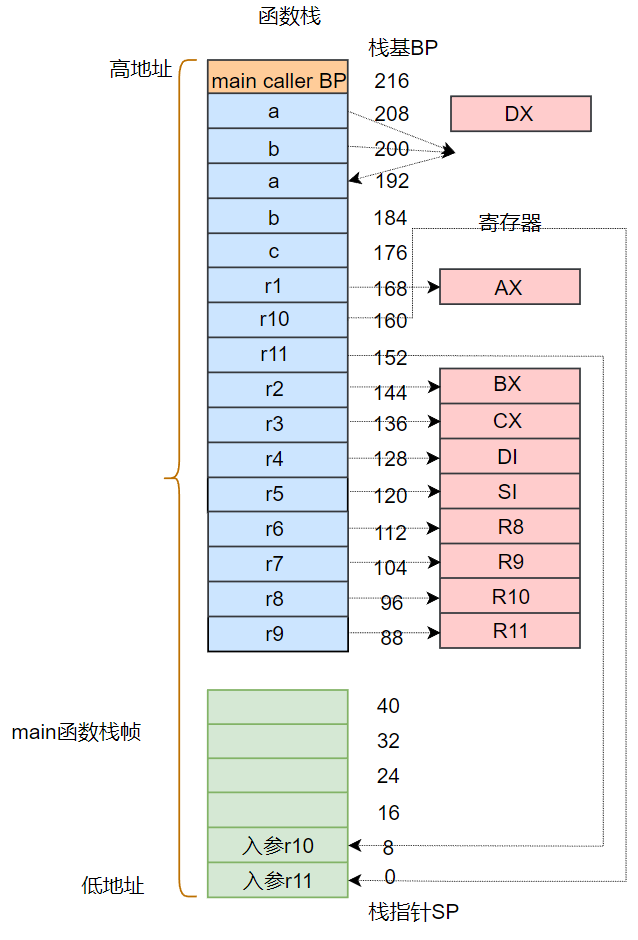
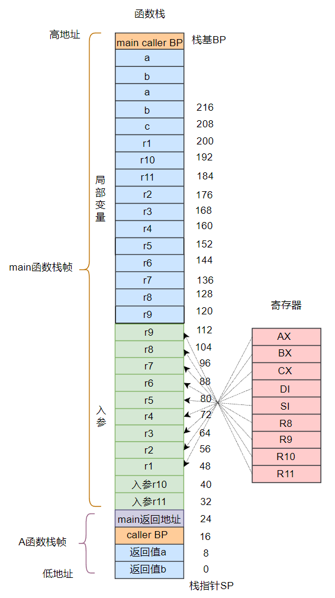

# Func函数底层实现

基于 go1.22.6 版本解析 func 函数底层实现


## 一、函数执行用例

```go
package main

func main() {
    var r1, r2, r3, r4, r5, r6, r7, r8, r9, r10, r11 int64 = 1, 2, 3, 4, 5, 6, 7, 8, 9, 10, 11
    a, b := A(r1, r2, r3, r4, r5, r6, r7, r8, r9, r10, r11)
    c := a + b
    print(c)
}

func A(p1, p2, p3, p4, p5, p6, p7, p8, p9, p10, p11 int64) (int64, int64) {
    return p1 + p2 + p3 + p4 + p5 + p6 + p7, p2 + p4 + p6 + p7 + p8 + p9 + p10 + p11  
}
```


执行命令打印 main.go 的汇编代码：

```shell
GOOS=linux GOARCH=amd64 go tool compile -S -N -l main.go
```


## 二、汇编代码分析

分析汇编代码 main.main：

```shell
"".main STEXT size=362 args=0x0 locals=0xe0 funcid=0x0
        0x0000 00000 (main.go:3)        TEXT    "".main(SB), ABIInternal, $224-0    #main函数定义, $224-0：224表示将分配的main函数的栈帧大小；0指定了调用方传入的参数，由于main是最上层函数，这里没有入参
        0x0000 00000 (main.go:3)        LEAQ    -96(SP), R12
        0x0005 00005 (main.go:3)        CMPQ    R12, 16(R14)
        0x0009 00009 (main.go:3)        PCDATA  $0, $-2
        0x0009 00009 (main.go:3)        JLS     349
        0x000f 00015 (main.go:3)        PCDATA  $0, $-1
        0x000f 00015 (main.go:3)        SUBQ    $224, SP                     # 为main函数栈帧分配了224字节的空间，注意此时的SP寄存器指向，会往下移动224个字节
        0x0016 00022 (main.go:3)        MOVQ    BP, 216(SP)                  # BP寄存器存放的是main函数caller的基址，movq这条指令是将main函数caller的基址入栈
        0x001e 00030 (main.go:3)        LEAQ    216(SP), BP                  # 将main函数的基址存放到到BP寄存器
        0x0026 00038 (main.go:3)        FUNCDATA        $0, gclocals·33cdeccccebe80329f1fdbee7f5874cb(SB)
        0x0026 00038 (main.go:3)        FUNCDATA        $1, gclocals·33cdeccccebe80329f1fdbee7f5874cb(SB)
        0x0026 00038 (main.go:4)        MOVQ    $1, "".r1+168(SP)            # main函数局部变量r1入栈    
        0x0032 00050 (main.go:4)        MOVQ    $2, "".r2+144(SP)            # main函数局部变量r2入栈
        0x003e 00062 (main.go:4)        MOVQ    $3, "".r3+136(SP)            # main函数局部变量r3入栈
        0x004a 00074 (main.go:4)        MOVQ    $4, "".r4+128(SP)            # main函数局部变量r4入栈
        0x0056 00086 (main.go:4)        MOVQ    $5, "".r5+120(SP)            # main函数局部变量r5入栈
        0x005f 00095 (main.go:4)        MOVQ    $6, "".r6+112(SP)            # main函数局部变量r6入栈
        0x0068 00104 (main.go:4)        MOVQ    $7, "".r7+104(SP)            # main函数局部变量r7入栈
        0x0071 00113 (main.go:4)        MOVQ    $8, "".r8+96(SP)             # main函数局部变量r8入栈 
        0x007a 00122 (main.go:4)        MOVQ    $9, "".r9+88(SP)             # main函数局部变量r9入栈
        0x0083 00131 (main.go:4)        MOVQ    $10, "".r10+160(SP)          # main函数局部变量r10入栈
        0x008f 00143 (main.go:4)        MOVQ    $11, "".r11+152(SP)          # main函数局部变量r11入栈
        0x009b 00155 (main.go:5)        MOVQ    "".r2+144(SP), BX            # 将局部变量r2传给寄存器BX
        0x00a3 00163 (main.go:5)        MOVQ    "".r3+136(SP), CX            # 将局部变量r3传给寄存器CX
        0x00ab 00171 (main.go:5)        MOVQ    "".r4+128(SP), DI            # 将局部变量r4传给寄存器DI
        0x00b3 00179 (main.go:5)        MOVQ    "".r5+120(SP), SI            # 将局部变量r5传给寄存器SI
        0x00b8 00184 (main.go:5)        MOVQ    "".r6+112(SP), R8            # 将局部变量r6传给寄存器R8
        0x00bd 00189 (main.go:5)        MOVQ    "".r7+104(SP), R9            # 将局部变量r7传给寄存器R9
        0x00c2 00194 (main.go:5)        MOVQ    "".r8+96(SP), R10            # 将局部变量r8传给寄存器R10
        0x00c7 00199 (main.go:5)        MOVQ    "".r9+88(SP), R11            # 将局部变量r9传给寄存器R11
        0x00cc 00204 (main.go:5)        MOVQ    "".r10+160(SP), DX           # 将局部变量r10传给寄存器DX
        0x00d4 00212 (main.go:5)        MOVQ    "".r1+168(SP), AX            # 将局部变量r1传给寄存器DX
        0x00dc 00220 (main.go:5)        MOVQ    DX, (SP)                     # 将寄存器DX保存的r10传给SP指向的栈顶
        0x00e0 00224 (main.go:5)        MOVQ    $11, 8(SP)                   # 将变量r11传给SP+8
        0x00e9 00233 (main.go:5)        PCDATA  $1, $0
        0x00e9 00233 (main.go:5)        CALL    "".A(SB)                     # 调用 A 函数
        0x00ee 00238 (main.go:5)        MOVQ    AX, ""..autotmp_14+208(SP)   # 将寄存器AX存的函数A的第一个返回值a赋值给SP+208
        0x00f6 00246 (main.go:5)        MOVQ    BX, ""..autotmp_15+200(SP)   # 将寄存器BX存的函数A的第二个返回值b赋值给SP+200
        0x00fe 00254 (main.go:5)        MOVQ    ""..autotmp_14+208(SP), DX   # 将SP+208保存的A函数第一个返回值a传给寄存器DX
        0x0106 00262 (main.go:5)        MOVQ    DX, "".a+192(SP)             # 将A函数第一个返回值a通过寄存器DX入栈到SP+192
        0x010e 00270 (main.go:5)        MOVQ    ""..autotmp_15+200(SP), DX   # 将SP+200保存的A函数第二个返回值b传给寄存器DX
        0x0116 00278 (main.go:5)        MOVQ    DX, "".b+184(SP)             # 将第二个返回值b通过寄存器DX入栈到SP+184
        0x011e 00286 (main.go:6)        MOVQ    "".a+192(SP), DX             # 将返回值a传给DX寄存器
        0x0126 00294 (main.go:6)        ADDQ    "".b+184(SP), DX             # 将a+b赋值给DX寄存器
        0x012e 00302 (main.go:6)        MOVQ    DX, "".c+176(SP)             # 将DX寄存器的值入栈到SP+176
        0x0136 00310 (main.go:7)        CALL    runtime.printlock(SB)        
        0x013b 00315 (main.go:7)        MOVQ    "".c+176(SP), AX             # 将SP+176存储的入参c赋值给AX
        0x0143 00323 (main.go:7)        CALL    runtime.printint(SB)         # 调用打印函数打印c
        0x0148 00328 (main.go:7)        CALL    runtime.printunlock(SB)
        0x014d 00333 (main.go:8)        MOVQ    216(SP), BP
        0x0155 00341 (main.go:8)        ADDQ    $224, SP
        0x015c 00348 (main.go:8)        RET
```

main函数调用A函数的参数个数为11个，其中前 9 个参数分别是通过寄存器 AX、BX、CX、DI、SI、R8、R9、R10、R11传递，后面两个通过栈顶的SP，SP+8地址传递。




下面再看函数 A 的汇编代码：

```shell

"".A STEXT nosplit size=175 args=0x58 locals=0x18 funcid=0x0
        0x0000 00000 (main.go:10)       TEXT    "".A(SB), NOSPLIT|ABIInternal, $24-88
        0x0000 00000 (main.go:10)       SUBQ    $24, SP                        # 为A函数栈帧分配了24字节的空间
        0x0004 00004 (main.go:10)       MOVQ    BP, 16(SP)
        0x0009 00009 (main.go:10)       LEAQ    16(SP), BP
        0x000e 00014 (main.go:10)       FUNCDATA        $0, gclocals·33cdeccccebe80329f1fdbee7f5874cb(SB)
        0x000e 00014 (main.go:10)       FUNCDATA        $1, gclocals·33cdeccccebe80329f1fdbee7f5874cb(SB)
        0x000e 00014 (main.go:10)       FUNCDATA        $5, "".A.arginfo1(SB)
        0x000e 00014 (main.go:10)       MOVQ    AX, "".p1+48(SP)               # 寄存器AX存储的r1赋值给SP+48    
        0x0013 00019 (main.go:10)       MOVQ    BX, "".p2+56(SP)               # 寄存器BX存储的r2赋值给SP+56
        0x0018 00024 (main.go:10)       MOVQ    CX, "".p3+64(SP)               # 寄存器CX存储的r3赋值给SP+64
        0x001d 00029 (main.go:10)       MOVQ    DI, "".p4+72(SP)               # 寄存器DI存储的r4赋值给SP+72
        0x0022 00034 (main.go:10)       MOVQ    SI, "".p5+80(SP)               # 寄存器SI存储的r5赋值给SP+80
        0x0027 00039 (main.go:10)       MOVQ    R8, "".p6+88(SP)               # 寄存器R8存储的r6赋值给SP+88
        0x002c 00044 (main.go:10)       MOVQ    R9, "".p7+96(SP)               # 寄存器R9存储的r7赋值给SP+96
        0x0031 00049 (main.go:10)       MOVQ    R10, "".p8+104(SP)             # 寄存器R10存储的r8赋值给SP+104
        0x0036 00054 (main.go:10)       MOVQ    R11, "".p9+112(SP)             # 寄存器R11存储的r9赋值给SP+112
        0x003b 00059 (main.go:10)       MOVQ    $0, "".~r11+8(SP)              # 初始化第一个返回值a存放地址SP+8为0
        0x0044 00068 (main.go:10)       MOVQ    $0, "".~r12(SP)                # 初始化第二个返回值b存放地址SP为0
        0x004c 00076 (main.go:11)       MOVQ    "".p1+48(SP), CX               # SP+48存储的r1赋值给CX寄存器
        0x0051 00081 (main.go:11)       ADDQ    "".p2+56(SP), CX               # CX+r2赋值给CX寄存器
        0x0056 00086 (main.go:11)       ADDQ    "".p3+64(SP), CX               # CX+r3赋值给CX寄存器
        0x005b 00091 (main.go:11)       ADDQ    "".p4+72(SP), CX               # CX+r4赋值给CX寄存器
        0x0060 00096 (main.go:11)       ADDQ    "".p5+80(SP), CX               # CX+r5赋值给CX寄存器
        0x0065 00101 (main.go:11)       ADDQ    "".p6+88(SP), CX               # CX+r6赋值给CX寄存器
        0x006a 00106 (main.go:11)       ADDQ    "".p7+96(SP), CX               # CX+r7赋值给CX寄存器
        0x006f 00111 (main.go:11)       MOVQ    CX, "".~r11+8(SP)              # CX寄存器赋值给第一个返回值存放地址SP+8
        0x0074 00116 (main.go:11)       MOVQ    "".p2+56(SP), BX               # r2赋值给BX寄存器
        0x0079 00121 (main.go:11)       ADDQ    "".p4+72(SP), BX               # BX+r4赋值给BX寄存器
        0x007e 00126 (main.go:11)       ADDQ    "".p6+88(SP), BX               # BX+r6赋值给BX寄存器
        0x0083 00131 (main.go:11)       ADDQ    "".p7+96(SP), BX               # BX+r7赋值给BX寄存器
        0x0088 00136 (main.go:11)       ADDQ    "".p8+104(SP), BX              # BX+r8赋值给BX寄存器
        0x008d 00141 (main.go:11)       ADDQ    "".p9+112(SP), BX              # BX+r9赋值给BX寄存器
        0x0092 00146 (main.go:11)       ADDQ    "".p10+32(SP), BX              # BX+r11赋值给BX寄存器
        0x0097 00151 (main.go:11)       ADDQ    "".p11+40(SP), BX              # BX+r10赋值给BX寄存器
        0x009c 00156 (main.go:11)       MOVQ    BX, "".~r12(SP)                # BX寄存器赋值给第二个返回值存放地址SP
        0x00a0 00160 (main.go:11)       MOVQ    "".~r11+8(SP), AX              # 第一个返回值SP+8的值赋值给AX寄存器
        0x00a5 00165 (main.go:11)       MOVQ    16(SP), BP                     # main返回地址赋值给BP
        0x00aa 00170 (main.go:11)       ADDQ    $24, SP                        # 回收A函数栈帧空间
        0x00ae 00174 (main.go:11)       RET
```

在A函数栈中，我们可以看到：程序先把 r1～r9 参数分别从寄存器赋值到main栈帧的入参地址部分，即当前的 SP+48～SP+112 位。

此时的栈结构布局是：



Go1.17.1之前的函数调用，参数都在栈上传递；Go1.17.1以后，9个以内的参数在寄存器传递，9个以外的在栈上传递；Go1.17.1之前版本，callee函数返回值通过caller栈传递；Go1.17.1以后，函数调用的返回值，9个以内通过寄存器传递回caller，9个以外在栈上传递。

在Go 1.17的版本发布说明文档中有提到：**切换到基于寄存器的调用惯例后，一组有代表性的Go包和程序的基准测试显示，Go程序的运行性能提高了约5%，二进制文件大小减少约2%**。

由于CPU访问寄存器的速度要远高于栈内存，参数在栈上传递会增加栈内存空间，并且影响栈的扩缩容和垃圾回收，改为寄存器传递，这些缺点都得到了优化，Go程序在从低版本升级到17版本后，性能有一定的提升。


