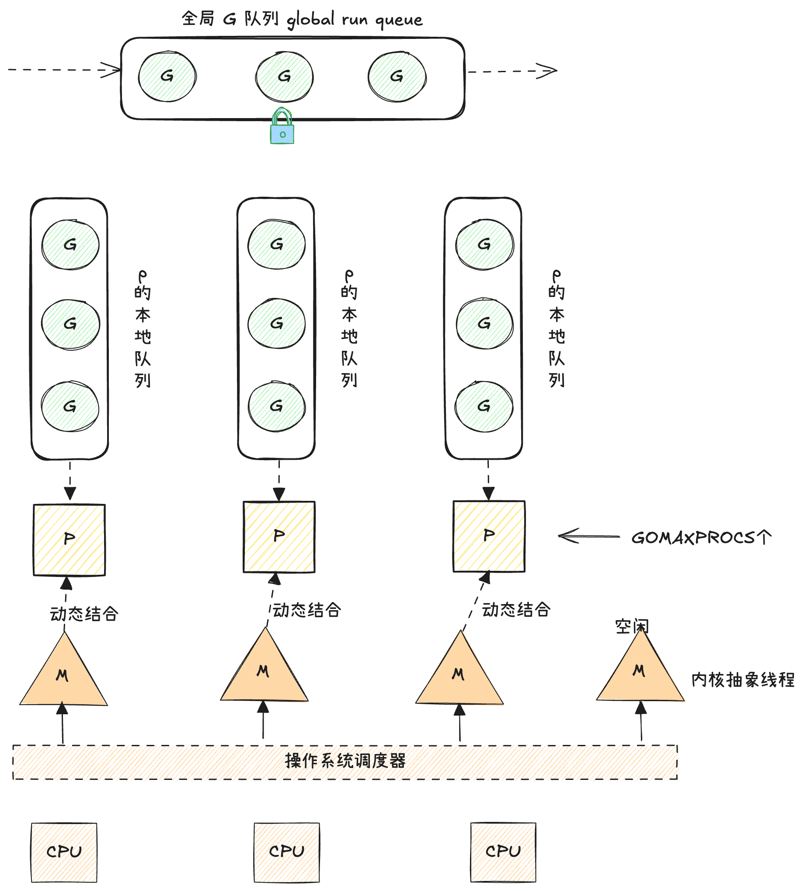
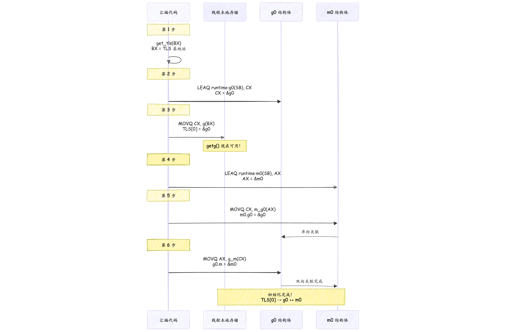
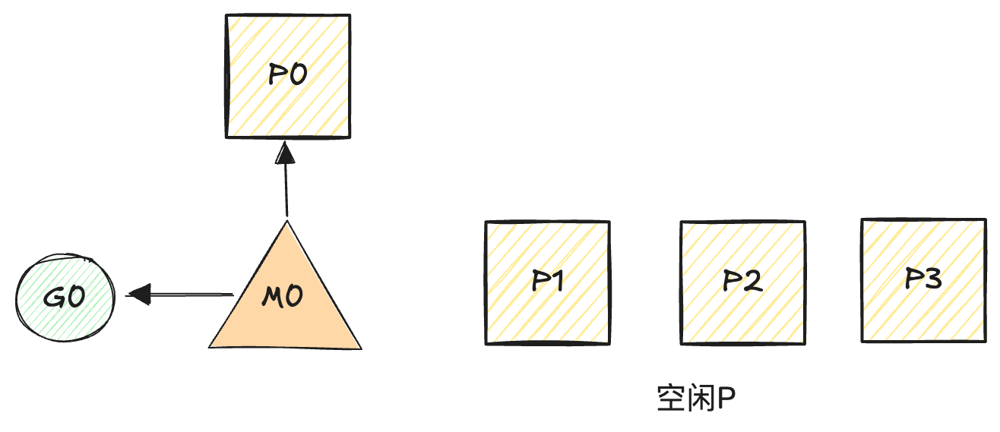
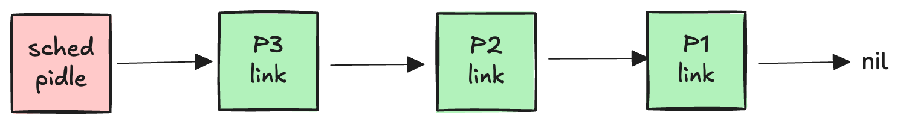
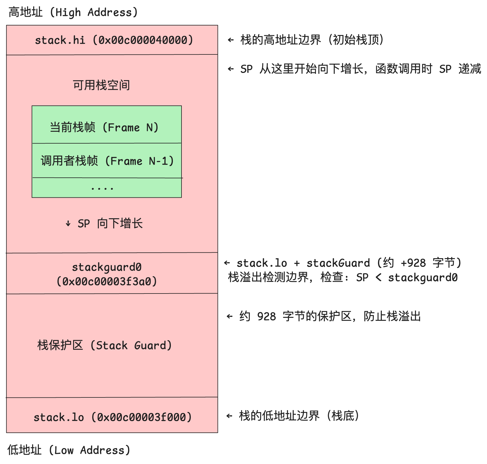
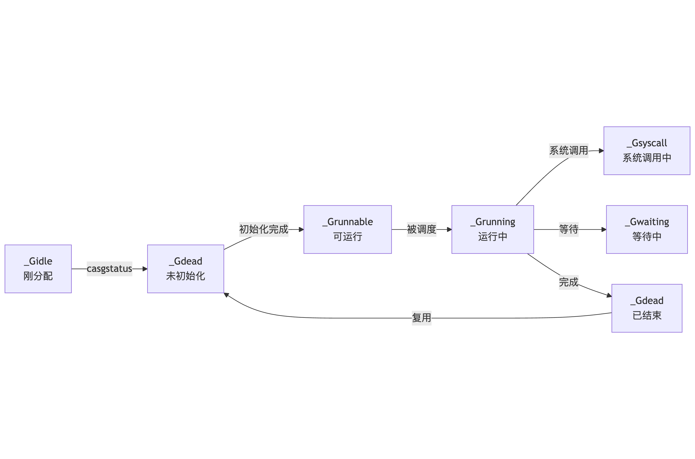
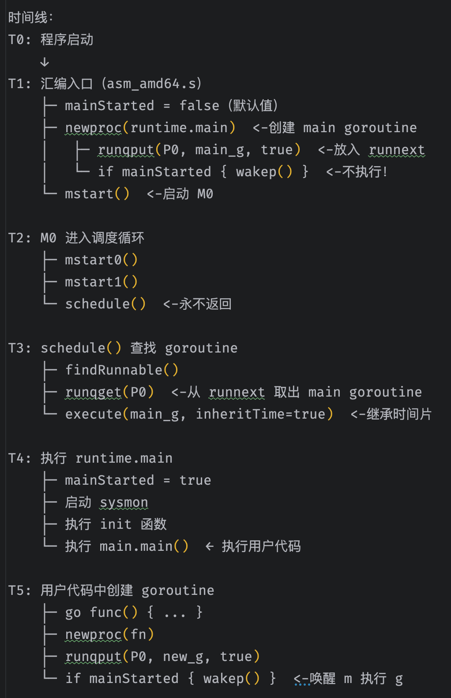

# GMP调度模型


从底层源码角度看 golang 的 GMP 调度模型
## 1、基础概念

### 1.1 进程、线程、协程

进程是由一段静态代码经过编译为二进制可执行程序被加载到内存中经 CPU 按顺序执行的一个程序。

线程是进程中的一个执行流程，多个线程之间共享代码段、数据段、打开的文件等资源，但每个线程各自都有一套独立的寄存器和栈，以此来保证其控制流的独立性

协程是用户态线程，是用户程序对对线程概念的二次封装，和线程为多对一关系，在逻辑意义上属于更细粒度的调度单元，其`调度过程由用户态闭环完成`，无需内核介入

go 语言中的协程是 goroutine，能够与 M、P动态结合，体积只有几 KB，栈空间支持动态扩缩。


### 1.2 GMP架构




**G**

goroutine，是 golang 中对协程的抽象；有自己的运行栈、生命周期状态、以及执行的任务函数（用户通过 go func 指定）；需要绑定在 m 上执行。


**M**

machine，是 golang 中对线程的抽象；跟 p 结合，它的运行目标始终在 g0 和 g 之间，当运行 g0 时执行的是 m 的调度流程，负责寻找合适的“任务”，也就是 g；当运行 g 时，执行的是 m 获取到的”任务“，也就是用户通过 go func 启动的 goroutine，不断交替运行任务：寻找任务（执行g0）；执行任务（执行g）

m 维护在一个 m 列表中，操作系统分配给当前 go 程序的线程数，m 的数目可以配置，空闲的 m 会回收或睡眠，有 m 阻塞时，会创建新的 m，因此其数目是动态的。


**P**

processor，是 golang 中的调度器，m 需要与 p 绑定后，才会进入到 gmp 调度模式当中；因此 p 的数量决定了 g 最大并行数量（通过 GOMAXPROCS 进行设定），p 是 g 的存储容器，其自带一个本地 g 队列，承载着等待被调度的 g

p 维护在一个 p 列表中，最大数目由 GOMAXPROCS 决定，可通过环境变量或 runtime 设置


如果将 GMP 看作一个任务管理系统：G 是任务，M 是运行任务的 work，P 是任务系统的中枢，跟 m 绑定开始寻找并运行 g，同时还是存储任务的容器

承载 G 的容器分为两部分：

- `p 的本地队列 lrq（local run queue）`：这是每个 p 私有的 g 队列，通常由 p 自行访问，并发竞争情况较少，因此设计为无锁化结构，通过 CAS（compare-and-swap）操作访问

- `全局队列 grq（global run queue）`：是全局调度模块 schedt 中的全局共享 g 队列，作为当某个 lrq 不满足条件时的备用容器，因为不同的 m 都可能访问 grq，因此并发竞争比较激烈，访问前需要加全局锁

将 g 放入容器和取出容器的流程设计：

- put g：当某个 g 中通过 go func(){...} 操作创建子 g 时，会先尝试将子 g 添加到当前所在 p 的 lrq 中（无锁化）；如果 lrq 满了，则会将 g 追加到 grq 中（全局锁）。

- get g：gmp 调度流程中，m 和 p 结合后，运行的 g0 会不断寻找合适的 g 用于执行，此时会采取`“负载均衡”`的思路，遵循如下实施步骤：

  - 优先从当前 p 的 lrq 中获取 g（无锁化-CAS）,在 g0 每经过 61 次调度循环后，下一次在处理 lrq 前优先处理一次 grq，避免因 lrq 过于忙碌而致使 grq 陷入饥荒状态

  - 从全局的 grq 中获取 g（全局锁）

  - 取 io 就绪的 g（netpoll 机制）

  - 从其他 p 的 lrq 中窃取 g（无锁化-CAS）


全局唯一的一个 m0，就是进程的主线程，拉起 main 函数这个 groutine。

每个 m 都有一个 g0，g0 仅负责调度 g 到 m 上运行，完成一个 g 到另一个 g 的切换。

**M 的自旋状态**：创建新的 G 时，运行的 G 会尝试唤醒其他空闲的 M 绑定 P 去执行，如果 G2 唤醒了M2，M2 绑定了一个 P2，会先运行 M2 的 G0，这时 M2 没有从 P2 的本地队列中找到 G，会进入自旋状态（spinning），自旋状态的 M2 会尝试从全局空闲线程队列里面获取 G，放到 P2 本地队列去执行，获取的数量满足公式：n = min(len(globrunqsize)/GOMAXPROCS + 1, len(localrunsize/2))，含义是每个P应该从全局队列承担的 G 数量，为了提高效率，不能太多，要给其他 P 留点；

**G 发生系统调用时**：如果 G 发生系统调度进入阻塞，其所在的 M 也会阻塞，因为会进入内核状态等待系统资源，和 M 绑定的 P 会寻找空闲的 M 执行，这是为了提高效率，不能让 P 本地队列的 G 因所在 M 进入阻塞状态而无法执行；需要说明的是，如果是 M 上的 G 进入 Channel 阻塞，则该 M 不会一起进入阻塞，因为 Channel 数据传输涉及内存拷贝，不涉及系统资源等待；

**G 退出系统调用时**：如果刚才进入系统调用的 G2 解除了阻塞，其所在的 M1 会寻找 P 去执行，优先找原来的 P，发现没有找到，则其上的 G2 会进入全局队列，等其他 M 获取执行，M1 进入空闲队列；


## 2、go程序入口

查找程序的执行入口：

https://zhuanlan.zhihu.com/p/654331129


一个 go 程序真正的入口在 runtime包的 src/runtime/rt0_linux_amd64.s (对 AMD64 架构上的 Linux，其他架构在不同的文件下)

```c
TEXT _rt0_amd64_linux(SB),NOSPLIT,$-8
	JMP	_rt0_amd64(SB)
```

跳转到了 src/runtime/asm_amd64.s 包的 _rt0_amd64 函数：

```c
// _rt0_amd64 is common startup code for most amd64 systems when using
// internal linking. This is the entry point for the program from the
// kernel for an ordinary -buildmode=exe program. The stack holds the
// number of arguments and the C-style argv.
TEXT _rt0_amd64(SB),NOSPLIT,$-8
	MOVQ	0(SP), DI	// argc
	LEAQ	8(SP), SI	// argv
	JMP	runtime·rt0_go(SB)
```

在 asm_amd64.s 中有 runtime·rt0_go 函数的实现：

```c
TEXT runtime·rt0_go(SB),NOSPLIT|NOFRAME|TOPFRAME,$0
	// copy arguments forward on an even stack
	MOVQ	DI, AX		// argc，保存命令行参数
	MOVQ	SI, BX		// argv
	......

	// create istack out of the given (operating system) stack.
	// _cgo_init may update stackguard.
  // 创建初始 goroutine（g0）的栈结构，设置栈边界
	MOVQ	$runtime·g0(SB), DI
	LEAQ	(-64*1024)(SP), BX
	MOVQ	BX, g_stackguard0(DI)
	MOVQ	BX, g_stackguard1(DI)
	MOVQ	BX, (g_stack+stack_lo)(DI)
	MOVQ	SP, (g_stack+stack_hi)(DI)

......
ok:
	// 建立 goroutine（g0）和 machine（m0）的双向关联，g0 是初始 goroutine，m0 是初始 OS 线程，使用操作系统提	 // 供的初始线程栈（通常是主线程栈）
	// set the per-goroutine and per-mach "registers"
	get_tls(BX)
	LEAQ	runtime·g0(SB), CX
	MOVQ	CX, g(BX)
	LEAQ	runtime·m0(SB), AX

	// save m->g0 = g0
	MOVQ	CX, m_g0(AX)
	// save m0 to g0->m
	MOVQ	AX, g_m(CX)

.......
  // 解析命令行参数，操作系统相关初始化，调度器初始化
	MOVL	24(SP), AX		// copy argc
	MOVL	AX, 0(SP)
	MOVQ	32(SP), AX		// copy argv
	MOVQ	AX, 8(SP)
	CALL	runtime·args(SB)
	CALL	runtime·osinit(SB)
	CALL	runtime·schedinit(SB)
	
  // 创建一个新的 goroutine 来运行 runtime.main，runtime.main 最终会调用用户的 main.main()
	// create a new goroutine to start program
	MOVQ	$runtime·mainPC(SB), AX		// entry
	PUSHQ	AX
	CALL	runtime·newproc(SB)
	POPQ	AX

	// start this M，启动调度
	CALL	runtime·mstart(SB)

	CALL	runtime·abort(SB)	// mstart should never return
	RET
```

这个汇编函数主要做了四件事：

- 建立 goroutine（g0）和 machine（m0）的双向关联，g0 是初始 goroutine，m0 是初始 OS 线程，它使用操作系统提供的初始线程栈（通常是主线程栈）

- 通过 runtime 中的 osinit、schedinit 等函数对 GMP 初始化。其中 osinit 主要是获取 CPU 数量，页大小等一些操作系统初始化工作

- 创建一个新的 goroutine 来运行 runtime.main，runtime.main 最终会调用用户的 main.main()，操作系统加载的时候只创建好了主线程，协程还是得用户态的 golang 自己管理，在这里 golang 创建出了自己的第一个协程

- 调用 runtime·mstart 开启调度


### 2.1 m0 和 g0 初始化过程

m0 和 g0 的初始化过程：

```shell
// 建立 goroutine（g0）和 machine（m0）的双向关联，g0 是初始 goroutine，m0 是初始 OS 线程，使用操作系统提	 // 供的初始线程栈（通常是主线程栈）
	// set the per-goroutine and per-mach "registers"
	get_tls(BX)
	LEAQ	runtime·g0(SB), CX   // 将全局变量 g0 的地址加载到 CX 寄存器，此时 CX 指向 g0 结构体
	MOVQ	CX, g(BX)						 //g(BX)宏展开为 0(r)(TLS*1)，即将 CX (g0 的地址)存储到 TLS 的第一个槽位
	LEAQ	runtime·m0(SB), AX   // 将全局变量 m0 的地址加载到 AX 寄存器

	// save m->g0 = g0
	MOVQ	CX, m_g0(AX)
	// save m0 to g0->m
	MOVQ	AX, g_m(CX)
```

get_tls(BX):将 TLS 基地址加载到 BX 寄存器，TLS 代表当前线程的线程本地存储区域的基地址。

```shell
// get_tls(r) 在 go_tls.h 中定义

#ifdef GOARCH_amd64
#define	get_tls(r)	MOVQ TLS, r
#define	g(r)	0(r)(TLS*1)
#endif
```

将全局变量 g0 的地址加载到 CX 寄存器，此时 CX 指向 g0 结构体

```shell
LEAQ	runtime·g0(SB), CX
```

g(BX)函数展开为 0(r)(TLS*1)，即将 CX (g0 的地址)存储到 TLS 的第一个槽位,从此刻起，getg() 函数就能工作了

```shell
MOVQ	CX, g(BX)

--------------------
// getg()的定义如下
// getg returns the pointer to the current g.
// The compiler rewrites calls to this function into instructions
// that fetch the g directly (from TLS or from the dedicated register).
func getg() *g
```

将全局变量 m0 的地址加载到 AX 寄存器

```shell
LEAQ	runtime·m0(SB), AX
```

此时的寄存器状态：

```shell
BX = TLS 基地址
CX = &g0
AX = &m0
```

m->g0 = g0

```shell
MOVQ	CX, m_g0(AX)
```

g0->m = m0

```shell
MOVQ	AX, g_m(CX)
```

完成 m0 和 g0 的相互引用，通过 TLS，能够快速访问 GMP 的调度链

┌─────────────────────────────────────┐
│  当前线程（M）                        │
├─────────────────────────────────────┤
│  TLS[0] → 当前 G                     │
│           ↓                          │
│           g.m → 当前 M               │
│                 ↓                    │
│                 m.p → 当前 P         │
│                       ↓              │
│                       p.runq → G队列 │
└─────────────────────────────────────┘





使用 TLS 的好处：

1、通过 TLS，getg() 可以在几个 CPU 周期内完成，无需函数调用开销。

2、支持多线程每个操作系统线程（M）都有自己的 TLS：M1 的 TLS[0] 指向它当前运行的 G；M2 的 TLS[0] 指向它当前运行的 G。互不干扰，无需加锁。

3、架构无关的抽象：不同操作系统和 CPU 架构的 TLS 实现不同，通过 get_tls 宏和 g(r) 宏抽象了这些差异。


### 2.2 schedinit()调度系统初始化


schedinit() 函数对调度系统进行初始化，位于 runtime/proc.go 下，它负责初始化整个 Go 运行时环境

```go
var (
	m0           m	// m0 作为全局变量静态分配
	g0           g  // m0 和 g0 是全局变量，在程序启动时就已经存在于数据段（.data 或 .bss 段）
	mcache0      *mcache
	raceprocctx0 uintptr
	raceFiniLock mutex
)


// The bootstrap sequence is: 启动顺序
//
//	call osinit
//	call schedinit
//	make & queue new G
//	call runtime·mstart
//
// The new G calls runtime·main.
func schedinit() {
	lockInit(&sched.lock, lockRankSched)
	lockInit(&sched.deferlock, lockRankDefer)
	lockInit(&sched.sudoglock, lockRankSudog)
	lockInit(&deadlock, lockRankDeadlock)
	lockInit(&paniclk, lockRankPanic)
	lockInit(&allglock, lockRankAllg)
	lockInit(&allpLock, lockRankAllp)
	lockInit(&reflectOffs.lock, lockRankReflectOffs)
	traceLockInit()
  ......

	gp := getg()
	
  // 设置最大线程数为 10000，即 M 的最大数目
	sched.maxmcount = 10000
	crashFD.Store(^uintptr(0))

	// The world starts stopped.
	worldStopped()

	ticks.init() // run as early as possible,用于性能分析和调度决策，需尽早运行
	stackinit()		// 栈初始化
	randinit() // must run before mallocinit, alginit, mcommoninit，随机数初始化
	mallocinit() // 内存分配器初始化
	cpuinit(godebug) // must run before alginit
	alginit()        // maps, hash, rand must not be used before this call，算法初始化（map、hash等）
	mcommoninit(gp.m, -1)  // 初始化当前的操作系统线程（M0，即主线程）。
	stkobjinit()    // must run before GC starts，栈对象初始化


  goargs()           // 处理命令行参数
  goenvs()           // 处理环境变量
  gcinit()           // GC初始化

	// Allocate stack space that can be used when crashing due to bad stack
	// conditions, e.g. morestack on g0.
  // 预分配 16KB 栈空间用于崩溃处理，如：当栈溢出或其他严重错误时，使用这个栈来输出错误信息
  // stackguard 栈保护边界，用于检测栈溢出
	gcrash.stack = stackalloc(16384)
	gcrash.stackguard0 = gcrash.stack.lo + 1000
	gcrash.stackguard1 = gcrash.stack.lo + 1000

	lock(&sched.lock)
  // GOMAXPROCS 变量设置，如果未设置，使用 CPU 核心数
	var procs int32
	if n, ok := strconv.Atoi32(gogetenv("GOMAXPROCS")); ok && n > 0 {
		procs = n
		sched.customGOMAXPROCS = true
	} else {
		// Use numCPUStartup for initial GOMAXPROCS for two reasons:
		//
		// 1. We just computed it in osinit, recomputing is (minorly) wasteful.
		//
		// 2. More importantly, if debug.containermaxprocs == 0 &&
		//    debug.updatemaxprocs == 0, we want to guarantee that
		//    runtime.GOMAXPROCS(0) always equals runtime.NumCPU (which is
		//    just numCPUStartup).
		procs = defaultGOMAXPROCS(numCPUStartup)
	}
  // 调用 procresize 调整 P（处理器）
	if procresize(procs) != nil {
		throw("unknown runnable goroutine during bootstrap")
	}
	unlock(&sched.lock)

	// World is effectively started now, as P's can run. 标记运行时已启动，P 可以开始运行
	worldStarted()
	......
}
```

P 的数量取决于当前 cpu 的数量，或者是 runtime.GOMAXPROCS 的配置。

几个重点：

1. mallocinit()：内存分配器，初始化 mcache（每个 P 的本地缓存），分三级mcache、mcentral（中心缓存）、mheap（全局堆），在此之前不能进行堆内存分配
2. mcommoninit(gp.m, -1)：完善初始化当前 M（M0，主线程），将 M 加入全局 M 列表。前面 M0 已经存在：作为全局变量静态分配且在 rt0_go 汇编中与 g0 建立了关联，g0 和 m0 不是通过 malloc 动态分配的，而是编译时就分配好的静态内存，解决了“鸡生蛋”问题（在内存分配器初始化之前，我们需要一个 M 和 G 来运行初始化代码）
3. gcinit()：初始化垃圾回收器的数据结构、工作线程、写屏障等
4. GOMAXPROCS 初始化
5. procresize(procs): 调整 P 的数目和 P 处理器的初始化。


重点看下`procresize(procs)`:

```go
var allp []*p

// Change number of processors.
//
// sched.lock must be held, and the world must be stopped.
//
// gcworkbufs must not be being modified by either the GC or the write barrier
// code, so the GC must not be running if the number of Ps actually changes.
//
// Returns list of Ps with local work, they need to be scheduled by the caller.
func procresize(nprocs int32) *p {
	assertLockHeld(&sched.lock)
	assertWorldStopped()

	......
  old := gomaxprocs
	// Grow allp if necessary.
	if nprocs > int32(len(allp)) {
		lock(&allpLock)
		if nprocs <= int32(cap(allp)) {
			allp = allp[:nprocs]
		} else {
			nallp := make([]*p, nprocs)
			copy(nallp, allp[:cap(allp)])
			allp = nallp
		}
		unlock(&allpLock)
	}

	// initialize new P's
	for i := old; i < nprocs; i++ {
		pp := allp[i]
		if pp == nil {
			pp = new(p)
		}
		pp.init(i)  // 设置id，初始化mcahe，设置状态为_Pgcstop
		atomicstorep(unsafe.Pointer(&allp[i]), unsafe.Pointer(pp))
	}

	gp := getg()
	if gp.m.p != 0 && gp.m.p.ptr().id < nprocs {
		// continue to use the current P
		gp.m.p.ptr().status = _Prunning
		gp.m.p.ptr().mcache.prepareForSweep()
	} else {
		// release the current P and acquire allp[0].
		//
		// We must do this before destroying our current P
		// because p.destroy itself has write barriers, so we
		// need to do that from a valid P.
		if gp.m.p != 0 {
			gp.m.p.ptr().m = 0
		}
		gp.m.p = 0
		pp := allp[0]		// 取第一个P
		pp.m = 0
		pp.status = _Pidle
		acquirep(pp)
	}

	// g.m.p is now set, so we no longer need mcache0 for bootstrapping.
	mcache0 = nil

	// release resources from unused P's
	for i := nprocs; i < old; i++ {
		pp := allp[i]
		pp.destroy()
		// can't free P itself because it can be referenced by an M in syscall
	}

	// Trim allp.
	if int32(len(allp)) != nprocs {
		lock(&allpLock)
		allp = allp[:nprocs]
		idlepMask = idlepMask[:maskWords]
		timerpMask = timerpMask[:maskWords]
		unlock(&allpLock)
	}
	
  // id 大于nprocs的 P 都不返回了
	var runnablePs *p
	for i := nprocs - 1; i >= 0; i-- {
		pp := allp[i]
		if gp.m.p.ptr() == pp {
			continue
		}
		pp.status = _Pidle
		if runqempty(pp) {
			pidleput(pp, now)
		} else {
			pp.m.set(mget())
			pp.link.set(runnablePs)
			runnablePs = pp
		}
	}
	stealOrder.reset(uint32(nprocs))  // 更新窃取其他 P 本地队列的 order
	var int32p *int32 = &gomaxprocs // make compiler check that gomaxprocs is an int32
	atomic.Store((*uint32)(unsafe.Pointer(int32p)), uint32(nprocs))

	return runnablePs  // 返回可用的 P 链表头指针
}

func wirep(pp *p) {
	gp := getg()

	if gp.m.p != 0 {
		systemstack(func() {
			throw("wirep: already in go")
		})
	}
	if pp.m != 0 || pp.status != _Pidle {
		systemstack(func() {
			id := int64(0)
			if pp.m != 0 {
				id = pp.m.ptr().id
			}
			print("wirep: p->m=", pp.m, "(", id, ") p->status=", pp.status, "\n")
			throw("wirep: invalid p state")
		})
	}
	gp.m.p.set(pp)  // 当前 m 关联 p
	pp.m.set(gp.m)  // p 关联当前 m
	pp.status = _Prunning
}

// 乐观无锁+双重检查判队列是否为空，for循环不会一直进行下去:1、时间窗口极窄，三条原子操作只有几纳秒；2、runqtail有限次变化（p的本地队列长度有限，256），单个 P 每秒最多处理 数百万次 队列操作，但在 5 纳秒的窗口内，最多只能发生 1-2 次 修改
// runqempty reports whether pp has no Gs on its local run queue.
// It never returns true spuriously.
func runqempty(pp *p) bool {
	// Defend against a race where 1) pp has G1 in runqnext but runqhead == runqtail,
	// 2) runqput on pp kicks G1 to the runq, 3) runqget on pp empties runqnext.
	// Simply observing that runqhead == runqtail and then observing that runqnext == nil
	// does not mean the queue is empty.
	for {
		head := atomic.Load(&pp.runqhead)
		tail := atomic.Load(&pp.runqtail)
		runnext := atomic.Loaduintptr((*uintptr)(unsafe.Pointer(&pp.runnext)))
		if tail == atomic.Load(&pp.runqtail) {
			return head == tail && runnext == 0
		}
	}
}

func pidleput(pp *p, now int64) int64 {
	assertLockHeld(&sched.lock)

	if !runqempty(pp) {
		throw("pidleput: P has non-empty run queue")
	}
	if now == 0 {
		now = nanotime()
	}
	if pp.timers.len.Load() == 0 {
		timerpMask.clear(pp.id)
	}
	idlepMask.set(pp.id)
	pp.link = sched.pidle
	sched.pidle.set(pp)
	sched.npidle.Add(1)
	if !pp.limiterEvent.start(limiterEventIdle, now) {
		throw("must be able to track idle limiter event")
	}
	return now
}
```

执行完 acquirep(pp) 后此时 m0 与 g0，p0 的关系就建立起来了。



此后，构建 p 的空闲单向链表，更新 sched 结构体的空闲 p 链表头节点指针和空闲的 p 数目。其中 sched.pidle：全局唯一的链表头指针，存储在调度器结构体中；p.link：每个 P 结构体内部的字段，用于串联成链表，使用头插法（LIFO - 后进先出），这样头插法和头取出都是 O(1) 时间复杂度，且不需要尾指针。





### 2.3 创建 main goroutine

```c
	// 创建一个新的 goroutine 来运行 runtime.main，runtime.main 最终会调用用户的 main.main()
	// create a new goroutine to start program
	MOVQ	$runtime·mainPC(SB), AX		// runtime·mainPC 是一个全局变量，存储了 runtime.main 函数的地址
	PUSHQ	AX												// 将 mainPC 压栈作为参数
	CALL	runtime·newproc(SB)
	POPQ	AX

    
// mainPC is a function value for runtime.main, to be passed to newproc.
// The reference to runtime.main is made via ABIInternal, since the
// actual function (not the ABI0 wrapper) is needed by newproc.
DATA	runtime·mainPC+0(SB)/8,$runtime·main<ABIInternal>(SB)
GLOBL	runtime·mainPC(SB),RODATA,$8
    
等价于：
// 只读全局变量，存储 runtime.main 函数的地址
var mainPC = (*funcval)(unsafe.Pointer(&runtime.main))
```


调用 newproc()，当写 go func() 时，编译器会将其转换为对 newproc 的调用。

```go
// Create a new g running fn.
// Put it on the queue of g's waiting to run.
// The compiler turns a go statement into a call to this.
func newproc(fn *funcval) {
	gp := getg()
	pc := sys.GetCallerPC()
	systemstack(func() {
		newg := newproc1(fn, gp, pc, false, waitReasonZero)

		pp := getg().m.p.ptr()
		runqput(pp, newg, true)

		if mainStarted {
			wakep()
		}
	})
}
```

#### 2.3.1 systemstack切换g0栈

systemstack()，切换系统栈，保存当前 goroutine 的上下文，如果已经在 g0 或 gsignal 上，则直接执行，否则切换到 g0 栈，执行传入的函数，执行完毕后恢复原来的 goroutine 上下文。

```go
// systemstack runs fn on a system stack.
// If systemstack is called from the per-OS-thread (g0) stack, or
// if systemstack is called from the signal handling (gsignal) stack,
// systemstack calls fn directly and returns.
// Otherwise, systemstack is being called from the limited stack
// of an ordinary goroutine. In this case, systemstack switches
// to the per-OS-thread stack, calls fn, and switches back.
// It is common to use a func literal as the argument, in order
// to share inputs and outputs with the code around the call
// to system stack:
//
//	... set up y ...
//	systemstack(func() {
//		x = bigcall(y)
//	})
//	... use x ...
//
//go:noescape
func systemstack(fn func())
```

系统栈（g0 栈）上执行，空间更大，不会栈增长，避免在用户 goroutine 栈上执行可能因为栈增长的操作，导致的递归问题；不会触发 GC 扫描（g0 的栈不需要扫描），安全地操作 schd 调度器数据结构，不会被抢占，为 runtime 提供了一个稳定、安全、高效的执行环境。


#### 2.3.2 新建一个 goroutine

```go
// Create a new g in state _Grunnable (or _Gwaiting if parked is true), starting at fn.
// callerpc is the address of the go statement that created this. The caller is responsible
// for adding the new g to the scheduler. If parked is true, waitreason must be non-zero.
func newproc1(fn *funcval, callergp *g, callerpc uintptr, parked bool, waitreason waitReason) *g {
  // 防止创建一个没有执行函数的 goroutine，var f func() 和 go f() 等会触发 fatal error
	if fn == nil {
		fatal("go of nil func value")
	}

	mp := acquirem() // disable preemption because we hold M and P in local vars.
	pp := mp.p.ptr()
	newg := gfget(pp)
	if newg == nil {
		newg = malg(stackMin)
		casgstatus(newg, _Gidle, _Gdead)
		allgadd(newg) // publishes with a g->status of Gdead so GC scanner doesn't look at uninitialized stack.
	}
	if newg.stack.hi == 0 {
		throw("newproc1: newg missing stack")
	}

	if readgstatus(newg) != _Gdead {
		throw("newproc1: new g is not Gdead")
	}
	// g结构体的各个字段值的赋值
	totalSize := uintptr(4*goarch.PtrSize + sys.MinFrameSize)
	totalSize = alignUp(totalSize, sys.StackAlign)
	sp := newg.stack.hi - totalSize
	memclrNoHeapPointers(unsafe.Pointer(&newg.sched), unsafe.Sizeof(newg.sched))
	newg.sched.sp = sp
	newg.stktopsp = sp
	newg.sched.pc = abi.FuncPCABI0(goexit) + sys.PCQuantum
	newg.sched.g = guintptr(unsafe.Pointer(newg))
	gostartcallfn(&newg.sched, fn)
	newg.parentGoid = callergp.goid
	newg.gopc = callerpc
	newg.ancestors = saveAncestors(callergp)
	newg.startpc = fn.fn

	var status uint32 = _Grunnable
	if parked {
		status = _Gwaiting
		newg.waitreason = waitreason
	}
	newg.goid = pp.goidcache
	casgstatus(newg, _Gdead, status)
	
	
	releasem(mp)

	return newg
}
```

参数说明：

- fn *funcval：要执行的函数（包含函数指针和闭包变量）
- gp *g：父 goroutine（当前 goroutine）
- pc uintptr：调用者的 PC（创建位置），即 go 语句的位置
- false：parked 参数，表示新 goroutine 不是处于等待状态
- waitReasonZero：等待原因（这里为0，因为不等待）


Part 1:

禁止当前 m 被抢占，绑定 m 和 p，从 p 的本地队列中获取空闲的 g，若没有则从全局队列中批量获取空闲的 g，仍然没有则创建一个 g，并分配栈空间，标记状态为 `_Gdead`，并添加到 allgs 中（全局变量，维持着所有的 g 数组，主要用来统计）

```go
mp := acquirem() // disable preemption because we hold M and P in local vars.
pp := mp.p.ptr()
newg := gfget(pp)
if newg == nil {
  newg = malg(stackMin)
  casgstatus(newg, _Gidle, _Gdead) // 切换状态
  allgadd(newg)	// 添加到全局数组 allgs    []*g
}
if newg.stack.hi == 0 {
  throw("newproc1: newg missing stack")
}

if readgstatus(newg) != _Gdead {
  throw("newproc1: new g is not Gdead")
}

//go:nosplit
func acquirem() *m {
	gp := getg()
	gp.m.locks++  // 绑定 m 与 p，禁止抢占
	return gp.m
}
```


gfget 获取 g：

- 优先从 pp.gFree.pop() 获取空闲的 g

- retry 循环中不断从获取 sched.gFree 全局队列中获取空闲的 g，获取时优先获取那些已经分配了栈空间的 g
- 为 g 分配栈空间，若已分配则判断其栈空间大小是否与起始栈空间大小一致，不一致则重新分配。

```go
// Get from gfree list.
// If local list is empty, grab a batch from global list.
func gfget(pp *p) *g {
retry:
	if pp.gFree.empty() && (!sched.gFree.stack.empty() || !sched.gFree.noStack.empty()) {
		lock(&sched.gFree.lock)
		// Move a batch of free Gs to the P.
		for pp.gFree.size < 32 {
			// 优先获取那些已经分配了栈空间的 g
			gp := sched.gFree.stack.pop()
			if gp == nil {
				gp = sched.gFree.noStack.pop()
				if gp == nil {
					break
				}
			}
			pp.gFree.push(gp)
		}
		unlock(&sched.gFree.lock)
		goto retry
	}
	gp := pp.gFree.pop()
	if gp == nil {
		return nil
	}
  // 如果 g 已经分配了栈空间，并且栈空间大小不等于起始栈空间大小，需要重新分配，确保每个新使用的 g的栈空间都是从 startingStackSize（2KB，该值可设置调整） 开始
	if gp.stack.lo != 0 && gp.stack.hi-gp.stack.lo != uintptr(startingStackSize) {
		systemstack(func() {
			stackfree(gp.stack)
			gp.stack.lo = 0
			gp.stack.hi = 0
			gp.stackguard0 = 0
		})
	}
	if gp.stack.lo == 0 {
		// Stack was deallocated in gfput or just above. Allocate a new one.
		systemstack(func() {
			gp.stack = stackalloc(startingStackSize)
		})
		gp.stackguard0 = gp.stack.lo + stackGuard
	}
	return gp
}
```

malg(stackMin)，p 本地队列和全局队列都没有空闲的 g 时，则新建 g

```go
// Allocate a new g, with a stack big enough for stacksize bytes.
func malg(stacksize int32) *g {
	newg := new(g)
	if stacksize >= 0 {
		stacksize = round2(stackSystem + stacksize)  // 按2的指数向上取整
		systemstack(func() {
			newg.stack = stackalloc(uint32(stacksize))
		})
		newg.stackguard0 = newg.stack.lo + stackGuard
		newg.stackguard1 = ^uintptr(0)
		// Clear the bottom word of the stack. We record g
		// there on gsignal stack during VDSO on ARM and ARM64.
		*(*uintptr)(unsafe.Pointer(newg.stack.lo)) = 0
	}
	return newg
}
```

Part2: g结构体的各个字段值的赋值


#### 2.3.3 runqput

runqput 函数负责将一个 goroutine (gp) 放入 P (pp) 的本地可运行队列中。有两种放置模式：
普通模式：将 goroutine 放到队列尾部
next 模式：将 goroutine 放到 pp.runnext 槽位（优先执行）

```go
// runqput tries to put g on the local runnable queue.
// If next is false, runqput adds g to the tail of the runnable queue.
// If next is true, runqput puts g in the pp.runnext slot.
// If the run queue is full, runnext puts g on the global queue.
// Executed only by the owner P.
func runqput(pp *p, gp *g, next bool) {
	if !haveSysmon && next {
		// A runnext goroutine shares the same time slice as the
		// current goroutine (inheritTime from runqget). To prevent a
		// ping-pong pair of goroutines from starving all others, we
		// depend on sysmon to preempt "long-running goroutines". That
		// is, any set of goroutines sharing the same time slice.
		//
		// If there is no sysmon, we must avoid runnext entirely or
		// risk starvation.
		next = false
	}

	if next {
	retryNext:
		oldnext := pp.runnext
		if !pp.runnext.cas(oldnext, guintptr(unsafe.Pointer(gp))) {
			goto retryNext
		}
		if oldnext == 0 {
			return
		}
		// Kick the old runnext out to the regular run queue.
		gp = oldnext.ptr()
	}

retry:
	h := atomic.LoadAcq(&pp.runqhead) // load-acquire, synchronize with consumers
	t := pp.runqtail
	if t-h < uint32(len(pp.runq)) {
		pp.runq[t%uint32(len(pp.runq))].set(gp)
		atomic.StoreRel(&pp.runqtail, t+1) // store-release, makes the item available for consumption
		return
	}
	if runqputslow(pp, gp, h, t) {
		return
	}
	goto retry
}
```

如果本地队列已经放满了，那么就往全局队列中放。即调用 `runqputslow`，这里会将 p 一半的本地队列和当前 goroutine 批量转移到全局队列，批量操作，操作全局队列需要加锁。全局队列按照链表串联起来，无限容量，有锁，起一个兜底作用。


### 2.4 启动 GMP 调度循环

整体流程：


汇编：

```c
// start this M，启动调度
	CALL	runtime·mstart(SB)
    
TEXT runtime·mstart(SB),NOSPLIT|TOPFRAME|NOFRAME,$0
	CALL	runtime·mstart0(SB)
	RET // not reached
```

在 runtime 中调用 mstart0，mstart0 中调用 mstart1，它的实现在 proc.go 中：

```go
func mstart1() {
	gp := getg()

	if gp != gp.m.g0 {
		throw("bad runtime·mstart")
	}
  // 保存返回点，执行完后需要回到调用方的下一条语句上继续执行
	gp.sched.g = guintptr(unsafe.Pointer(gp))
	gp.sched.pc = sys.GetCallerPC()
	gp.sched.sp = sys.GetCallerSP()	
	
  // 如果当前 m 不等于 m0，则需要绑定一个 p
	if gp.m != &m0 {
		acquirep(gp.m.nextp.ptr())
		gp.m.nextp = 0
	}
	schedule()
}
```

schedule()：开启GMP调度，不在返回，循环执行下去

```go
// One round of scheduler: find a runnable goroutine and execute it.
// Never returns.
func schedule() {
	mp := getg().m

	// 省略其他代码......

top:
	pp := mp.p.ptr()
	pp.preempt = false

	// Safety check: if we are spinning, the run queue should be empty.
	// Check this before calling checkTimers, as that might call
	// goready to put a ready goroutine on the local run queue.
	if mp.spinning && (pp.runnext != 0 || pp.runqhead != pp.runqtail) {
		throw("schedule: spinning with local work")
	}
	// 找到一个可执行的goroutine
	gp, inheritTime, tryWakeP := findRunnable() // blocks until work is available

	// 解除M自旋
	if mp.spinning {
		resetspinning()
	}

	// If about to schedule a not-normal goroutine (a GCworker or tracereader),
	// wake a P if there is one.
	if tryWakeP {
		wakep()
	}
	// 执行 goroutine
	execute(gp, inheritTime)
}
```

#### 2.4.1 findRunnable()

函数返回值，分别代表：

- gp：找到的 goroutine
- inheritTime：是否继承时间片
- tryWakeP：是否需要唤醒其他 P

findRunnable() 查找顺序：

1. 清理和初始化
   ├─ 清除 allp 快照
   ├─ 检查 GC 等待 → gcstopm() → goto top
   ├─ 检查安全点函数 → runSafePointFn()
   └─ 检查定时器

2. 特殊 goroutine（优先级最高）
   ├─ Trace reader (tryWakeP=true)
   └─ GC worker (tryWakeP=true)

3. 全局队列公平性检查（每 61 次）
   └─ schedtick % 61 == 0 → globrunqget()

4. 唤醒特殊 goroutine
   ├─ Finalizer goroutine
   └─ GC cleanup goroutine

5. 本地队列（快速路径）
   └─ runqget(pp) → 优先检查 runnext

6. 全局队列（批量获取）
   └─ globrunqgetbatch() → 获取一半到本地队列

7. 网络轮询（非阻塞）
   └─ netpoll(0) → 检查就绪的网络 I/O

8. 工作窃取
   └─ stealWork() → 从其他 P 窃取

9. 空闲 GC 标记
   └─ 如果有 GC 工作，运行空闲标记

10. 准备休眠
    ├─ 释放 P
    ├─ 再次检查所有队列
    ├─ 网络轮询（阻塞）
    └─ stopm() → 休眠 M


```go
func findRunnable() (gp *g, inheritTime, tryWakeP bool) {
	mp := getg().m
top:
  // 获取 p
	pp := mp.p.ptr()
	if sched.gcwaiting.Load() {
		gcstopm()
		goto top
	}
  if gcBlackenEnabled != 0 {
		gp, tnow := gcController.findRunnableGCWorker(pp, now)
		if gp != nil {
			return gp, false, true
		}
		now = tnow
	}
  // 每 61 次调度，需要尝试处理一次全局队列 (防止饥饿)
	if pp.schedtick%61 == 0 && !sched.runq.empty() {
		lock(&sched.lock)
		gp := globrunqget()
		unlock(&sched.lock)
		if gp != nil {
			return gp, false, false
		}
	}
  
  // local runq
	if gp, inheritTime := runqget(pp); gp != nil {
		return gp, inheritTime, false
	}

	// global runq
	if !sched.runq.empty() {
		lock(&sched.lock)
		gp, q := globrunqgetbatch(int32(len(pp.runq)) / 2)
		unlock(&sched.lock)
		if gp != nil {
			if runqputbatch(pp, &q); !q.empty() {
				throw("Couldn't put Gs into empty local runq")
			}
			return gp, false, false
		}
	}
  
  // 从网络就绪io中读取，netpoll，返回io就绪的 g
  if netpollinited() && netpollAnyWaiters() && sched.lastpoll.Load() != 0 && sched.pollingNet.Swap(1) == 0 {
		list, delta := netpoll(0)
		sched.pollingNet.Store(0)
		if !list.empty() { // non-blocking
			gp := list.pop()
			injectglist(&list)
			netpollAdjustWaiters(delta)
			casgstatus(gp, _Gwaiting, _Grunnable)
			return gp, false, false
		}
	}
  
  // Spinning Ms: steal work from other Ps.
	//
	// Limit the number of spinning Ms to half the number of busy Ps.
	// This is necessary to prevent excessive CPU consumption when
	// GOMAXPROCS>>1 but the program parallelism is low.
	if mp.spinning || 2*sched.nmspinning.Load() < gomaxprocs-sched.npidle.Load() {
		if !mp.spinning {
			mp.becomeSpinning()
		}
		// 窃取其他 p 的 g
		gp, inheritTime, tnow, w, newWork := stealWork(now)
		if gp != nil {
			// Successfully stole.
			return gp, inheritTime, false
		}
	}
  .......
  
  // We have nothing to do.
	// 若存在 gc 并发标记任务，做GC标记工作，好过直接回收 p
	// If we're in the GC mark phase, can safely scan and blacken objects,
	// and have work to do, run idle-time marking rather than give up the P. 
	if gcBlackenEnabled != 0 && gcMarkWorkAvailable(pp) && gcController.addIdleMarkWorker() {
		node := (*gcBgMarkWorkerNode)(gcBgMarkWorkerPool.pop())
		if node != nil {
			pp.gcMarkWorkerMode = gcMarkWorkerIdleMode
			gp := node.gp.ptr()
			casgstatus(gp, _Gwaiting, _Grunnable)
			return gp, false, false
		}
		gcController.removeIdleMarkWorker()
	}
  // 加全局锁，并 double check 全局队列是否有 g
	lock(&sched.lock)
	// ...
	if sched.runqsize != 0 {
		gp := globrunqget(_p_, 0)
		unlock(&sched.lock)
		return gp, false, false
	}
  
  // 确认当前 p 无事可做，则将 p 和 m 解绑，并将其添加到全局调度模块 schedt 中的空闲 p 队列 pidle 中 
  if releasep() != pp {
		throw("findrunnable: wrong p")
	}
	now = pidleput(pp, now)
	unlock(&sched.lock)
  ......
  // 走到此处仍然未找到合适的 g 用于调度，则需要将 m block 住，添加到 schedt 的 midle 中
  stopm()
	goto top
}
```

**1、从本地队列lrq获取g**

```go
func runqget(pp *p) (gp *g, inheritTime bool) {
	// If there's a runnext, it's the next G to run.
	next := pp.runnext
	if next != 0 && pp.runnext.cas(next, 0) {
		return next.ptr(), true
	}
	// 尝试基于 cas 操作，获取本地队列头节点中的 g
	for {
		h := atomic.LoadAcq(&pp.runqhead) // load-acquire, synchronize with other consumers
		t := pp.runqtail
    // 头尾相等，说明队列为空
		if t == h {
			return nil, false
		}
    // 取出头节点
		gp := pp.runq[h%uint32(len(pp.runq))].ptr()
    // 通过 cas 操作更新头节点索引
		if atomic.CasRel(&pp.runqhead, h, h+1) { // cas-release, commits consume
			return gp, false
		}
	}
}
```

**2、从全局队列中获取g**

```go
// A gQueue is a dequeue of Gs linked through g.schedlink. A G can only
// be on one gQueue or gList at a time.
type gQueue struct {
	head guintptr
	tail guintptr
	size int32
}

func globrunqgetbatch(n int32) (gp *g, q gQueue) {
	assertLockHeld(&sched.lock)
	// 为空直接返回
	if sched.runq.size == 0 {
		return
	}
	// 据传入的 max 值尝试获取 grq 中的半数 g 填充到 p 的 lrq 中
	n = min(n, sched.runq.size, sched.runq.size/gomaxprocs+1)

	gp = sched.runq.pop()
	n--

	for ; n > 0; n-- {
		gp1 := sched.runq.pop()
		q.pushBack(gp1)
	}
	return
}
// 批量存放到p的本地队列
func runqputbatch(pp *p, q *gQueue) {
	if q.empty() {
		return
	}
	h := atomic.LoadAcq(&pp.runqhead)
	t := pp.runqtail
	n := uint32(0)
	for !q.empty() && t-h < uint32(len(pp.runq)) {
		gp := q.pop()
		pp.runq[t%uint32(len(pp.runq))].set(gp)
		t++
		n++
	}
  // 更新尾节点
	atomic.StoreRel(&pp.runqtail, t)
	return
}
```

**3、获取io就绪的g**

以非阻塞模式下的 epoll_wait 操作获取 io 就绪的 g。 该方法位于 runtime/netpoll_epoll.go，是 Linux 平台上基于 epoll 实现的网络轮询器核心函数

```go
// netpoll checks for ready network connections.
// Returns a list of goroutines that become runnable,
// and a delta to add to netpollWaiters.
// This must never return an empty list with a non-zero delta.
//
// delay < 0: blocks indefinitely 无限期阻塞
// delay == 0: does not block, just polls
// delay > 0: block for up to that many nanoseconds 阻塞纳秒数
func netpoll(delay int64) (gList, int32) {
	.......
	var events [128]linux.EpollEvent
retry:
	n, errno := linux.EpollWait(epfd, events[:], int32(len(events)), waitms)
	......
  // 遍历所有就绪的事件
	var toRun gList
	delta := int32(0)
	for i := int32(0); i < n; i++ {
		ev := events[i]
		if ev.Events == 0 {
			continue
		}

		if *(**uintptr)(unsafe.Pointer(&ev.Data)) == &netpollEventFd {
			if ev.Events != linux.EPOLLIN {
				println("runtime: netpoll: eventfd ready for", ev.Events)
				throw("runtime: netpoll: eventfd ready for something unexpected")
			}
			continue
		}
		// 调用 netpollready 唤醒等待的 goroutine
    if pd.fdseq.Load() == tag {
      pd.setEventErr(ev.Events == linux.EPOLLERR, tag)
      delta += netpollready(&toRun, pd, mode)
    }
		
	}
	return toRun, delta
}
```

**4、从其他p处窃取g**

```go
func stealWork(now int64) (gp *g, inheritTime bool, rnow, pollUntil int64, newWork bool) {
	pp := getg().m.p.ptr()

	const stealTries = 4
	for i := 0; i < stealTries; i++ {
		// 通过随机数以随机起点随机步长选取目标 p 进行窃取，实现方式是stealOrder保存着p的总数count，和与count互质的数，如果 X 和 N 互质，序列 (i + X) % N 会不重复地遍历 0 到 N-1 的所有数字，实现随机性
		for enum := stealOrder.start(cheaprand()); !enum.done(); enum.next() {
			// 获取要窃取的p
			p2 := allp[enum.position()]
			if pp == p2 {
				continue
			}
			// Don't bother to attempt to steal if p2 is idle.
			if !idlepMask.read(enum.position()) {
        // 窃取目标 p2，其中会尝试将目标 p2 lrq 中半数 g 窃取到当前 p 的 lrq 中
				if gp := runqsteal(pp, p2, stealTimersOrRunNextG); gp != nil {
					return gp, false, now, pollUntil, ranTimer
				}
			}
		}
	}
	// 窃取失败
	return nil, false, now, pollUntil, ranTimer
}
```

**5、释放p和m**

```go
func releasep() *p {
	return releasepNoTrace()
}

func releasepNoTrace() *p {
	gp := getg()

	if gp.m.p == 0 {
		throw("releasep: invalid arg")
	}
	pp := gp.m.p.ptr()
	if pp.m.ptr() != gp.m || pp.status != _Prunning {
		print("releasep: m=", gp.m, " m->p=", gp.m.p.ptr(), " p->m=", hex(pp.m), " p->status=", pp.status, "\n")
		throw("releasep: invalid p state")
	}
	gp.m.p = 0
	pp.m = 0
	pp.status = _Pidle
	return pp
}

//go:nowritebarrierrec
func pidleput(pp *p, now int64) int64 {
	assertLockHeld(&sched.lock)
	if !runqempty(pp) {
		throw("pidleput: P has non-empty run queue")
	}
	if now == 0 {
		now = nanotime()
	}
	if pp.timers.len.Load() == 0 {
		timerpMask.clear(pp.id)
	}
	idlepMask.set(pp.id)
	pp.link = sched.pidle
	sched.pidle.set(pp)
	sched.npidle.Add(1)
	return now
}
```


stopm:

```go
// Stops execution of the current m until new work is available.
// Returns with acquired P.
func stopm() {
	gp := getg()

	if gp.m.locks != 0 {
		throw("stopm holding locks")
	}
	if gp.m.p != 0 {
		throw("stopm holding p")
	}
	if gp.m.spinning {
		throw("stopm spinning")
	}

	lock(&sched.lock)
  // 放入schd的全局空闲m队列
	mput(gp.m)
	unlock(&sched.lock)
  // 阻塞m
	mPark()
  // mPark返回后意味着 m 唤醒尝试获取p
	acquirep(gp.m.nextp.ptr())
	gp.m.nextp = 0
}
```


#### 2.4.2 execute

gmp调度的最后一公里，完成从调度器到用户代码的最后一跳

```go
// 执行给定的 g. 当前执行方还是 g0，但会通过 gogo 方法切换至 gp
func execute(gp *g, inheritTime bool) {
  // 获取m
	mp := getg().m

	// Assign gp.m before entering _Grunning so running Gs have an M.
	mp.curg = gp  // 指定当前m运行的g
	gp.m = mp		// g绑定的m
	
  // 切换到运行态
	casgstatus(gp, _Grunnable, _Grunning)

	gp.preempt = false	//清除抢占标识
	gp.stackguard0 = gp.stack.lo + stackGuard	// 设置栈边界
  // 不是继承p的时间片时，调度次数加1
	if !inheritTime {
		mp.p.ptr().schedtick++
	}
	// g0切换至g，运行用户g，通过汇编实现，不会返回了，goroutine 执行完毕后会调用 goexit()，在goexit会再次调用schedule()
	gogo(&gp.sched)
}

// func gogo(buf *gobuf)
// restore state from Gobuf; longjmp
TEXT runtime·gogo(SB), NOSPLIT, $0-8
	MOVQ	buf+0(FP), BX		// BX = gobuf 地址
	MOVQ	gobuf_g(BX), DX	// DX = gp
	MOVQ	0(DX), CX		// make sure g != nil
	JMP	gogo<>(SB)

TEXT gogo<>(SB), NOSPLIT, $0
	get_tls(CX)
	MOVQ	DX, g(CX)	// 设置 TLS 中的 g
	MOVQ	DX, R14		// set the g register
	MOVQ	gobuf_sp(BX), SP	// restore SP 恢复栈指针
	MOVQ	gobuf_ctxt(BX), DX
	MOVQ	gobuf_bp(BX), BP
	MOVQ	$0, gobuf_sp(BX)	// clear to help garbage collector
	MOVQ	$0, gobuf_ctxt(BX)
	MOVQ	$0, gobuf_bp(BX)
	MOVQ	gobuf_pc(BX), BX	// BX = 要跳转的 PC
	JMP	BX
```

用户 g 的一个生命周期大致如下：

```bash
创建 -> _Grunnable -> execute() -> _Grunning -> 用户代码执行 -> goexit() -> goexit0() -> schedule() -> execute(下一个 G)
```


## 3、让渡设计

### 3.1 g执行完后让渡

g 执行完后退出

自动调用 runtime·goexit，进而 runtime·goexit1，在 runtime·goexit1 中通过 `mcall(goexit0) `切换到 g0，调用goexit0

```go
TEXT runtime·goexit(SB),NOSPLIT|TOPFRAME|NOFRAME,$0-0
	BYTE	$0x90	// NOP
	CALL	runtime·goexit1(SB)	// does not return

// goexit continuation on g0.
func goexit0(gp *g) {
	gdestroy(gp)
	schedule()
}
```

```go
func gdestroy(gp *g) {
	mp := getg().m
	pp := mp.p.ptr()
	// 状态切换
	casgstatus(gp, _Grunning, _Gdead)
	
  // 解除 M ↔ G 的关联
	gp.m = nil
	locked := gp.lockedm != 0
	gp.lockedm = 0
	mp.lockedg = 0
  // 清理 goroutine 的各种字段
	gp.preemptStop = false
	gp.paniconfault = false
	gp._defer = nil // should be true already but just in case.
	gp._panic = nil // non-nil for Goexit during panic. points at stack-allocated data.
	gp.writebuf = nil
	gp.waitreason = waitReasonZero
	gp.param = nil
	gp.labels = nil
	gp.timer = nil
	
  // 解除当前 M 和 G 的关联，清除双向指针：M.curg 和 G.m
	dropg()
  // 加入到 p 的本地空闲 gFree队列，当创建新的 goroutine 时（newproc1），会先从空闲列表获取
	gfput(pp, gp)
	
}
```


### 3.2 g主动让渡

g主动让渡指的是由用户手动调用 runtime.Gosched 方法让出 g 所持有的执行权。在 Gosched 方法中，会通过 mcall 指令切换至 g0，并由 g0 执行 gosched_m 方法，其中包含如下步骤：

- 将 g 由 running 改为 runnable 状态
- 解除 g 和 m 的关系
- 将 g 直接添加到全局队列 grq 中
- 调用 schedule 方法发起新一轮调度

```go
// 主动让渡出执行权，此时执行方还是普通 g
func Gosched() {
  // 通过 mcall，将执行方转为 g0，调用 gosched_m 方法
	mcall(gosched_m)
}


// 将 gp 切换回就绪态后添加到全局队列 grq，并发起新一轮调度
// 此时执行方为 g0
func gosched_m(gp *g) {
	// ...
	goschedImpl(gp)
}

func goschedImpl(gp *g) {
  // 将 g 状态由 running 改为 runnable 就绪态
	casgstatus(gp, _Grunning, _Grunnable)
  // 解除 g 和 m 的关系
	dropg()
  // 将 g 添加到全局队列 grq
	lock(&sched.lock)
	globrunqput(gp)
	unlock(&sched.lock)
  // 发起新一轮调度
	schedule()
}
```


### 3.3 g阻塞让渡

G阻塞让渡指的是 g 在执行过程中有需要等待的外部资源，需要进入阻塞等待的状态（waiting），直到条件达成后才能完成将状态重新更新为就绪态（runnable），如：Channel 操作阻塞、Select 语句阻塞、网络 I/O 等待

通过 runtime/proc.go 的 gopark 方法实现：

- 通过 mcall 从 g 切换至 g0，并由 g0 执行 park_m 方法
- g0 将 g 由 running 更新为 waiting 状态，然后发起新一轮调度

```go
// 此时执行方为普通 g
func gopark(unlockf func(*g, unsafe.Pointer) bool, lock unsafe.Pointer, reason waitReason, traceEv byte, traceskip int) {
  // 获取 m 正在执行的 g，也就是要阻塞让渡的 g
  mp := acquirem()
	gp := mp.curg
	.......
  // 通过 mcall，将执行方由普通 g -> g0
	mcall(park_m)
}

// 此时执行方为 g0. 入参 gp 为需要执行 park 的普通 g
func park_m(gp *g) {
  // 获取 m
	mp := getg().m
	// 将 gp 状态由 running 变更为 waiting
	casgstatus(gp, _Grunning, _Gwaiting)
  // 解绑 g 与 m 的关系
	dropg()
	// g0 发起新一轮调度流程
	schedule()
}
```

相反，唤醒 g 的方法是 goready 方法，通过 systemstack 压栈切换至 g0 执行 ready 方法——将目标 g 状态由 waiting 改为 runnable，然后添加到就绪队列中。

```go
// 此时执行方为普通 g. 入参 gp 为需要唤醒的另一个普通 g
func goready(gp *g, traceskip int) {
 // 调用 systemstack 后，会切换至 g0 调用传入的 ready 方法. 调用结束后则会直接切换回到当前普通 g 继续执行. 
	systemstack(func() {
		ready(gp, traceskip, true)
	})
	// 恢复成普通 g 继续执行 ...
}

// 此时执行方为 g0. 入参 gp 为拟唤醒的普通 g
func ready(gp *g, traceskip int, next bool) {
	mp := acquirem()
	casgstatus(gp, _Gwaiting, _Grunnable)
  /*
      1) 优先将目标 g 添加到当前 p 的本地队列 lrq
      2）若 lrq 满了，则将 g 追加到全局队列 grq
  */
	runqput(mp.p.ptr(), gp, next)
  // 如果有 m 或 p 处于 idle 状态，将其唤醒
	wakep()
}
```


## 4、抢占设计

抢占和让渡有相同之处，都表示由 g->g0 的流转过程，但区别在于，让渡是由 g 主动发起的（第一人称），而抢占则是由外力干预（sysmon thread监控线程）发起的（第三人称）。

程序启动创建 main goroutine时，在运行时的 main 函数中，会启动一个全局唯一的监控线程 sysmon thread，定时执行监控工作，包括：

- 从网络轮询中将就绪的 g 放到运行队列
- retake 抢占长时间运行的 Goroutine 和夺回阻塞的 P

```go
func main() {
  mainStarted = true

  if haveSysmon {
      systemstack(func() {
          newm(sysmon, nil, -1)  // 通过newm创建新线程，执行sysmon函数，ID 为 -1，标记为系统线程
      })
  }
}
```

```go
// Always runs without a P, so write barriers are not allowed.
//go:nowritebarrierrec
func sysmon() {
	lock(&sched.lock)
	sched.nmsys++ // 增加系统 M 计数
	unlock(&sched.lock)
  ......

	for {
		// 根据闲忙情况调整轮询间隔，在空闲情况下 10 ms 轮询一次
    if idle == 0 {
        delay = 20  // 开始时睡眠 20 微秒
    } else if idle > 50 {
        delay *= 2  // 1ms 后开始加倍睡眠时间
    }
    if delay > 10*1000 {
        delay = 10 * 1000  // 最多睡眠 10ms
    }
    usleep(delay)
    // 将就绪的网络 goroutine 重新放入运行队列
		// poll network if not polled for more than 10ms
		lastpoll := sched.lastpoll.Load()
		if netpollinited() && lastpoll != 0 && lastpoll+10*1000*1000 < now {
			sched.lastpoll.CompareAndSwap(lastpoll, now)
			list, delta := netpoll(0) // non-blocking - returns list of goroutines
			if !list.empty() {
				incidlelocked(-1)
				injectglist(&list)
				incidlelocked(1)
				netpollAdjustWaiters(delta)
			}
		}
		// 抢占长时间运行的 Goroutine 和夺回阻塞的 P
		// retake P's blocked in syscalls
		// and preempt long running G's
		if retake(now) != 0 {
			idle = 0	// 有工作被抢占，重置空闲计数
		} else {
			idle++
		}
		// check if we need to force a GC
		if t := (gcTrigger{kind: gcTriggerTime, now: now}); t.test() && forcegc.idle.Load() {
			....
		}
		unlock(&sched.sysmonlock)
	}
}
```


下面主要关注 retake：

```go
func retake(now int64) uint32 {
    n := 0
    for i := 0; i < len(allp); i++ {
        pp := allp[i]
        pd := &pp.sysmontick
        s := pp.status
        
        // 情况 1: P 正在运行或在系统调用中
        if s == _Prunning || s == _Psyscall {
            t := int64(pp.schedtick)
            if int64(pd.schedtick) != t {
                // schedtick 变化了，说明有新的 G 在运行
                pd.schedtick = uint32(t)
                pd.schedwhen = now
            } else if pd.schedwhen+forcePreemptNS <= now {
                // 同一个 G 运行超过 10ms，抢占它
                preemptone(pp)
                sysretake = true
            }
        }
        
        // 情况 2: P 在系统调用中
        if s == _Psyscall {
            t := int64(pp.syscalltick)
            if !sysretake && int64(pd.syscalltick) != t {
                pd.syscalltick = uint32(t)
                pd.syscallwhen = now
                continue
            }
            
            // 系统调用超过 20us，且有其他工作要做
            if runqempty(pp) && sched.nmspinning.Load()+sched.npidle.Load() > 0 
                && pd.syscallwhen+10*1000*1000 > now {
                continue  // P 的队列为空，不夺回
            }
            
            // 夺回 P
            if atomic.Cas(&pp.status, s, _Pidle) {
                n++
                pp.syscalltick++
                handoffp(pp)  // 将 P 交给其他 M
            }
        }
    }
    return uint32(n)
}
```

两种抢占场景：
场景 A：抢占长时间运行的 Goroutine

场景 B：夺回阻塞在系统调用中的 P


### 4.1 超时抢占

时间阈值：10 毫秒（forcePreemptNS = 10 * 1000 * 1000）
触发条件：同一个 G（或通过 runnext 共享时间片的 G 序列）运行超过 10ms
抢占方式：

```go
func preemptone(pp *p) bool {
  	mp := pp.m.ptr()
  	// 获取 p 上正在执行的 g（抢占目标）
    gp := mp.curg
    gp.preempt = true
    gp.stackguard0 = stackPreempt  // 设置栈边界为stackPreempt，当g执行时触发栈检查。
    
    // 异步抢占（发送信号）会对目标 g 所在的 m 发送抢占信号 sigPreempt，通过改写 g 程序计数器（pc，program counter）的方式将 g 逼停
    if preemptMSupported && debug.asyncpreemptoff == 0 {
        pp.preempt = true
        preemptM(mp)  // 发送 SIGURG 信号
    }
    return true
}
// 发送抢占信号
func preemptM(mp *m) {
  .......
	if mp.signalPending.CompareAndSwap(0, 1) {
		signalM(mp, sigPreempt)
	}
}
func signalM(mp *m, sig int) {
	pthread_kill(pthread(mp.procid), uint32(sig))
}
```


### 4.2 系统调用抢占

在发起系统调用时，会执行位于 runtime/proc.go 的 reentersyscall 方法，此方法核心步骤包括：

- 将 g 和 p 的状态更新为 syscall
- 解除 p 和 m 的绑定
- 将 p 设置为 m.oldp，保留 p 与 m 之间的弱联系（使得 m syscall 结束后，还有一次尝试复用 p 的机会）

```go
func reentersyscall(pc, sp uintptr) {
  // 获取 g
	gp := getg()
	// 保存寄存器信息
	save(pc, sp)
	// ...
  // 将 g 状态更新为 syscall
	casgstatus(_g_, _Grunning, _Gsyscall)
	// ...
  // 解除 p 与 m 绑定关系
	pp := gp.m.p.ptr()
	pp.m = 0
  // 将 p 设置为 m 的 oldp
	gp.m.oldp.set(pp)
	gp.m.p = 0
  // 将 p 状态更新为 syscall
	atomic.Store(&pp.status, _Psyscall)
}
```


当系统系统调用完成时，会执行位于 runtime/proc.go 的 exitsyscall 方法（此时执行方还是 m 上的 g），包含如下步骤：

- 检查 syscall 期间，p 是否未和其他 m 结合，如果是的话，直接复用 p，继续执行 g
- 通过 mcall 操作切换至 g0 执行 exitsyscall0 方法，尝试为当前 m 结合一个新的 p，如果结合成功，则继续执行 g，否则将 g 添加到 grq 后暂停 m

```go
func exitsyscall() {
  // 获取 g
	gp := getg()

	// ...

	// 如果 oldp 没有和其他 m 结合，则直接复用 oldp
	oldp := _g_.m.oldp.ptr()
	_g_.m.oldp = 0
	if exitsyscallfast(oldp) {
		// ...
    // 将 g 状态由 syscall 更新回 running
		casgstatus(_g_, _Gsyscall, _Grunning)
	 // ...
		return
	}
	// 切换至 g0 调用 exitsyscall0 方法
	mcall(exitsyscall0)
}
```


```go
// 此时执行方为 m 下的 g0
func exitsyscall0(gp *g) {
  // 将 g 的状态修改为 runnable 就绪态
	casgstatus(gp, _Gsyscall, _Grunnable)
   // 解除 g 和 m 的绑定关系
	dropg()
	lock(&sched.lock)
  // 尝试寻找一个空闲的 p 与当前 m 结合
	var pp *p
	if schedEnabled(gp) {
		pp, _ = pidleget(0)
	}
	var locked bool
        // 如果与 p 结合失败，则将 g 添加到全局队列中
	if pp == nil {
		globrunqput(gp)
		// ...
	} 
  // ...
	unlock(&sched.lock)
  // 如果与 p 结合成功，则继续调度 g 
	if pp != nil {
		acquirep(pp)
		execute(gp, false) // Never returns.
	}
	// ...
  // 与 p 结合失败的话，需要将当前 m 添加到 schedt 的 midle 队列并停止 m
	stopm()
  // 如果 m 被重新启用，则发起新一轮调度
	schedule() // Never returns.
}
```


回到 sysmon thread 中的 retake 方法，此处会遍历每个 p，并针对正在发起系统调用的 p 执行如下检查逻辑：

- 检查 p 的 lrq 中是否存在等待执行的 g
- 检查 p 的 syscall 时长是否 >= 10ms

处理方式：
将 P 的状态改为 _Pidle
调用 handoffp(pp) 将 P 交给其他 M 使用
原来的 M 从系统调用返回后会寻找新的 P

```go
func retake(now int64) uint32 {
	// 情况 2: P 在系统调用中
      if s == _Psyscall {
          t := int64(pp.syscalltick)
          if !sysretake && int64(pd.syscalltick) != t {
              pd.syscalltick = uint32(t)
              pd.syscallwhen = now
              continue
          }

          // 系统调用超过 20us，且有其他工作要做
          if runqempty(pp) && sched.nmspinning.Load()+sched.npidle.Load() > 0 
              && pd.syscallwhen+10*1000*1000 > now {
              continue  // P 的队列为空，不夺回
          }

          // 夺回 P
          if atomic.Cas(&pp.status, s, _Pidle) {
              n++
              pp.syscalltick++
              handoffp(pp)  // 将 P 交给其他 M
          }
      }
}
```


```go
func handoffp(_p_ *p) {
	// 如果 p lrq 中还有 g 或者全局队列 grq 中还有 g，则立即分配一个新 m 与该 p 结合
	if !runqempty(_p_) || sched.runqsize != 0 {
                // 分配一个 m 与 p 结合
		startm(_p_, false)
		return
	}
	// ...
        // 若系统空闲没有 g 需要调度，则将 p 添加到 schedt 中的空闲 p 队列 pidle 中
	pidleput(_p_, 0)
	// ...
}
```


## 其他

### 1 补充

#### 1.1 g 栈空间分布：



栈大小计算：
`stack.hi - stack.lo = 2048 字节` (初始栈大小，即 stackMin)

如果 `SP < stackguard0`:
    触发栈增长（调用 runtime.morestack）
    分配更大的栈
    复制旧栈内容到新栈
    继续执行

除了栈溢出检测，stackguard0 还用于实现抢占。

```go
gp.stackguard0 = stackPreempt  // 0xfffffade（一个很大的值）
```

下次函数调用时：
`SP (正常值) < stackPreempt (超大值)` → 触发 morestack
morestack 检测到 `stackguard0 == stackPreempt`
执行抢占逻辑而非栈增长


#### 1.2 goroutine 状态转换



#### 1.3 抢占禁用p的next槽位

```go
// Goroutine A
for {
    ch <- 1  // 发送后立即阻塞，没有函数调用
}

// Goroutine B  
for {
    <-ch     // 接收后立即阻塞，没有函数调用
}

```

上述例子中会出现 A B 互相唤醒，互相执行，继承 p 的时间片一直执行下去，导致 p 上的其他 g 处于饥饿状态，时间片一直会被刷新，是因为从 runqget 中获取 g 时，如果 next 有值，则优先返回，并且 `inheritTime = true`,标志继承时间片。

```go
func runqget(pp *p) (gp *g, inheritTime bool) {
    // 如果 runnext 有值，优先返回它
    if next != 0 && pp.runnext.cas(next, 0) {
        return next.ptr(), true  // ← inheritTime = true
    }
    
    // 否则从普通队列取
    // ...
    return gp, false  // ← inheritTime = false
}
```

在调度器执行时，会判断 `inheritTime` 标识是否为 true，为 true 则调度器计数器不增加。

```GO
func execute(gp *g, inheritTime bool) {
    mp := getg().m
    // ... 省略其他代码 ...
    if !inheritTime {
        mp.p.ptr().schedtick++  // ← 只有 inheritTime=false 时才增加 schedtick
    }
    // ... 省略其他代码 ...
    gogo(&gp.sched)  // 开始执行 goroutine
}
```

因此，在 runqput 中如果没有系统监控主动抢占时，需要禁止 next。

系统监控抢占是通过 sysmon 检查 pp.schedtick 是否变化来判断，如果 schedtick 长时间不变，说明时间片用完，触发抢占。

```go
// sysmon 每 10ms 检查一次
func retake(now int64) uint32 {
    // ...
    if s == _Prunning || s == _Psyscall {
        // Preempt G if it's running on the same schedtick for
        // too long. This could be from a single long-running
        // goroutine or a sequence of goroutines run via
        // runnext, which share a single schedtick time slice.
        t := int64(pp.schedtick)
        if int64(pd.schedtick) != t {
            pd.schedtick = uint32(t)
            pd.schedwhen = now
        } else if pd.schedwhen+forcePreemptNS <= now {
            preemptone(pp)  // ← 抢占
        }
    }
    // ...
}
```


#### 1.4 完整启动流程




#### 1.5 一个阻塞 channel 的生命周期

1. Goroutine 尝试从空 channel 接收
2. 发现没有数据，需要阻塞
3. 调用 gopark() → mcall(park_m)
4. park_m():
   - casgstatus(gp, _Grunning, _Gwaiting)  // 状态转换
   - dropg()                                // 解除 M ↔ G 关联
   - schedule()                             // 调度下一个 goroutine
5. M 继续执行其他 goroutine
6. 另一个 goroutine 向 channel 发送数据
7. 调用 goready(gp) 唤醒阻塞的 goroutine
8. gp 被放入运行队列
9. 某个 M 通过 schedule() → findrunnable() 获取 gp
10. execute(gp):
    - mp.curg = gp    // 重新建立 M → G 关联
    - gp.m = mp       // 重新建立 G → M 关联
    - gogo(&gp.sched) // 恢复执行


### 2 GMP 模型的进化思想

在高并发场景下，大量的线程创建、使用、切换、销毁会占用大量的内存，并浪费 CPU 时间工作在非工作任务的上，导致程序并发处理请求的能力降低。

### 3 GMP 生态

go 语言中的并发工具都是以 G 为并发粒度打造的，围绕GMP构造的并发世界

- 锁 mutex、通道 channel 等都是基于 GMP 适配，在执行阻塞操作时，是阻塞在 g 的粒度，而非 m 粒度，因此这里的唤醒与阻塞都在用户态完成，无需内核介入，同时阻塞一个 g 也不会影响 m 下其他 g 的运行。

- 在网络 io 模型方面，采用 epoll 多路复用技术，epoll_wait 阻塞在 m（thread）粒度，golang 专门设计一套 netpoll 机制，使用用户态的 gopark 指令实现阻塞操作，使用非阻塞 epoll_wait 结合用户态的 goready 指令实现唤醒操作，从而将 io 行为也控制在 g 粒度。
- 内存管理，继承 TCMalloc（Thread-Caching-Malloc）思路，为每一个 p 都准备了一份私有的高速缓冲 mcahe，这部分内存分配可以使得 p 无锁化。
