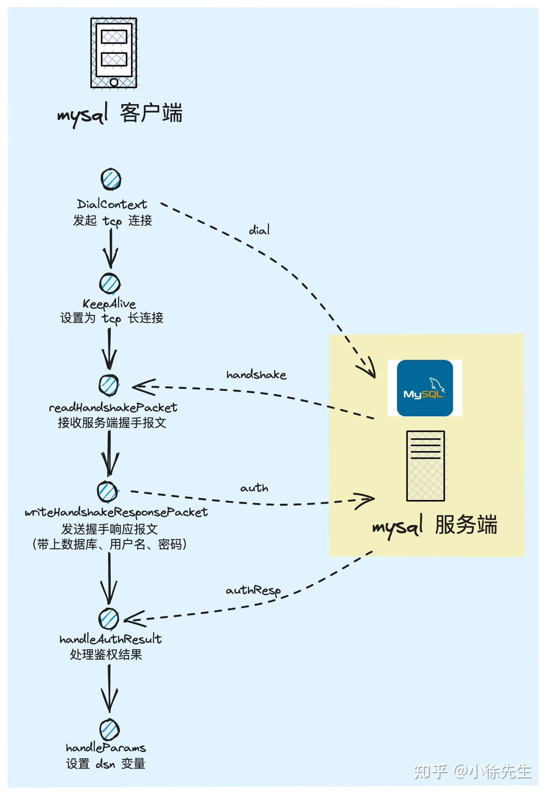

# mysql驱动


go 标准库 mysql 驱动底层实现

# 一、mysql 驱动基本架子

## 1、驱动打开连接

mysql 驱动的实现库：github.com/go-sql-driver/mysql

基本用法：

```go
import (
_ "github.com/go-sql-driver/mysql"
)
```

在库的 init 函数中会注册驱动到前一节提到的 go 官方数据库

```go
var driverName = "mysql"

func init() {
	if driverName != "" {
		sql.Register(driverName, &MySQLDriver{})
	}
}
```


mysql 库实现了 Driver 接口的驱动结构体是 MySQLDriver{}

```go
type Driver interface {
	// 开启一个新的数据库连接
    Open(name string) (Conn, error)
}
```


```go
// Open new Connection.
// See https://github.com/go-sql-driver/mysql#dsn-data-source-name for how
// the DSN string is formatted
func (d MySQLDriver) Open(dsn string) (driver.Conn, error) {
	cfg, err := ParseDSN(dsn)
	if err != nil {
		return nil, err
	}
	c := newConnector(cfg)
	return c.Connect(context.Background())
}
```

分为两步：

1、解析 dsn 字符串为配置对象

2、使用 cfg 配置对象新建一个连接器对象，并调用连接器对象的 Connect 方法创建一个连接


### 1.解析配置

dsn 字符串的总体形式：

```go
[user[:password]@][net[(addr)]]/dbname[?param1=value1&paramN=valueN]
```

解析 dsn 字符串主要通过按照不同的特殊符号（@，/，？）等分割字符串，取出对应的值保存到 Config 对象中,并对一些未给值的赋予默认值


Config 结构体：

```go
type Config struct {
	// non boolean fields

	User                 string            // Username
	Passwd               string            // Password (requires User)
	Net                  string            // Network (e.g. "tcp", "tcp6", "unix". default: "tcp")
	Addr                 string            // Address (default: "127.0.0.1:3306" for "tcp" and "/tmp/mysql.sock" for "unix")
	DBName               string            // Database name
	Params               map[string]string // Connection parameters
	ConnectionAttributes string            // Connection Attributes, comma-delimited string of user-defined "key:value" pairs
	Collation            string            // Connection collation
	Loc                  *time.Location    // Location for time.Time values
	MaxAllowedPacket     int               // Max packet size allowed
	ServerPubKey         string            // Server public key name
	TLSConfig            string            // TLS configuration name
	TLS                  *tls.Config       // TLS configuration, its priority is higher than TLSConfig
	Timeout              time.Duration     // Dial timeout
	ReadTimeout          time.Duration     // I/O read timeout
	WriteTimeout         time.Duration     // I/O write timeout
	Logger               Logger            // Logger

	// boolean fields

	AllowAllFiles            bool // Allow all files to be used with LOAD DATA LOCAL INFILE
	AllowCleartextPasswords  bool // Allows the cleartext client side plugin
	AllowFallbackToPlaintext bool // Allows fallback to unencrypted connection if server does not support TLS
	AllowNativePasswords     bool // Allows the native password authentication method
	AllowOldPasswords        bool // Allows the old insecure password method
	CheckConnLiveness        bool // Check connections for liveness before using them
	ClientFoundRows          bool // Return number of matching rows instead of rows changed
	ColumnsWithAlias         bool // Prepend table alias to column names
	InterpolateParams        bool // Interpolate placeholders into query string
	MultiStatements          bool // Allow multiple statements in one query
	ParseTime                bool // Parse time values to time.Time
	RejectReadOnly           bool // Reject read-only connections

	// unexported fields. new options should be come here

	beforeConnect func(context.Context, *Config) error // Invoked before a connection is established
	pubKey        *rsa.PublicKey                       // Server public key
	timeTruncate  time.Duration                        // Truncate time.Time values to the specified duration
}
```


### 2.新建连接

```go
func newConnector(cfg *Config) *connector {
	encodedAttributes := encodeConnectionAttributes(cfg)
	return &connector{
		cfg:               cfg,
		encodedAttributes: encodedAttributes,
	}
}

func encodeConnectionAttributes(cfg *Config) string {
	connAttrsBuf := make([]byte, 0)

	// default connection attributes
	connAttrsBuf = appendLengthEncodedString(connAttrsBuf, connAttrClientName)
	connAttrsBuf = appendLengthEncodedString(connAttrsBuf, connAttrClientNameValue)
	connAttrsBuf = appendLengthEncodedString(connAttrsBuf, connAttrOS)
	connAttrsBuf = appendLengthEncodedString(connAttrsBuf, connAttrOSValue)
	connAttrsBuf = appendLengthEncodedString(connAttrsBuf, connAttrPlatform)
	connAttrsBuf = appendLengthEncodedString(connAttrsBuf, connAttrPlatformValue)
	connAttrsBuf = appendLengthEncodedString(connAttrsBuf, connAttrPid)
	connAttrsBuf = appendLengthEncodedString(connAttrsBuf, strconv.Itoa(os.Getpid()))
	serverHost, _, _ := net.SplitHostPort(cfg.Addr)
	if serverHost != "" {
		connAttrsBuf = appendLengthEncodedString(connAttrsBuf, connAttrServerHost)
		connAttrsBuf = appendLengthEncodedString(connAttrsBuf, serverHost)
	}

	// user-defined connection attributes
	for _, connAttr := range strings.Split(cfg.ConnectionAttributes, ",") {
		k, v, found := strings.Cut(connAttr, ":")
		if !found {
			continue
		}
		connAttrsBuf = appendLengthEncodedString(connAttrsBuf, k)
		connAttrsBuf = appendLengthEncodedString(connAttrsBuf, v)
	}

	return string(connAttrsBuf)
}
```

这段代码的核心目的是在建立 MySQL 连接时，按照协议规范将客户端信息（默认属性）和用户自定义属性编码为特定格式的字节流。这些属性会在握手阶段发送给服务器，用于：

1. **服务端监控**：识别客户端类型、操作系统、PID 等。
2. **审计跟踪**：记录连接来源和自定义元数据。
3. **协议兼容性**：确保客户端与不同版本 MySQL 服务器的兼容性。

通过逐层编码，最终生成一个符合 MySQL 协议的连接属性字符串，存储在 `connector` 中供后续连接使用。

将字符串编码为 `长度前缀 + 原始内容` 格式，例如字符串 `"abc"` 编码为 `0x03 'a' 'b' 'c'`


## 2.mysqlConn 结构体


```go

type mysqlConn struct {
	buf              buffer			// 读写缓冲区
	netConn          net.Conn		// 当前活跃的网络连接对象，可能是普通的TCP连接或者TLS加密连接
	rawConn          net.Conn		// underlying connection when netConn is TLS connection.当 netConn 是 TLS 连接时，保存底层原始 TCP 连接（用于需要绕过 TLS 的场景，如连接超时设置）。比如设置 SO_TIMEOUT 等底层 Socket 参数时需操作 rawConn
	result           mysqlResult 	// managed by clearResult() and handleOkPacket().
	cfg              *Config
	connector        *connector  	// 连接器
	maxAllowedPacket int		 	// 服务器允许的最大数据包大小（单位：字节），用于限制客户端发送的单个数据包体积，从服务器握手阶段返回的 																						max_allowed_packet 值初始化
	maxWriteSize     int			// 客户端单次写入网络的最大数据块大小，用于优化大块数据的分片发送
	writeTimeout     time.Duration	// 写入操作的超时时间
	flags            clientFlag		// 客户端能力标志位，记录与服务器协商后的支持特性（如是否启用 SSL、是否支持多语句等）
	status           statusFlag		// 连接状态标志位，表示服务器返回的当前状态（如事务是否活跃、是否有未读取的结果集）
	sequence         uint8			// 数据包序列号（0~255 循环），用于保证客户端与服务器之间数据包的顺序一致性，递增
	parseTime        bool

	// for context support (Go 1.8+)
	watching bool					// 标记是否正在通过 watcher 通道监听上下文取消事件
	watcher  chan<- context.Context	// 单向通道（只发送），用于向外部通知上下文取消事件
	closech  chan struct{}			// 通知连接关闭的内部通道。关闭此通道表示连接已终止
	finished chan<- struct{}		// 单向通道（只发送），用于通知外部调用者连接已完全关闭
	canceled atomicError 			// set non-nil if conn is canceled 原子存储的取消错误，记录连接被取消的原因
	closed   atomicBool  			// set when conn is closed, before closech is closed 原子标记连接是否已关闭，避免重复关闭导致的 panic
}
```

`mysqlConn` 结构体封装了一个 MySQL 连接的完整状态，包括网络层、协议控制、数据结果、超时管理、上下文生命周期等。


调用 `connector.Connect()` 方法创建一个 mysql 连接，该连接使用结构体 `mysqlConn` 表示，它实现了 sql 标准库的 `driver.Conn` 接口

```go
type Conn interface {
	// Prepare returns a prepared statement, bound to this connection.
	Prepare(query string) (Stmt, error)
	Close() error
	Begin() (Tx, error)
}
```


### 1.client与server端数据交互协议


在看跟 mysql 服务端交互逻辑之前，先熟悉 mysql 客户端跟服务端之前的数据交互协议：


- 每笔消息分为请求头和正文两部分
- **在请求头部分中：**
- **前三个字节对应的是消息正文长度**，共 24 个 bit 位，表示的长度最大值为 2^24 - 1，因此消息最大长度为 16MB-1byte. 如果消息长度大于该阈值，则需要进行分包
- **第四个字节对应为请求的 sequence 序列号**. 一个新的客户端从 0 开始依次递增序列号，每次读消息时，会对序列号进行校验，要求必须必须和本地序号保持一致
- **在正文部分中：**
- **对于客户端接收服务端消息的场景，首个字节标识了这条消息的状态.** 倘若为 0，代表响应成功；倘若为 255，代表有错误发生；其他枚举值含义此处不再赘述
- **对于客户端发送消息到服务端的场景，首个字节标识了这笔请求的类型**. 首个字节代表的是 sql 指令的类型。


### 2.读写缓冲区

读数据包：

```go
// Read packet to buffer 'data'
func (mc *mysqlConn) readPacket() ([]byte, error) {
	var prevData []byte		// 存数据包分片的缓冲区
	for {
		// read packet header 包头
		data, err := mc.buf.readNext(4)
		// 读取失败，关闭连接
		if err != nil {
			if cerr := mc.canceled.Value(); cerr != nil {
				return nil, cerr
			}
			mc.log(err)
			mc.Close()
			return nil, ErrInvalidConn
		}

		// packet length [24 bit]
		// 读前三个字节表示包的长度
		pktLen := int(uint32(data[0]) | uint32(data[1])<<8 | uint32(data[2])<<16)

		// check packet sync [8 bit]
		// 校验第四个字节的服务端包序列号是否跟本地的序列号一致
		if data[3] != mc.sequence {
			mc.Close()
			// 出现跳包
            // ErrPktSync = errors.New("commands out of sync. You can't run this command now")
			// ErrPktSyncMul = errors.New("commands out of sync. Did you run multiple statements at once?")
			if data[3] > mc.sequence {
				return nil, ErrPktSyncMul
			}
			return nil, ErrPktSync
		}
		// 序号递增，一个字节8位最多能表示256个序号，从0到255
		mc.sequence++

		// packets with length 0 terminate a previous packet which is a
		// multiple of (2^24)-1 bytes long
		// 包长为0，说明前面的包都已经读取完成，MySQL 协议规定：0长度包表示分片结束
		if pktLen == 0 {
			// there was no previous packet
			// 前面必须要读到数据，没有则报错，关闭连接
			if prevData == nil {
				mc.log(ErrMalformPkt)
				mc.Close()
				return nil, ErrInvalidConn
			}
			// 返回成功读取的数据
			return prevData, nil
		}

		// read packet body [pktLen bytes]
		// 读取 pktLen 长度的数据出来
		data, err = mc.buf.readNext(pktLen)
		if err != nil {
			if cerr := mc.canceled.Value(); cerr != nil {
				return nil, cerr
			}
			mc.log(err)
			mc.Close()
			return nil, ErrInvalidConn
		}

		// return data if this was the last packet
		// 如果该包长度小于 2^24 - 1 = 16MB, 则是最后一个包了
		if pktLen < maxPacketSize {
			// zero allocations for non-split packets
			// 这个 if 表示只有一个小于最大长度的单包，都不要分片，直接读取完成返回
			if prevData == nil {
				return data, nil
			}
			// 追加最后一个包到buf中，返回
			return append(prevData, data...), nil
		}
		// 追加该包到buf中，继续读取剩余的数据
		prevData = append(prevData, data...)
	}
}

// returns next N bytes from buffer.
// The returned slice is only guaranteed to be valid until the next read
func (b *buffer) readNext(need int) ([]byte, error) {
	if b.length < need {
		// refill
		if err := b.fill(need); err != nil {
			return nil, err
		}
	}

	offset := b.idx
	b.idx += need
	b.length -= need
	return b.buf[offset:b.idx], nil
}

// fill reads into the buffer until at least _need_ bytes are in it
func (b *buffer) fill(need int) error {
	n := b.length
	// fill data into its double-buffering target: if we've called
	// flip on this buffer, we'll be copying to the background buffer,
	// and then filling it with network data; otherwise we'll just move
	// the contents of the current buffer to the front before filling it
	dest := b.dbuf[b.flipcnt&1]

	// grow buffer if necessary to fit the whole packet.
	if need > len(dest) {
		// Round up to the next multiple of the default size
		dest = make([]byte, ((need/defaultBufSize)+1)*defaultBufSize)

		// if the allocated buffer is not too large, move it to backing storage
		// to prevent extra allocations on applications that perform large reads
		if len(dest) <= maxCachedBufSize {
			b.dbuf[b.flipcnt&1] = dest
		}
	}

	// if we're filling the fg buffer, move the existing data to the start of it.
	// if we're filling the bg buffer, copy over the data
	if n > 0 {
		copy(dest[:n], b.buf[b.idx:])
	}

	b.buf = dest
	b.idx = 0

	for {
		if b.timeout > 0 {
			if err := b.nc.SetReadDeadline(time.Now().Add(b.timeout)); err != nil {
				return err
			}
		}

		nn, err := b.nc.Read(b.buf[n:])
		n += nn

		switch err {
		case nil:
			if n < need {
				continue
			}
			b.length = n
			return nil

		case io.EOF:
			if n >= need {
				b.length = n
				return nil
			}
			return io.ErrUnexpectedEOF

		default:
			return err
		}
	}
}
```


写数据包到缓存区：

```go
// Write packet buffer 'data'
func (mc *mysqlConn) writePacket(data []byte) error {
	// 真实数据长度
	pktLen := len(data) - 4
	
	// 大于最大允许的包长度
	if pktLen > mc.maxAllowedPacket {
		return ErrPktTooLarge
	}

	for {
		var size int
		// 该包已经超过单个包的大小上限 16MB 了
		if pktLen >= maxPacketSize {
			data[0] = 0xff
			data[1] = 0xff
			data[2] = 0xff
			size = maxPacketSize
		} else {
			data[0] = byte(pktLen)
			data[1] = byte(pktLen >> 8)
			data[2] = byte(pktLen >> 16)
			size = pktLen
		}
		data[3] = mc.sequence

		// Write packet
		// 写超时时间
		if mc.writeTimeout > 0 {
			if err := mc.netConn.SetWriteDeadline(time.Now().Add(mc.writeTimeout)); err != nil {
				return err
			}
		}
		// 写4+size 长度数据到网络中
		n, err := mc.netConn.Write(data[:4+size])
		if err == nil && n == 4+size {
			// 写成功序列号加1
			mc.sequence++
			// 单包小于 16 MB，已经写完了直接返回即可
			if size != maxPacketSize {
				return nil
			}
			// 否则，则计算剩余包长度
			pktLen -= size
			data = data[size:]
			continue
		}

		// Handle error
		// 属于没 err 但是 n != len(data)
		if err == nil {
			mc.cleanup()
			mc.log(ErrMalformPkt)
		} else {
			if cerr := mc.canceled.Value(); cerr != nil {
				return cerr
			}
			if n == 0 && pktLen == len(data)-4 {
				// only for the first loop iteration when nothing was written yet
				return errBadConnNoWrite
			}
			mc.cleanup()
			mc.log(err)
		}
		return ErrInvalidConn
	}
}
```

读写数据都遵循着数据包的协议格式。


重点看 Connect 函数：

```go
var (
	dialsLock sync.RWMutex
	dials     map[string]DialContextFunc   // 全局变量，用来收集用户自定义的协议拨号
)

// RegisterDialContext registers a custom dial function. It can then be used by the
// network address mynet(addr), where mynet is the registered new network.
// The current context for the connection and its address is passed to the dial function.
func RegisterDialContext(net string, dial DialContextFunc) {
	dialsLock.Lock()
	defer dialsLock.Unlock()
	if dials == nil {
		dials = make(map[string]DialContextFunc)
	}
	dials[net] = dial
}


// Connect implements driver.Connector interface.
// Connect returns a connection to the database.
func (c *connector) Connect(ctx context.Context) (driver.Conn, error) {
	var err error

	// Invoke beforeConnect if present, with a copy of the configuration
	cfg := c.cfg
	if c.cfg.beforeConnect != nil {
		cfg = c.cfg.Clone()		// 深拷贝配置避免污染原始配置
		err = c.cfg.beforeConnect(ctx, cfg)  // 执行用户自定义前置钩子
		if err != nil {
			return nil, err
		}
	}

	// New mysqlConn
	mc := &mysqlConn{
		maxAllowedPacket: maxPacketSize,
		maxWriteSize:     maxPacketSize - 1,
		closech:          make(chan struct{}), // 用于通知关闭的通道
		cfg:              cfg,	// 关联处理后的配置
		connector:        c,	  // 反向引用连接器
	}
	mc.parseTime = mc.cfg.ParseTime

	// Connect to Server
	// 加读锁，通过全局注册表 dials 支持自定义网络协议（如 TLS 封装）。
	dialsLock.RLock()
	dial, ok := dials[mc.cfg.Net]
	dialsLock.RUnlock()
	if ok {
		dctx := ctx
		if mc.cfg.Timeout > 0 {
			var cancel context.CancelFunc
			dctx, cancel = context.WithTimeout(ctx, c.cfg.Timeout)
			defer cancel()
		}
		mc.netConn, err = dial(dctx, mc.cfg.Addr)
	} else {		// 用户没有自定义协议，则使用默认的网络连接拨号，根据不同协议建立网络连接
		nd := net.Dialer{Timeout: mc.cfg.Timeout}
		mc.netConn, err = nd.DialContext(ctx, mc.cfg.Net, mc.cfg.Addr)
	}
	if err != nil {
		return nil, err
	}
	mc.rawConn = mc.netConn

	// Enable TCP Keepalives on TCP connections
	if tc, ok := mc.netConn.(*net.TCPConn); ok {
		if err := tc.SetKeepAlive(true); err != nil {
			c.cfg.Logger.Print(err)
		}
	}

	// Call startWatcher for context support (From Go 1.8)
	mc.startWatcher()
	if err := mc.watchCancel(ctx); err != nil {
		mc.cleanup()
		return nil, err
	}
	defer mc.finish()

	mc.buf = newBuffer(mc.netConn)

	// Set I/O timeouts
	mc.buf.timeout = mc.cfg.ReadTimeout
	mc.writeTimeout = mc.cfg.WriteTimeout

	// Reading Handshake Initialization Packet
	authData, plugin, err := mc.readHandshakePacket()
	if err != nil {
		mc.cleanup()
		return nil, err
	}

	if plugin == "" {
		plugin = defaultAuthPlugin
	}

	// Send Client Authentication Packet
	authResp, err := mc.auth(authData, plugin)
	if err != nil {
		// try the default auth plugin, if using the requested plugin failed
		c.cfg.Logger.Print("could not use requested auth plugin '"+plugin+"': ", err.Error())
		plugin = defaultAuthPlugin
		authResp, err = mc.auth(authData, plugin)
		if err != nil {
			mc.cleanup()
			return nil, err
		}
	}
	if err = mc.writeHandshakeResponsePacket(authResp, plugin); err != nil {
		mc.cleanup()
		return nil, err
	}

	// Handle response to auth packet, switch methods if possible
	if err = mc.handleAuthResult(authData, plugin); err != nil {
		// Authentication failed and MySQL has already closed the connection
		// (https://dev.mysql.com/doc/internals/en/authentication-fails.html).
		// Do not send COM_QUIT, just cleanup and return the error.
		mc.cleanup()
		return nil, err
	}

	if mc.cfg.MaxAllowedPacket > 0 {
		mc.maxAllowedPacket = mc.cfg.MaxAllowedPacket
	} else {
		// Get max allowed packet size
		maxap, err := mc.getSystemVar("max_allowed_packet")
		if err != nil {
			mc.Close()
			return nil, err
		}
		mc.maxAllowedPacket = stringToInt(maxap) - 1
	}
	if mc.maxAllowedPacket < maxPacketSize {
		mc.maxWriteSize = mc.maxAllowedPacket
	}

	// Handle DSN Params
	err = mc.handleParams()
	if err != nil {
		mc.Close()
		return nil, err
	}

	return mc, nil
}

```

整体步骤：

1、创建连接（net.Dialer.DialContext）

2、设置为 tcp 长连接（net.TCPConn.KeepAlive）

3、创建连接缓冲区（mc.buf = newBuffer）

4、设置连接超时配置（mc.buf.timeout = mc.cfg.ReadTimeout；mc.writeTimeout = mc.cfg.WriteTimeout）

5、接收来自服务端的握手请求（mc.readHandshakePacket）

6、向服务端发起鉴权请求（mc.writeHandshakeResponsePacket）

7、处理鉴权结果（mc.handleAuthResult）

8、设置 dsn 中的参数变量（mc.handleParams）



`Connect` 方法完成了 MySQL 客户端与服务器的完整连接过程，包括：

1. 网络连接的建立
2. 服务器握手
3. 客户端认证
4. 连接参数设置（压缩、字符集、最大数据包大小等）
5. 其他 DSN 参数处理

**核心设计思想总结**

1. **接口化设计**：实现 `driver.Connector` 接口，与 Go 标准库 `database/sql` 无缝集成。
2. **分层处理**：将连接过程分解为`网络层、协议层、认证层、参数层`，模块化清晰。
3. **资源安全**：
   - 通过 `defer` 和 `cleanup` 确保资源释放。
   - 上下文取消监控防止协程泄漏。
4. **可扩展性**：
   - 支持自定义 `beforeConnect` 钩子。
   - 允许注册自定义协议拨号器。
5. **健壮性**：
   - 认证失败自动回退机制。
   - TCP Keepalive 和超时设置防止网络故障。


