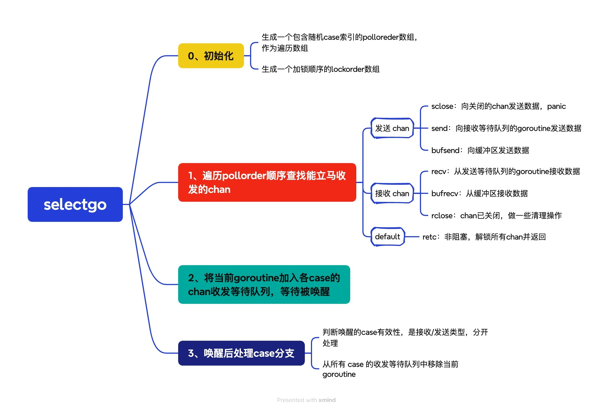

# select

从源码角度看 select 的底层实现
# select

前言：

一个 go 代码，会经过编译器编译成一个可执行二进制程序，运行在不同的 cpu 架构上。

编译器编译 go 代码的过程包含以下过程，其中前三步又叫编译前端，后两步叫编译后端

词法分析器 --> 语法分析器 --> 类型检查 --> 中间代码生成 --> 机器码生成

1、词法分析器通过对每一行 go 代码，按照某个生产规则进行分割，组装成一个 Token，输入给语法分析器。例如：`package`, `json`, `import`, `(`, `io`, `)`, …，而语法分析会把 Token 序列转换成有意义的结构体，即语法树

2、类型检查会检查常量、类型、函数声明以及变量赋值语句的类型，`src/cmd/compile/internal/typecheck`文件夹下能看到具体的检查动作

3、类型检查同时还会对 go 的关键字进行替换改写，比如 Go 语言中很常见的内置函数 `make`，在类型检查阶段之前，无论是创建切片、哈希还是 Channel 用的都是 `make` 关键字，不过在类型检查阶段会根据创建的类型将 `make` 替换成特定的函数，后面生成中间代码的过程就不再会处理 `OMAKE` 类型的节点了，而是会依据生成的细分类型处理；编译器会先检查关键字 `make` 的第一个类型参数，根据类型的不同进入不同分支，切片分支 `TSLICE`、哈希分支 `TMAP` 和 Channel 分支 `TCHAN`

4、在生成中间代码之前，编译器还需要替换抽象语法树中节点的一些元素，这个替换的过程是通过 cmd/compile/internal/walk/expr.go 和cmd/compile/internal/walk/stmt.go 和相关函数实现的，这里简单展示几个函数的签名：

```go
func walk(fn *Node)
func walkappend(n *Node, init *Nodes, dst *Node) *Node
...
func walkrange(n *Node) *Node
func walkselect(sel *Node)
func walkselectcases(cases *Nodes) []*Node
func walkstmt(n *Node) *Node
func walkstmtlist(s []*Node)
func walkswitch(sw *Node)
```

这些用于遍历抽象语法树的函数会将一些关键字和内建函数转换成函数调用，例如： 上述函数会将 `panic`、`recover` 两个内建函数转换成 runtime.gopanic 和 runtime.gorecover 两个真正运行时函数，而关键字 `new` 也会被转换成调用 runtime.newobject 函数。

5、生成机器码

这里主要了解大体流程，主要需要关注的是类型检查和中间码生成，在这里能够搞清 go 代码的入口是在哪里，一个内建函数是怎么由编译器跟运行时共同作用下实现的


## 1. 编译期间的 select

select 语句在编译期间会被转换成 ir.OSELECT 类型的节点，见 src/cmd/compile/internal/walk/stmt.go 的 walkStmt() 函数：

```go
func walkStmt(n ir.Node) ir.Node {

    ...
    case ir.OSELECT:
    n := n.(*ir.SelectStmt)
    walkSelect(n)
    return n

    case ir.OSWITCH:
    n := n.(*ir.SwitchStmt)
    walkSwitch(n)
    return n

    case ir.ORANGE:
    n := n.(*ir.RangeStmt)
    return walkRange(n)
    ...
}
```

交由，`go/src/cmd/compile/internal/walk/select.go` 实现：

```go
func walkSelect(sel *ir.SelectStmt) {
    lno := ir.SetPos(sel)
    if sel.Walked() {
        base.Fatalf("double walkSelect")
    }
    sel.SetWalked(true)

    init := ir.TakeInit(sel)

    init = append(init, walkSelectCases(sel.Cases)...)
    sel.Cases = nil

    sel.Compiled = init
    walkStmtList(sel.Compiled)

    base.Pos = lno
}
```

在 `walkSelect` 中主要逻辑在 `walkSelectCases` 中，在 `walkSelectCases`中根据对不同case分支条件的处理，不同的情况会调用不同的运行时函数，大致分为如下四类：


根据`walkSelectCases`函数的具体代码来看：

### 1.1. case1：select 没有 case 分支

表现形式就是：

```go
select{}
```


```go
func walkSelectCases(cases []*ir.CommClause) []ir.Node {
    ncas := len(cases)	// case分支的数目
    sellineno := base.Pos

    // optimization: zero-case select
    if ncas == 0 {
        return []ir.Node{mkcallstmt("block")}
    }
}
```

调用 runtime.block()，位于`go/src/runtime/select.go`

```go
func block() {
	gopark(nil, nil, waitReasonSelectNoCases, traceBlockForever, 1) // forever
}
```

会直接报死锁，不会得到执行


### 1.2. case2：select 只有一个非 default case

select 只有非 default 的分支时，实际会被编译器转换为对 channel 的读写操作，实际调用 `data := <- ch` 或 `ch <- data` 并没有什么区别

```go
ch := make(chan struct{})
select {
case data <- ch:
    fmt.Printf("ch data: %v\n", data)
}
会被编译器转换为：
data := <- ch
fmt.Printf("ch data: %v\n", data)
```


```go
func walkSelectCases(cases []*ir.CommClause) []ir.Node {
    ...
    // optimization: one-case select: single op.
    if ncas == 1 {
        cas := cases[0]	// 只有一个case
        ir.SetPos(cas)
        l := cas.Init()
        if cas.Comm != nil { // not default:
            n := cas.Comm	// 获取case的条件语句
            l = append(l, ir.TakeInit(n)...)
            switch n.Op() {
                default:
                base.Fatalf("select %v", n.Op())

                case ir.OSEND:	// 如果是往chan里写，即 ch <- data，不需要编译器做转换，
                // already ok

                case ir.OSELRECV2:	// 从chan中接收
                r := n.(*ir.AssignListStmt)							// 接收操作完整形式：d,ok := <- ch
                if ir.IsBlank(r.Lhs[0]) && ir.IsBlank(r.Lhs[1]) {	// 如果不关心返回值，直接转成 <- ch
                    n = r.Rhs[0]
                    break
                }
                r.SetOp(ir.OAS2RECV)	// 否则，是 data, ok := <- chan 这种形式
            }

            l = append(l, n)	// 把编译器处理后的case语句条件加入待执行语句列表
        }

        l = append(l, cas.Body...) // 把case条件后要执行的语句体加入待执行语句列表
        l = append(l, ir.NewBranchStmt(base.Pos, ir.OBREAK, nil)) // 默认加入break类型语句，跳出select-case语句体
        return l
    }
    ...
}
```

这是一种编译器在语法树级别对 select 语句的静态优化，可以有效简化运行时的开销。


### 1.3. case3：select 有一个 case 和一个 default

```go
ch := make(chan int)
select {
    case ch <- 1:
    fmt.Println("run case 1")
    default:
    fmt.Println("run default")
}
会被编译器替换为：
if selectnbsend(ch, 1) {
    fmt.Println("run case 1")
} else {
    fmt.Println("run default")
}
```

看 walkSelectCases 的后续分支：

```go
func walkSelectCases(cases []*ir.CommClause) []ir.Node {
    ...
    // optimization: two-case select but one is default: single non-blocking op.
    if ncas == 2 && dflt != nil {
        cas := cases[0]
        if cas == dflt {
            cas = cases[1]
        }

        n := cas.Comm
        ir.SetPos(n)
        r := ir.NewIfStmt(base.Pos, nil, nil, nil) // 创建一个新的 if 语句 r，用于表示优化后的代码结构。
        r.SetInit(cas.Init())  // 将该 case 的初始化语句设置为 if 语句的初始化部分。
        var cond ir.Node
        switch n.Op() {
            default:
            base.Fatalf("select %v", n.Op())

            case ir.OSEND:	// 往chan里发送数据
            // if selectnbsend(c, v) { body } else { default body }
            n := n.(*ir.SendStmt)
            ch := n.Chan
            cond = mkcall1(chanfn("selectnbsend", 2, ch.Type()), types.Types[types.TBOOL], r.PtrInit(), ch, n.Value)

            case ir.OSELRECV2: // 从chan里接收数据
            n := n.(*ir.AssignListStmt)
            recv := n.Rhs[0].(*ir.UnaryExpr)
            ch := recv.X
            elem := n.Lhs[0]
            if ir.IsBlank(elem) {
                elem = typecheck.NodNil()
            }
            cond = typecheck.TempAt(base.Pos, ir.CurFunc, types.Types[types.TBOOL])
            fn := chanfn("selectnbrecv", 2, ch.Type())
            call := mkcall1(fn, fn.Type().ResultsTuple(), r.PtrInit(), elem, ch)
            as := ir.NewAssignListStmt(r.Pos(), ir.OAS2, []ir.Node{cond, n.Lhs[1]}, []ir.Node{call})
            r.PtrInit().Append(typecheck.Stmt(as))
        }

        r.Cond = typecheck.Expr(cond) // 将非阻塞操作的结果布尔值 cond 作为 if 语句的条件。
        r.Body = cas.Body	// 设置 if 的主体为非 default 分支的执行体
        // 将 default 分支的初始化语句和执行体作为 else 分支。
        r.Else = append(dflt.Init(), dflt.Body...)

        // 构造一个包含 if 语句和一个 break 语句的语法树节点列表，break 语句用于跳出 select 的控制流
        return []ir.Node{r, ir.NewBranchStmt(base.Pos, ir.OBREAK, nil)}  
    }
    ...
}
```

编译器会将其转为调用运行时 `runtime.selectnbrecv()` 函数和`runtime.selectnbsend()`函数，这两个函数会分别调用`runtime.cahnrecv()`函数和`runtime.chansend()`函数，传入这两个函数的 block 参数为 false，代表非阻塞，不成功则直接返回。


### 1.4. case4：select 有多个可读写的 case

```go
ch1 := make(chan int)
ch2 := make(chan int)
select {
    case ch1 <- 1:
    fmt.Println("run case 1")
    case data := <- ch2:
    fmt.Printf("run case 2, data is: %d", data)
}
func walkSelectCases(cases []*ir.CommClause) []ir.Node {
    ...
    if dflt != nil {	// 过滤掉default分支，case数目减1，以下逻辑只对非default多case分支选择，若多chan分支都没准备好，走default分支
		ncas--
	}
	casorder := make([]*ir.CommClause, ncas) // casorder为ncas大小的case语句的数组
	nsends, nrecvs := 0, 0	// 对接收操作和发送操作分类

	var init []ir.Node	// 定义init为多case编译后待执行的语句列表

	// generate sel-struct
	base.Pos = sellineno	// 通过scasetype()构造长度同ncas的scase结构体数组
	selv := typecheck.TempAt(base.Pos, ir.CurFunc, types.NewArray(scasetype(), int64(ncas)))
	init = append(init, typecheck.Stmt(ir.NewAssignStmt(base.Pos, selv, nil)))

	// No initialization for order; runtime.selectgo is responsible for that.
    // 定义order为2倍的ncas长度的TUINT16类型的数组
    // 后续这两者，selv和order作为runtime.selectgo()函数的入参，前者存放scase列表内存地址，后者用来做scase排序使用，排序是为了便于挑选出待执行的case
	order := typecheck.TempAt(base.Pos, ir.CurFunc, types.NewArray(types.Types[types.TUINT16], 2*int64(ncas)))

	var pc0, pcs ir.Node
	if base.Flag.Race { // 竞态分析
		pcs = typecheck.TempAt(base.Pos, ir.CurFunc, types.NewArray(types.Types[types.TUINTPTR], int64(ncas)))
		pc0 = typecheck.Expr(typecheck.NodAddr(ir.NewIndexExpr(base.Pos, pcs, ir.NewInt(base.Pos, 0))))
	} else {
		pc0 = typecheck.NodNil()
	}

	// register cases 开始注册case，遍历生成scase对象放到selv中
	for _, cas := range cases {
		ir.SetPos(cas)

		init = append(init, ir.TakeInit(cas)...)

		n := cas.Comm
		if n == nil { // default:跳过
			continue
		}

		var i int
		var c, elem ir.Node
		switch n.Op() {
		default:
			base.Fatalf("select %v", n.Op())
		case ir.OSEND:
			n := n.(*ir.SendStmt)
			i = nsends  // 对发送类型的chan，i 从 0 开始往 ncas 计数
			nsends++
			c = n.Chan
			elem = n.Value
		case ir.OSELRECV2:
			n := n.(*ir.AssignListStmt)
			nrecvs++
			i = ncas - nrecvs	// 对接收类型的chann，i 从 ncas 往前计数
			recv := n.Rhs[0].(*ir.UnaryExpr)
			c = recv.X
			elem = n.Lhs[0]		// data,ok := <- ch
		}

		casorder[i] = cas // 编译器对多个case排列后，发送chan的case在左边，接收chan的case在右边，在selv中也是如此

        // 定义一个函数，写入chan或elem到selv数组, 实际执行的是selv[i]=f
		setField := func(f string, val ir.Node) {
			r := ir.NewAssignStmt(base.Pos, ir.NewSelectorExpr(base.Pos, ir.ODOT, ir.NewIndexExpr(base.Pos, selv, ir.NewInt(base.Pos, int64(i))), typecheck.Lookup(f)), val)
			init = append(init, typecheck.Stmt(r))
		}

        // 将c指针转换为 unsafe.Pointer
		c = typecheck.ConvNop(c, types.Types[types.TUNSAFEPTR])
        // 写入 c 代表的 chan 到 selv，selv[c]=c
		setField("c", c)
		if !ir.IsBlank(elem) {
			elem = typecheck.ConvNop(elem, types.Types[types.TUNSAFEPTR])
            // 写入 elem 到 selv，selv[elem]=elem
			setField("elem", elem)
		}

		// TODO(mdempsky): There should be a cleaner way to
		// handle this.
		if base.Flag.Race {
			r := mkcallstmt("selectsetpc", typecheck.NodAddr(ir.NewIndexExpr(base.Pos, pcs, ir.NewInt(base.Pos, int64(i)))))
			init = append(init, r)
		}
	}
    // 发送与接收chan数目与总数目不对，panic
	if nsends+nrecvs != ncas {
		base.Fatalf("walkSelectCases: miscount: %v + %v != %v", nsends, nrecvs, ncas)
	}

	// run the select
	base.Pos = sellineno
	chosen := typecheck.TempAt(base.Pos, ir.CurFunc, types.Types[types.TINT])
	recvOK := typecheck.TempAt(base.Pos, ir.CurFunc, types.Types[types.TBOOL])
	r := ir.NewAssignListStmt(base.Pos, ir.OAS2, nil, nil)
	r.Lhs = []ir.Node{chosen, recvOK} // 左边有双值，一个chosen，一个recvOK，分别代表选择了哪个case分支，是否接收成功
	fn := typecheck.LookupRuntime("selectgo") // 调用 runtime.selectgo
	var fnInit ir.Nodes
    // r右边调用runtime.selectgo函数，传递 selv，order，nsend，nrecvs，block是否阻塞等参数
	r.Rhs = []ir.Node{mkcall1(fn, fn.Type().ResultsTuple(), &fnInit, bytePtrToIndex(selv, 0), bytePtrToIndex(order, 0), pc0, ir.NewInt(base.Pos, int64(nsends)), ir.NewInt(base.Pos, int64(nrecvs)), ir.NewBool(base.Pos, dflt == nil))}
	init = append(init, fnInit...)
	init = append(init, typecheck.Stmt(r))

	// selv, order, and pcs (if race) are no longer alive after selectgo.

	// dispatch cases 分发case，定义一个函数，根据chosen确定的case分支生成if语句，执行该分支的语句
	dispatch := func(cond ir.Node, cas *ir.CommClause) {
		var list ir.Nodes	// 一个 ir.Nodes 类型的切片，用于存储该分支需要执行的所有语句

		if n := cas.Comm; n != nil && n.Op() == ir.OSELRECV2 {
			n := n.(*ir.AssignListStmt)
            // n.Lhs[1]表示接收语句的第二个返回值（即 `ok`）；如果 ok 不是空标识符（`_`），表示接收结果的状态需要被保存
			if !ir.IsBlank(n.Lhs[1]) {
				x := ir.NewAssignStmt(base.Pos, n.Lhs[1], recvOK)//创建一条赋值语句，将recvOK的值赋给n.Lhs[1]，即ok=recvOK
				list.Append(typecheck.Stmt(x))
			}
		}
        // 将 case 的执行体（cas.Body）添加到list，并添加一个break语句（ir.OBREAK），跳出select控制块
		list.Append(cas.Body.Take()...)
		list.Append(ir.NewBranchStmt(base.Pos, ir.OBREAK, nil))

		var r ir.Node
		if cond != nil {
			cond = typecheck.Expr(cond)
			cond = typecheck.DefaultLit(cond, nil)
            // 创建一个 if 语句，条件为cond，执行体为list
			r = ir.NewIfStmt(base.Pos, cond, list, nil)
		} else {
            // 没有条件，创建一个代码块节点（ir.NewBlockStmt），表示无条件的代码块，通常是最后一个分支或者default分支
			r = ir.NewBlockStmt(base.Pos, list)
		}
        // 将生成的 if 或代码块节点添加到 init 切片中。
        // init 是最终生成代码的指令序列，用于表示select的完整控制流。
		init = append(init, r)
	}
    // 如果多case中有default分支，并且chosen小于0，执行该default分支
	if dflt != nil {
		ir.SetPos(dflt)
        // ir.NewBinaryExpr二元表达式，ir.OLT表示<，chosen左操作数，ir.NewInt(base.Pos, 0)右操作数
		dispatch(ir.NewBinaryExpr(base.Pos, ir.OLT, chosen, ir.NewInt(base.Pos, 0)), dflt)
	}
    // 如果有chosen选中的case分支，即chosen等于i，则执行该分支
	for i, cas := range casorder {
		ir.SetPos(cas)
		if i == len(casorder)-1 {
			dispatch(nil, cas)
			break
		}
        // ir.NewBinaryExpr二元表达式，ir.OEQ表示==，左右操作数chosen, ir.NewInt(base.Pos, int64(i))，i==chosen？
		dispatch(ir.NewBinaryExpr(base.Pos, ir.OEQ, chosen, ir.NewInt(base.Pos, int64(i))), cas)
	}

	return init
    ...
}
```

1）过滤 default 分支，初始化 `casoreder` 数组、`nsends`、`nrecvs`，对接收 chan 和发送 chan 分开计数

2）生成 `selv` 结构体数组（`scase`）和 `order` uint16 类型数组（长度 2*len(ncas)），作为 `runtime.selectgo` 的其中两个入参

3）遍历所有 case，区分发送 chan 和接收 chan，send 从 0 开始计数，recv 从 ncas 到 0 计数，保存到 `casorder` 中，[chansend1，chansend2 ... chanrecv1,chanrecv2]，并给 selv 的成员变量通过 setField 函数动态赋值，给 case 分支执行做数据准备

4）传入参数（`selv，order，nsend，nrecvs，block是否阻塞`），调用 `runtime.selectgo` 函数选择执行哪个 case 分支

5）根据`runtime.selectgo`的返回值 `chosen` 和 `recvOK`，生成`if`语句，执行该分支的语句，由 `dispatch`函数完成。如果 `chosen<0&&default!=nil`，则执行 `default` 分支；如果 `chosen==casoreder[i]` ，则执行选中的 case。

6）生成 break 语句，跳出 select 控制块。


假如有以下代码：

```go
select {
case x, ok := <-ch:
    fmt.Println("received")
case ch <- y:
    fmt.Println("sent")
default:
    fmt.Println("default")
}
```

 dispatch 函数生成代码大体类似于：

```go
if chosen < 0 {
    // default 分支
    fmt.Println("default")
    break
}

if chosen == 0 {
    // case x, ok := <-ch
    ok = recvOK
    fmt.Println("received")
    break
}

if chosen == 1 {
    // case ch <- y
    fmt.Println("sent")
    break
}
```


在 `src/cmd/compile/internal/walk/select.go`中通过 scasetype()初始化 scase 结构体，包含 chan 和 elem 两个字段，同 runtime 中的 scase 结构体，存储 case 分支的元信息。

```go
// Keep in sync with src/runtime/select.go.
func scasetype() *types.Type {
	if scase == nil {
		n := ir.NewDeclNameAt(src.NoXPos, ir.OTYPE, ir.Pkgs.Runtime.Lookup("scase"))
		scase = types.NewNamed(n)
		n.SetType(scase)
		n.SetTypecheck(1)

		scase.SetUnderlying(types.NewStruct([]*types.Field{
			types.NewField(base.Pos, typecheck.Lookup("c"), types.Types[types.TUNSAFEPTR]),
			types.NewField(base.Pos, typecheck.Lookup("elem"), types.Types[types.TUNSAFEPTR]),
		}))
	}
	return scase
}


// Select case descriptor.
// Known to compiler.
// Changes here must also be made in src/cmd/compile/internal/walk/select.go's scasetype.
type scase struct {
	c    *hchan         // chan
	elem unsafe.Pointer // data element
}
```


## 2. 运行时的 select




### 2.1. runtime.selectgo 实现

```go
// selectgo implements the select statement.
//
// cas0 points to an array of type [ncases]scase, and order0 points to
// an array of type [2*ncases]uint16 where ncases must be <= 65536.
// Both reside on the goroutine's stack (regardless of any escaping in
// selectgo).
//
// For race detector builds, pc0 points to an array of type
// [ncases]uintptr (also on the stack); for other builds, it's set to
// nil.
//
// selectgo returns the index of the chosen scase, which matches the
// ordinal position of its respective select{recv,send,default} call.
// Also, if the chosen scase was a receive operation, it reports whether
// a value was received.
func selectgo(cas0 *scase, order0 *uint16, pc0 *uintptr, nsends, nrecvs int, block bool) (int, bool) {
	...
	// NOTE: In order to maintain a lean stack size, the number of scases
	// is capped at 65536.
	cas1 := (*[1 << 16]scase)(unsafe.Pointer(cas0))	// 64kb cas1,128kb order1
	order1 := (*[1 << 17]uint16)(unsafe.Pointer(order0))

	ncases := nsends + nrecvs	// ncases个数是发送chan个数nsends加上接收chan个数nrecvs
	scases := cas1[:ncases:ncases]	// scases切片是上面分配cas1数组的前ncases个元素,并且数组容量也为ncases
	pollorder := order1[:ncases:ncases]	// pollorder是order1数组的前ncases个元素，与lockorder共用一个底层数组，避免多次分配
	lockorder := order1[ncases:][:ncases:ncases]	//加锁列表lockorder是order1数组的第二批ncase个元素
    
    norder := 0
	for i := range scases {
		cas := &scases[i]

		// Omit cases without channels from the poll and lock orders.
		if cas.c == nil {
			cas.elem = nil // allow GC
			continue
		}

		j := cheaprandn(uint32(norder + 1))
		pollorder[norder] = pollorder[j]
		pollorder[j] = uint16(i)
		norder++
	}
	pollorder = pollorder[:norder]
	lockorder = lockorder[:norder]

	// sort the cases by Hchan address to get the locking order.
	// simple heap sort, to guarantee n log n time and constant stack footprint.
	for i := range lockorder {
		j := i
		// Start with the pollorder to permute cases on the same channel.
		c := scases[pollorder[i]].c
		for j > 0 && scases[lockorder[(j-1)/2]].c.sortkey() < c.sortkey() {
			k := (j - 1) / 2
			lockorder[j] = lockorder[k]
			j = k
		}
		lockorder[j] = pollorder[i]
	}
	for i := len(lockorder) - 1; i >= 0; i-- {
		o := lockorder[i]
		c := scases[o].c
		lockorder[i] = lockorder[0]
		j := 0
		for {
			k := j*2 + 1
			if k >= i {
				break
			}
			if k+1 < i && scases[lockorder[k]].c.sortkey() < scases[lockorder[k+1]].c.sortkey() {
				k++
			}
			if c.sortkey() < scases[lockorder[k]].c.sortkey() {
				lockorder[j] = lockorder[k]
				j = k
				continue
			}
			break
		}
		lockorder[j] = o
	}
    // lock all the channels involved in the select
    sellock(scases, lockorder)
    ...
}
```

#### 2.1.1. 初始化

1）**pollorder** 和 **lockorder**，用于存储 select 语句中通道的**随机顺序**和**锁定顺序**；初始化 **lockorder** 和 **pollorder**，采用随机数生成器将随机化后的 case 索引存储在 **pollorder** 中，可以避免 channel 的饥饿问题，保证公平性，后续遍历该数组进而遍历所有 case 分支

2）构建一个最大堆，通过堆排序下沉的操作，每次调整堆结构，保证按照通道的地址值从大到小排序，并将对应的 scase 数组的下标索引存在 **lockorder** 中。

3）调用`sellock`依次对`lockorder`中的所有 case 的 chan 进行上锁，避免并发时发生死锁。这也是为什么要顺序上锁的原因

```go
// 加锁，正序
func sellock(scases []scase, lockorder []uint16) {
    var c *hchan
    for _, o := range lockorder {
        c0 := scases[o].c
        // 跳过重复加锁，并更新c为前一个
        if c0 != c {
            c = c0
            lock(&c.lock)
        }
    }
}
// 解锁，倒叙
func selunlock(scases []scase, lockorder []uint16) {
  for i := len(lockorder) - 1; i >= 0; i-- {
    c := scases[lockorder[i]].c
    if i > 0 && c == scases[lockorder[i-1]].c {
      continue 
    }
    unlock(&c.lock)
  }
}
```


#### 2.1.2. 第一阶段处理

4）开始第一轮查询

```go
func selectgo(cas0 *scase, order0 *uint16, pc0 *uintptr, nsends, nrecvs int, block bool) (int, bool) {
    ...
    var (
		gp     *g
		sg     *sudog
		c      *hchan
		k      *scase
		sglist *sudog
		sgnext *sudog
		qp     unsafe.Pointer
		nextp  **sudog
	)
    // pass 1 - look for something already waiting
    var casi int
    var cas *scase
    var caseSuccess bool
    var caseReleaseTime int64 = -1
    var recvOK bool
    for _, casei := range pollorder {
        casi = int(casei)	// case的索引
        cas = &scases[casi]	// 当前case
        c = cas.c

        // 因为从编译器保证了传进来的scase数组是按照send在前，recv在后的顺序，并且不包含default分支
        if casi >= nsends {      // 所以说明该case是接收chan，另外下面这几个if的前后顺序也有讲究
            sg = c.sendq.dequeue()	 // 在该chan的发送队列有阻塞等待发送的g，则goto到recv从缓冲区读取数据后将等待goroutine中的数据放入到缓冲区中相同的位置
            if sg != nil {
                goto recv
            }
            if c.qcount > 0 {	// 当前chan是有缓冲chan，缓冲区有数据，goto到bufrecv，从缓冲区接收数据
                goto bufrecv
            }
            if c.closed != 0 {	// 当前chan已被close，goto到rclose
                goto rclose
            }
        } else {		// else分支表明该case是发送chan，另外下面这几个if的前后顺序也有讲究
            if raceenabled {
                racereadpc(c.raceaddr(), casePC(casi), chansendpc)
            }
            if c.closed != 0 {	// 当前chan已被close，goto sclose
                goto sclose
            }
            sg = c.recvq.dequeue()	// 从当前chan的接收等待队列中获得一个g，goto到send
            if sg != nil {
                goto send
            }
            if c.qcount < c.dataqsiz {	// 当前chan是有缓冲chan，且缓冲区未满，goto到bufsend，往缓冲区发送
                goto bufsend
            }
        }
    }
    // 非阻塞模式，即包含default分支，会解锁所有 Channel 并返回，casi = -1
    if !block {
        selunlock(scases, lockorder)
        casi = -1
        goto retc
    }
    ...
}
```

- 遍历 pollorder，依次检查每个 case 分支的通道状态：

- - **casi >= nsends 是接收操作**:

1. 1. 1. 有等待发送方 -> 执行recv。这种情况说明若是带缓冲的 chan，此时缓冲区一定是满了的，只有缓冲区满的情况下才会入发送等待队列
      2. 缓冲区有数据 -> 执行缓冲区接收 bufrecv。
      3. 通道关闭 -> 执行关闭接收 rclose。可能在关闭的同时有其他 g 往里写了数据，有未来得及处理的数据

- - **casi < nsends 是发送操作**:

1. 1. 1. 通道关闭 -> 执行 sclose
      2. 有等待接收方 -> 执行发送 send
      3. 缓冲区有空间 -> 执行往缓冲区发送，bufsend

非阻塞模式，即包含default分支，会解锁所有 Channel 并返回，casi = -1


#### 2.1.3. 第二阶段处理

5）当前没有能够处理的 chan，进入下一阶段的处理，将当前 g 加入到 chan 的收发等待队列中等待其他 g 的唤醒

```go
func selectgo(cas0 *scase, order0 *uint16, pc0 *uintptr, nsends, nrecvs int, block bool) (int, bool) {
    ...
    // pass 2 - enqueue on all chans
    gp = getg()
    if gp.waiting != nil {
        throw("gp.waiting != nil")
    }
    nextp = &gp.waiting
    for _, casei := range lockorder {
        casi = int(casei)
        cas = &scases[casi]
        c = cas.c
        sg := acquireSudog()
        sg.g = gp
        sg.isSelect = true
        // No stack splits between assigning elem and enqueuing
        // sg on gp.waiting where copystack can find it.
        sg.elem = cas.elem
        sg.releasetime = 0
        if t0 != 0 {
            sg.releasetime = -1
        }
        sg.c = c
        // Construct waiting list in lock order.
        // 将 sg 添加到当前 Goroutine 的等待链表中，链表通过 gp.waiting 字段链接，waitlink 是链表的下一节点指针。
        // gp.waiting 是链表的头，nextp 逐步链接每个 Sudog 节点，构造出 Goroutine 对所有通道操作的等待链表。
        // 通过 gp.waiting 链表，Go runtime 能够快速找到当前 Goroutine 正在等待的所有通道操作；
        // 当某个通道操作成功时，调度器可以顺着 gp.waiting 链表找到与该操作相关的 Sudog，并唤醒对应的 Goroutine。
        *nextp = sg
        nextp = &sg.waitlink

        if casi < nsends {
            c.sendq.enqueue(sg)
        } else {
            c.recvq.enqueue(sg)
        }
    }

    // wait for someone to wake us up
    gp.param = nil
    // Signal to anyone trying to shrink our stack that we're about
    // to park on a channel. The window between when this G's status
    // changes and when we set gp.activeStackChans is not safe for
    // stack shrinking.
    gp.parkingOnChan.Store(true)
    gopark(selparkcommit, nil, waitReasonSelect, traceBlockSelect, 1)
    gp.activeStackChans = false

    sellock(scases, lockorder)

    gp.selectDone.Store(0)
    sg = (*sudog)(gp.param)
    gp.param = nil
    ...    
}
```

构造 goroutine 的 sudog 等待队列链表，每一个 sudog 代表了该 goroutine 在一个通道上的等待操作

将能代表 goroutine 的 sudog 加入到 chan 收发队列中，让出调度权，等待被其他 g 唤醒

#### 2.1.4. 第三阶段处理

6）第三阶段

```go
func selectgo(cas0 *scase, order0 *uint16, pc0 *uintptr, nsends, nrecvs int, block bool) (int, bool) {
    ...
    // 对所有通道加锁
    sellock(scases, lockorder)

    gp.selectDone.Store(0)
    sg = (*sudog)(gp.param)	// 记录是被哪个通道唤醒了
    gp.param = nil

    // pass 3 - dequeue from unsuccessful chans
    // otherwise they stack up on quiet channels
    // record the successful case, if any.
    // We singly-linked up the SudoGs in lock order.
    casi = -1	// 清空变量
    cas = nil
    caseSuccess = false
    sglist = gp.waiting	 // 指向 Goroutine 等待的 sudog 链表（gp.waiting）
    // Clear all elem before unlinking from gp.waiting，遍历 gp.waiting 链表，清空每个 sudog 的属性
    for sg1 := gp.waiting; sg1 != nil; sg1 = sg1.waitlink {
        sg1.isSelect = false
        sg1.elem = nil
        sg1.c = nil
    }
    gp.waiting = nil	// 将当前g的等待链表清空，表示 Goroutine 不再等待任何操作。

    // 遍历 lockorder（按照加锁顺序）中的每个通道，处理每个 case
    for _, casei := range lockorder {
        k = &scases[casei]
        if sg == sglist {	// 判断当前 sudog 节点 sg 是否是 gp.param 指定的节点（唤醒节点），若是，则说明goroutine是被当前case的channel收发操作唤醒的
            // sg has already been dequeued by the G that woke us up.
            casi = int(casei)
            cas = k
            caseSuccess = sglist.success	// 标记通道操作成功
            if sglist.releasetime > 0 {
                caseReleaseTime = sglist.releasetime
            }
        } else {	// 如果不是，则清理未被唤醒的等待队列，从chan的收发队列中出队
            c = k.c
            if int(casei) < nsends {
                c.sendq.dequeueSudoG(sglist)
            } else {
                c.recvq.dequeueSudoG(sglist)
            }
        }
      // 记录下一个节点 sgnext。
	 // 将当前节点的 waitlink 清空。
	 // 释放当前 sudog，回收资源（releaseSudog）。
	 // 更新 sglist 为下一个节点，继续处理。
        sgnext = sglist.waitlink
        sglist.waitlink = nil
        releaseSudog(sglist)
        sglist = sgnext
    }

    if cas == nil {
        throw("selectgo: bad wakeup")
    }

    c = cas.c

    if debugSelect {
        print("wait-return: cas0=", cas0, " c=", c, " cas=", cas, " send=", casi < nsends, "\n")
    }
    // 验证唤醒后的通道case，判断唤醒的操作是否是发送操作
    if casi < nsends {
        if !caseSuccess {
            goto sclose  	//是发送操作且 caseSuccess == false，说明发送操作失败了（例如通道已关闭）。
        }
    } else {
        recvOK = caseSuccess	//唤醒的是接收操作（casi >= nsends），记录操作成功状态到 recvOK
    }

    if raceenabled {
        if casi < nsends {
            raceReadObjectPC(c.elemtype, cas.elem, casePC(casi), chansendpc)
        } else if cas.elem != nil {
            raceWriteObjectPC(c.elemtype, cas.elem, casePC(casi), chanrecvpc)
        }
    }
    if msanenabled {
        if casi < nsends {
            msanread(cas.elem, c.elemtype.Size_)
        } else if cas.elem != nil {
            msanwrite(cas.elem, c.elemtype.Size_)
        }
    }
    if asanenabled {
        if casi < nsends {
            asanread(cas.elem, c.elemtype.Size_)
        } else if cas.elem != nil {
            asanwrite(cas.elem, c.elemtype.Size_)
        }
    }
    // 解锁，返回
    selunlock(scases, lockorder)
    goto retc
    ...
}
```

主要做了：

1. 清空当前 goroutine 的 sudog 等待队列，因为 goroutine 已经被唤醒了
2. 遍历全部 case 的 sudog，找到唤醒当前 goroutine 的 case 的索引，并验证其有效性，记录操作状态
3. 剩下的不是唤醒当前 goroutine 的 case，需要将当前 goroutine 从这些 case 的发送队列或接收队列出队，并释放这些 case 的 sudog


#### 2.1.5. goto 标签

最后是一些 goto 标签代码：

```go
func selectgo(cas0 *scase, order0 *uint16, pc0 *uintptr, nsends, nrecvs int, block bool) (int, bool) {
    ...
bufrecv:
	// can receive from buffer
	if raceenabled {
		if cas.elem != nil {
			raceWriteObjectPC(c.elemtype, cas.elem, casePC(casi), chanrecvpc)
		}
		racenotify(c, c.recvx, nil)
	}
	if msanenabled && cas.elem != nil {
		msanwrite(cas.elem, c.elemtype.Size_)
	}
	if asanenabled && cas.elem != nil {
		asanwrite(cas.elem, c.elemtype.Size_)
	}
	recvOK = true
	qp = chanbuf(c, c.recvx)
	if cas.elem != nil {
		typedmemmove(c.elemtype, cas.elem, qp)
	}
	typedmemclr(c.elemtype, qp)
	c.recvx++
	if c.recvx == c.dataqsiz {
		c.recvx = 0
	}
	c.qcount--
	selunlock(scases, lockorder)
	goto retc

bufsend:
	// can send to buffer
	if raceenabled {
		racenotify(c, c.sendx, nil)
		raceReadObjectPC(c.elemtype, cas.elem, casePC(casi), chansendpc)
	}
	if msanenabled {
		msanread(cas.elem, c.elemtype.Size_)
	}
	if asanenabled {
		asanread(cas.elem, c.elemtype.Size_)
	}
	typedmemmove(c.elemtype, chanbuf(c, c.sendx), cas.elem)
	c.sendx++
	if c.sendx == c.dataqsiz {
		c.sendx = 0
	}
	c.qcount++
	selunlock(scases, lockorder)
	goto retc

recv:
	// can receive from sleeping sender (sg)
	recv(c, sg, cas.elem, func() { selunlock(scases, lockorder) }, 2)
	if debugSelect {
		print("syncrecv: cas0=", cas0, " c=", c, "\n")
	}
	recvOK = true
	goto retc

rclose:
	// read at end of closed channel
	selunlock(scases, lockorder)
	recvOK = false
	if cas.elem != nil {
		typedmemclr(c.elemtype, cas.elem)
	}
	if raceenabled {
		raceacquire(c.raceaddr())
	}
	goto retc

send:
	// can send to a sleeping receiver (sg)
	if raceenabled {
		raceReadObjectPC(c.elemtype, cas.elem, casePC(casi), chansendpc)
	}
	if msanenabled {
		msanread(cas.elem, c.elemtype.Size_)
	}
	if asanenabled {
		asanread(cas.elem, c.elemtype.Size_)
	}
	send(c, sg, cas.elem, func() { selunlock(scases, lockorder) }, 2)
	if debugSelect {
		print("syncsend: cas0=", cas0, " c=", c, "\n")
	}
	goto retc

retc:
	if caseReleaseTime > 0 {
		blockevent(caseReleaseTime-t0, 1)
	}
	return casi, recvOK

sclose:
	// send on closed channel
	selunlock(scases, lockorder)
	panic(plainError("send on closed channel"))
    ...
}
```


综合上面的分析，总结如下：

**编译器会对select有不同的case的情况进行优化以提高性能**，主要是包含以下四类：

1. select 没有 case --> 调用 runtime.block 出让调度权，陷入死锁
2. select 有单 case --> 转换为对 channel 的读写操作，实际调用 `data := <- ch` 或 `ch <- data` 并没有什么区别
3. select 有单一 case 和 default --> 转换为调用`runtime.selectnbrecv()` 函数和`runtime.selectnbsend()`函数，非阻塞调用
4. select 有多个可读写 case --> 调用 `runtime.selectgo()` 函数随机获取一个已准备好的 case 分支索引，并生成 if 语句执行该 case 的代码。若都没有准备好，陷入等待，若此时有 default 分支，则执行 default 分支。


`runtime.selectgo()` 函数实现步骤：

1. 生成一个具有随机性的 pollorder 数组，该数组存放着各个执行 case 的索引，后续遍历该数组来遍历所有 case，随机性能够保证在有多个 chan 同时准备好能够读写的情况下，都有被执行的机会，避免 chan 饥饿，保证公平性
2. 根据 chan 的地址生成加锁顺序的数组 lockorder，数组中保存的 case，按遍历顺序依次加锁，能够避免死锁和重复加锁。
3. 遍历 pollorder 数组，顺序查找 scases 是否存在能够立即进行收发操作的 chan，有的话获取 case 索引进行处理
4. 如果此时没有，则将当前 goroutine 加入各 case 的 chan 对应的收发队列中，让出调度权，等待其他 goroutine 唤醒
5. 调度器唤醒当前 goroutine 后，会再次遍历 lockorder，按顺序对 case 中的 chan 加锁，并从中找到需要被处理的 case 分支的索引，验证其有效性，跳转到收发操作的 goto 标签进行处理；同时，从所有 case 的收发等待队列中移除当前 goroutine


#### 2.1.6. 其他

1、pollorder 随机性验证：

举例子验证：

```go
假设随机数恒为 1 的完整案例分析

初始状态
pollorder = [_, _, _, _]，norder = 0。
第 1 次迭代 (i = 0):
	•	cas.c != nil，进入逻辑。
	•	j = cheaprandn(1) = 0
	•	操作：

pollorder[0] = pollorder[0]  // 没有影响
pollorder[0] = 0            // 插入当前索引


更新：
pollorder = [0, _, _, _]
norder = 1

第 2 次迭代 (i = 1):

	•	cas.c != nil，进入逻辑。
	•	j = cheaprandn(2) = 1。
	•	操作：

pollorder[1] = pollorder[1]  // 无影响
pollorder[1] = 1            // 插入当前索引

更新：
pollorder = [0, 1, _, _]
norder = 2

第 3 次迭代 (i = 2):

	•	cas.c != nil，进入逻辑。
	•	j = cheaprandn(3) = 1。
	•	操作：

pollorder[2] = pollorder[1]  // pollorder[2] = 1
pollorder[1] = 2            // pollorder[1] 被覆盖为当前索引

更新：
pollorder = [0, 2, 1, _]
norder = 3

第 4 次迭代 (i = 3):

	•	cas.c != nil，进入逻辑。
	•	j = cheaprandn(4) = 1。
	•	操作：

pollorder[3] = pollorder[1]  // pollorder[3] = 2
pollorder[1] = 3            // pollorder[1] 被覆盖为当前索引

更新：
pollorder = [0, 3, 1, 2]
norder = 4

结果分析

	pollorder = [0, 3, 1, 2]
	包含所有有效索引 [0, 1, 2, 3]，顺序被随机化。
即使随机数总是返回 1，由于 pollorder 的插入操作总是遵循随机交换逻辑，最终结果仍然包含所有有效的 case 索引，不会丢失索引或超出范围。
```


2、 参考链接：

https://cloud.tencent.com/developer/article/2205909
