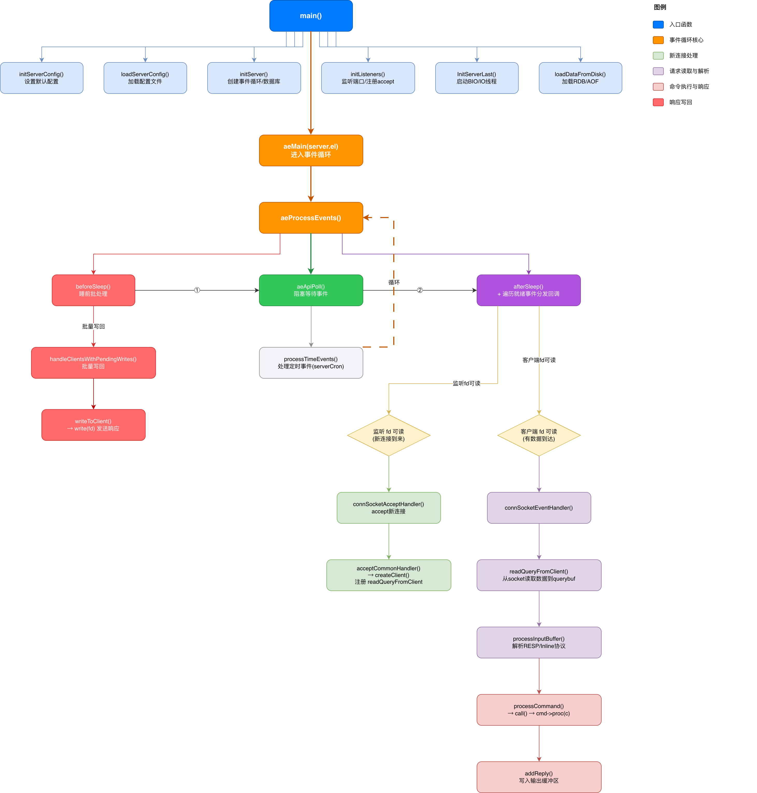
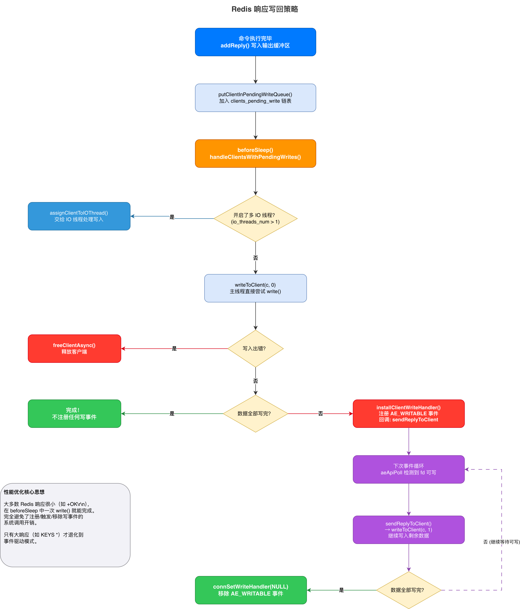
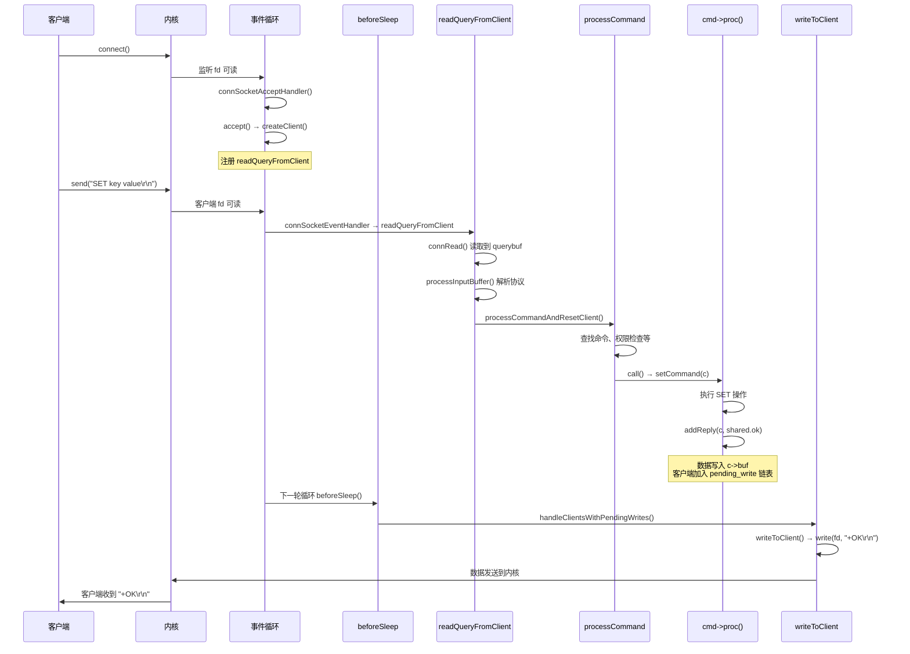

# Redis 事件分发机制


redis 服务端与客户端的网络连接交互，通过 epoll/kqueue/select 多路复用机制监听 socket IO 事件，完成事件分发与响应。


# Redis 事件驱动架构与客户端请求处理全流程

> 本文基于 Redis 8.6 最新源码，从 `main()` 函数出发，完整梳理 Redis 服务器的启动、事件循环、连接建立、请求读取、协议解析、命令执行、响应写回的全链路流程。

---

## 一、全局架构概览

Redis 采用经典的 **Reactor 模式**：单线程事件循环 + I/O 多路复用。整个服务器的生命周期可以用一张图概括：



---

## 二、服务器启动阶段

### 2.1 main() 函数入口

> 源码位置：`src/server.c` — `main()` 函数

Redis 的 `main()` 函数是整个程序的入口，它按照以下顺序完成启动：

```c
int main(int argc, char **argv) {
    // ① 基础初始化：时区、随机种子、CRC64、哈希种子
    tzset();
    zmalloc_set_oom_handler(redisOutOfMemoryHandler);
    gettimeofday(&tv, NULL);
    srand(time(NULL)^getpid()^tv.tv_usec);
    crc64_init();
    dictSetHashFunctionSeed(hashseed);

    // ② 配置初始化
    initServerConfig();       // 设置所有配置项的默认值
    ACLInit();                // 初始化 ACL 子系统
    moduleInitModulesSystem();// 初始化模块系统
    connTypeInitialize();     // 初始化连接类型（TCP/TLS/Unix）

    // ③ 解析命令行参数和配置文件
    loadServerConfig(server.configfile, config_from_stdin, options);

    // ④ 核心初始化
    initServer();             // 创建事件循环、数据库、注册 serverCron 等
    initListeners();          // 监听端口，注册 accept 事件
    InitServerLast();         // 启动 BIO 后台线程和 IO 线程

    // ⑤ 加载持久化数据
    loadDataFromDisk();       // 加载 RDB 或 AOF 文件

    // ⑥ 进入事件循环（永不返回，直到服务器关闭）
    aeMain(server.el);

    // ⑦ 清理退出
    aeDeleteEventLoop(server.el);
    return 0;
}
```

**要点**：`main()` 函数的核心逻辑就是"初始化一切，然后进入事件循环"。`aeMain()` 是一个无限循环，只有当 `server.el->stop` 被设置为 1 时才会退出。

### 2.2 initServer() — 核心初始化

> 源码位置：`src/server.c` — `initServer()` 函数

`initServer()` 是最重要的初始化函数，它完成了以下关键工作：

```c
void initServer(void) {
    // ① 信号处理
    signal(SIGHUP, SIG_IGN);
    signal(SIGPIPE, SIG_IGN);
    setupSignalHandlers();

    // ② 创建各种数据结构
    server.clients = listCreate();              // 客户端链表
    server.clients_pending_write = listCreate(); // 待写客户端链表
    server.clients_to_close = listCreate();      // 待关闭客户端链表

    // ③ ★ 创建事件循环 ★
    server.el = aeCreateEventLoop(server.maxclients + CONFIG_FDSET_INCR);

    // ④ 创建数据库
    server.db = zmalloc(sizeof(redisDb) * server.dbnum);
    for (j = 0; j < server.dbnum; j++) {
        server.db[j].keys = kvstoreCreate(...);
        server.db[j].expires = kvstoreCreate(...);
        // ...
    }

    // ⑤ ★ 注册定时事件 serverCron ★
    aeCreateTimeEvent(server.el, 1, serverCron, NULL, NULL);

    // ⑥ ★ 注册 beforeSleep 和 afterSleep 钩子 ★
    aeSetBeforeSleepProc(server.el, beforeSleep);
    aeSetAfterSleepProc(server.el, afterSleep);

    // ⑦ 初始化 Lua 脚本引擎、慢日志等
  	luaEnvInit();
    scriptingInit(1);
    slowlogInit();
}
```

其中 `aeCreateEventLoop()` 创建了事件循环的核心数据结构：

```c
#define INITIAL_EVENT 1024
aeEventLoop *aeCreateEventLoop(int setsize) {
    aeEventLoop *eventLoop;
    eventLoop = zmalloc(sizeof(*eventLoop));
  	eventLoop->nevents = setsize < INITIAL_EVENT ? setsize : INITIAL_EVENT;
    // events 数组：以 fd 为下标存储注册的事件和回调函数
    eventLoop->events = zmalloc(sizeof(aeFileEvent) * eventLoop->nevents);
    // fired 数组：存储 aeApiPoll 返回的就绪事件
    eventLoop->fired = zmalloc(sizeof(aeFiredEvent) * eventLoop->nevents);
    eventLoop->setsize = setsize;
    eventLoop->maxfd = -1;
  	eventLoop->stop = 0;
    eventLoop->beforesleep = NULL;
    eventLoop->aftersleep = NULL;

    // 创建底层多路复用实例（epoll_create / kqueue 等）
    aeApiCreate(eventLoop);

    // 初始化所有事件槽为 AE_NONE
    for (i = 0; i < eventLoop->nevents; i++)
        eventLoop->events[i].mask = AE_NONE;
    return eventLoop;
}
```

### 2.3 initListeners() — 监听端口并注册 accept 事件

> 源码位置：`src/server.c` — `initListeners()` 函数

这个函数负责创建监听 socket 并注册 accept 事件：

```c
void initListeners(void) {
    // ① 配置各类型监听器（TCP / TLS / Unix Socket）
    if (server.port != 0) {
        conn_index = connectionIndexByType(CONN_TYPE_SOCKET);
        listener = &server.listeners[conn_index];
        listener->bindaddr = server.bindaddr;
        listener->port = server.port;
        listener->ct = connectionByType(CONN_TYPE_SOCKET);
    }
    // TLS 和 Unix Socket 类似...

    // ② 遍历所有监听器，执行 listen 并注册 accept 事件
    for (int j = 0; j < CONN_TYPE_MAX; j++) {
        listener = &server.listeners[j];
        if (listener->ct == NULL) continue;

        // 调用 bind() + listen()
        connListen(listener);

        // ★ 为监听 fd 注册 AE_READABLE 事件，回调为 connSocketAcceptHandler ★
        createSocketAcceptHandler(listener, connAcceptHandler(listener->ct));
    }
}
// 回调函数 connSocketAcceptHandler，是在下面这个函数注册的（RedisRegisterConnectionTypeSocket）
// socket/TLS/Unix三种连接类型
int connTypeInitialize(void) {
    serverAssert(RedisRegisterConnectionTypeSocket() == C_OK);
    serverAssert(RedisRegisterConnectionTypeUnix() == C_OK);
    RedisRegisterConnectionTypeTLS();
    return C_OK;
}
int RedisRegisterConnectionTypeSocket(void)
{
    return connTypeRegister(&CT_Socket);
}
// 即 accept_handler = connSocketAcceptHandler
static ConnectionType CT_Socket = {
    /* connection type */
    .get_type = connSocketGetType,
    .ae_handler = connSocketEventHandler,
    .accept_handler = connSocketAcceptHandler,
  	.ae_handler = connSocketEventHandler,
  	.set_write_handler = connSocketSetWriteHandler,
    .set_read_handler = connSocketSetReadHandler,
    ......
};
```

`createSocketAcceptHandler()` 的实现非常简洁：

```c
int createSocketAcceptHandler(connListener *sfd, aeFileProc *accept_handler) {
    int j;
    for (j = 0; j < sfd->count; j++) {
        if (aeCreateFileEvent(server.el, sfd->fd[j], AE_READABLE, accept_handler,sfd) == AE_ERR) {
            /* Rollback */
            for (j = j-1; j >= 0; j--) aeDeleteFileEvent(server.el, sfd->fd[j], AE_READABLE);
            return C_ERR;
        }
    }
    return C_OK;
}
```

> **关键理解**：此时 `events[listen_fd].rfileProc = connSocketAcceptHandler`，当有新连接到来时，`aeApiPoll` 会返回这个 fd，然后事件循环调用 `connSocketAcceptHandler` 来 accept 新连接。

### 2.4 InitServerLast() — 启动后台线程

> 源码位置：`src/server.c` — `InitServerLast()` 函数

```c
void InitServerLast(void) {
    bioInit();           // 启动 BIO 后台线程（用于异步关闭文件、AOF fsync 等）
    initThreadedIO();    // 启动 IO 线程（多线程读写，默认关闭）
    server.initial_memory_usage = zmalloc_used_memory();
}
```

---

## 三、事件循环机制

### 3.1 ae 库的核心数据结构

> 源码位置：`src/ae.h`

Redis 的事件循环由 `ae` 库实现，核心数据结构如下：

```c
/* 文件事件 —— 以 fd 为下标存储在 events 数组中 */
typedef struct aeFileEvent {
    int mask;                // AE_READABLE | AE_WRITABLE | AE_BARRIER
    aeFileProc *rfileProc;   // 可读事件回调函数
    aeFileProc *wfileProc;   // 可写事件回调函数
    void *clientData;        // 回调函数的私有数据
} aeFileEvent;

/* 定时事件 —— 链表结构 */
typedef struct aeTimeEvent {
    long long id;
    monotime when;           // 触发时间
    aeTimeProc *timeProc;    // 定时回调函数
    struct aeTimeEvent *prev;
    struct aeTimeEvent *next;
} aeTimeEvent;

/* 就绪事件 —— aeApiPoll 填充 */
typedef struct aeFiredEvent {
    int fd;
    int mask;
} aeFiredEvent;

/* 事件循环主结构 */
typedef struct aeEventLoop {
    int maxfd;                      // 当前注册的最大 fd
    int setsize;                    // 最大可跟踪的 fd 数量
    aeFileEvent *events;            // ★ 注册事件数组（以 fd 为下标）
    aeFiredEvent *fired;            // ★ 就绪事件数组
    aeTimeEvent *timeEventHead;     // 定时事件链表头
    void *apidata;                  // 底层多路复用 API 的私有数据
    aeBeforeSleepProc *beforesleep; // 睡前钩子
    aeBeforeSleepProc *aftersleep;  // 醒后钩子
    int stop;                       // 停止标志
} aeEventLoop;
```

**核心设计**：`events` 数组以 fd 为下标，实现 O(1) 的事件查找。当 `aeApiPoll` 返回就绪的 fd 后，直接用 `events[fd]` 就能找到对应的回调函数。

### 3.2 aeMain() — 事件循环主入口

> 源码位置：`src/ae.c` — `aeMain()` 函数

```c
void aeMain(aeEventLoop *eventLoop) {
    eventLoop->stop = 0;
    while (!eventLoop->stop) {
        aeProcessEvents(eventLoop, AE_ALL_EVENTS |
                                   AE_CALL_BEFORE_SLEEP |
                                   AE_CALL_AFTER_SLEEP);
    }
}
```

这是一个极其简洁的无限循环，每次迭代调用 `aeProcessEvents()` 处理所有类型的事件。

### 3.3 aeProcessEvents() — 事件分发核心

> 源码位置：`src/ae.c` — `aeProcessEvents()` 函数

这是 Redis 事件驱动的心脏，每一次循环迭代都会执行以下步骤：

```c
int aeProcessEvents(aeEventLoop *eventLoop, int flags) {
    int processed = 0, numevents;

    // ========== 阶段 1：调用 beforeSleep 钩子 ==========
    if (eventLoop->beforesleep != NULL && (flags & AE_CALL_BEFORE_SLEEP))
        eventLoop->beforesleep(eventLoop);
    // beforeSleep 中会：
    //   - 批量写回客户端响应（handleClientsWithPendingWrites）
    //   - 刷写 AOF 缓冲区
    //   - 快速过期键清理
    //   - 处理集群状态等

    // ========== 阶段 2：计算阻塞超时时间 ==========
    // 根据最近的定时事件计算 aeApiPoll 的超时时间
    // 确保定时事件能被及时触发

    // ========== 阶段 3：调用底层多路复用 API 等待事件 ==========
    numevents = aeApiPoll(eventLoop, tvp);
    // 这里会阻塞，直到有事件就绪或超时
    // 底层调用 epoll_wait / kevent / select

    // ========== 阶段 4：调用 afterSleep 钩子 ==========
    if (eventLoop->aftersleep != NULL && flags & AE_CALL_AFTER_SLEEP)
        eventLoop->aftersleep(eventLoop);

    // ========== 阶段 5：遍历就绪事件，分发到回调函数 ==========
    for (j = 0; j < numevents; j++) {
        int fd = eventLoop->fired[j].fd;       // 就绪的 fd
        aeFileEvent *fe = &eventLoop->events[fd]; // 通过 fd 找到注册的事件
        int mask = eventLoop->fired[j].mask;    // 就绪的事件类型

        int invert = fe->mask & AE_BARRIER;

        // 默认先读后写
        if (!invert && fe->mask & mask & AE_READABLE) {
            fe->rfileProc(eventLoop, fd, fe->clientData, mask);  // 触发读回调
        }
        if (fe->mask & mask & AE_WRITABLE) {
            fe->wfileProc(eventLoop, fd, fe->clientData, mask);  // 触发写回调
        }
        // AE_BARRIER 模式：先写后读（用于 AOF fsync=always 场景）
        if (invert && fe->mask & mask & AE_READABLE) {
            fe->rfileProc(eventLoop, fd, fe->clientData, mask);
        }
        processed++;
    }

    // ========== 阶段 6：处理定时事件 ==========
    if (flags & AE_TIME_EVENTS)
        processed += processTimeEvents(eventLoop);

    return processed;
}
```


### 3.4 多路复用后端的选择

> 源码位置：`src/ae.c` 头部

Redis 根据操作系统自动选择最优的多路复用实现：

```c
#ifdef HAVE_EVPORT
#include "ae_evport.c"    // Solaris event ports
#else
    #ifdef HAVE_EPOLL
    #include "ae_epoll.c" // Linux epoll（最常用）
    #else
        #ifdef HAVE_KQUEUE
        #include "ae_kqueue.c" // macOS/BSD kqueue
        #else
        #include "ae_select.c" // 通用 select（性能最差）
        #endif
    #endif
#endif
```

每个后端都实现了统一的接口：
- `aeApiCreate()` — 创建多路复用实例
- `aeApiAddEvent()` — 注册事件
- `aeApiDelEvent()` — 删除事件
- `aeApiPoll()` — 等待就绪事件

### 3.5 事件注册 — aeCreateFileEvent()

> 源码位置：`src/ae.c` — `aeCreateFileEvent()` 函数

```c
int aeCreateFileEvent(aeEventLoop *eventLoop, int fd, int mask,
        aeFileProc *proc, void *clientData)
{
    // 如果 fd 超出当前 events 数组大小，动态扩容
    if (fd >= eventLoop->nevents) {
        int newnevents = eventLoop->nevents * 2;
        eventLoop->events = zrealloc(eventLoop->events, sizeof(aeFileEvent) * newnevents);
        eventLoop->fired = zrealloc(eventLoop->fired, sizeof(aeFiredEvent) * newnevents);
    }

    aeFileEvent *fe = &eventLoop->events[fd];  // ★ 以 fd 为下标

    // 调用底层 API 注册事件（如 epoll_ctl）
    aeApiAddEvent(eventLoop, fd, mask);

    // 保存回调函数
    fe->mask |= mask;
    if (mask & AE_READABLE) fe->rfileProc = proc;  // 读回调
    if (mask & AE_WRITABLE) fe->wfileProc = proc;  // 写回调
    fe->clientData = clientData;

    if (fd > eventLoop->maxfd) eventLoop->maxfd = fd;
    return AE_OK;
}
```

> **关键理解**：这就是"注册"和"分发"之间的桥梁。注册时把回调函数存入 `events[fd]`，分发时通过 `fired[j].fd` 找到 `events[fd]` 取出回调函数执行。

---

## 四、新连接建立

### 4.1 accept 事件触发

当客户端发起 TCP 连接时，监听 socket 变为可读，`aeApiPoll` 返回该 fd，事件循环调用注册的回调函数 `connSocketAcceptHandler`：

> 源码位置：`src/socket.c` — `connSocketAcceptHandler()` 函数

```c
static void connSocketAcceptHandler(aeEventLoop *el, int fd, void *privdata, int mask) {
    int cport, cfd;
    int max = server.max_new_conns_per_cycle;  // 每次循环最多 accept 的连接数
    char cip[NET_IP_STR_LEN];

    while(max--) {
        // ① 调用 accept() 系统调用获取新连接的 fd
        cfd = anetTcpAccept(server.neterr, fd, cip, sizeof(cip), &cport);
        if (cfd == ANET_ERR) {
            if (errno != EWOULDBLOCK)
                serverLog(LL_WARNING, "Accepting client connection: %s", server.neterr);
            return;
        }
        serverLog(LL_VERBOSE, "Accepted %s:%d", cip, cport);

        // ② 创建 connection 对象并进入通用处理流程
        acceptCommonHandler(connCreateAcceptedSocket(el, cfd, NULL), 0, cip);
    }
}
```

底层就是系统调用 accept，并且包装成 connection 对象 → 创建 client → 注册读事件 → 等待客户端发送命令，后面的逻辑由 `acceptCommonHandler(connCreateAcceptedSocket(el,cfd,NULL), 0, cip);` 完成

> **注意**：这里用 `while(max--)` 循环，是因为在高并发场景下，一次 `aeApiPoll` 返回时可能有多个连接等待 accept。但为了避免饿死其他事件，限制了每次循环最多 accept 的数量。

### 4.2 acceptCommonHandler() — 通用连接处理

> 源码位置：`src/networking.c` — `acceptCommonHandler()` 函数

```c
void acceptCommonHandler(connection *conn, int flags, char *ip) {
    client *c;

    // ① 检查连接状态
    if (connGetState(conn) != CONN_STATE_ACCEPTING) {
        connClose(conn);
        return;
    }

    // ② 检查连接数限制
    if (listLength(server.clients) + getClusterConnectionsCount() >= server.maxclients) {
        connWrite(conn, "-ERR max number of clients reached\r\n", ...);
        server.stat_rejected_conn++;
        connClose(conn);
        return;
    }

    // ③ ★ 创建客户端对象（核心步骤）★
    if ((c = createClient(conn)) == NULL) {
        connClose(conn);
        return;
    }

    c->flags |= flags;

    // ④ 发起 accept 握手（对于 TCP 直接完成，对于 TLS 需要异步握手）
    connAccept(conn, clientAcceptHandler);
}
```

### 4.3 createClient() — 创建客户端对象

> 源码位置：`src/networking.c` — `createClient()` 函数

这是连接建立过程中最关键的函数，它创建 `client` 对象并**注册读事件回调**：

```c
client *createClient(connection *conn) {
    client *c = zmalloc(sizeof(client));

    if (conn) {
        // 设置 TCP_NODELAY，禁用 Nagle 算法以降低延迟
        connEnableTcpNoDelay(conn);
        // 设置 TCP keepalive
        if (server.tcpkeepalive)
            connKeepAlive(conn, server.tcpkeepalive);

        // ★★★ 核心：注册读事件回调为 readQueryFromClient ★★★
        connSetReadHandler(conn, readQueryFromClient);
        // 将 client 指针存入 connection 的私有数据
        connSetPrivateData(conn, c);
    }

    // 初始化客户端的各种字段
    c->conn = conn;           // 持有 connection 引用（内含 socket fd）
    c->buf = zmalloc_usable(PROTO_REPLY_CHUNK_BYTES, &c->buf_usable_size); // 输出缓冲区
    c->querybuf = NULL;       // 输入缓冲区（延迟分配）
    c->reqtype = 0;           // 请求类型（RESP/Inline，待检测）
    c->argc = 0;              // 命令参数数量
    c->argv = NULL;           // 命令参数数组
    c->cmd = c->lastcmd = NULL;
    c->reply = listCreate();  // 输出链表（大回复用）
    c->flags = 0;
    // ... 更多字段初始化 ...

    if (conn) linkClient(c);  // 加入全局客户端链表
    return c;
}
```

`connSetReadHandler` 最终会调用 `aeCreateFileEvent` 将客户端 fd 注册到事件循环中：

```
connSetReadHandler(conn, readQueryFromClient)
  └─ connSocketSetReadHandler()
       ├─ conn->read_handler = readQueryFromClient  // 保存逻辑回调
       └─ aeCreateFileEvent(el, fd, AE_READABLE, connSocketEventHandler, conn)
            // 注册到 ae 的回调是 connSocketEventHandler（连接层的统一入口）
            // connSocketEventHandler 内部再调用 conn->read_handler
```

> **为什么要多一层 connSocketEventHandler？** 因为 Redis 的连接抽象层需要统一处理 TCP 和 TLS。TCP 的读写直接对应 AE 事件，但 TLS 的读写可能需要多次底层 I/O（握手、重协商等）。通过 `connSocketEventHandler` 这一层，上层代码不需要关心底层是 TCP 还是 TLS。

---

## 五、请求读取与协议解析

### 5.1 connSocketEventHandler() — 连接层事件分发

> 源码位置：`src/socket.c` — `connSocketEventHandler()` 函数

当客户端 socket 有数据可读时，`aeProcessEvents` 触发 `connSocketEventHandler`：

```c
static void connSocketEventHandler(struct aeEventLoop *el, int fd, 
                                    void *clientData, int mask) {
    connection *conn = clientData;

    // 处理连接中状态（异步连接完成）
    if (conn->state == CONN_STATE_CONNECTING && (mask & AE_WRITABLE) && conn->conn_handler) {
        // ... 处理连接完成回调 ...
    }

    // 是否需要反转读写顺序（AE_BARRIER 场景）
    int invert = conn->flags & CONN_FLAG_WRITE_BARRIER;

    int call_write = (mask & AE_WRITABLE) && conn->write_handler;
    int call_read = (mask & AE_READABLE) && conn->read_handler;

    // 默认：先读后写
    if (!invert && call_read) {
        // ★ 调用 conn->read_handler，即 readQueryFromClient
        if (!callHandler(conn, conn->read_handler)) return;
    }
    if (call_write) {
        // 调用 conn->write_handler，即 sendReplyToClient
        if (!callHandler(conn, conn->write_handler)) return;
    }
    // AE_BARRIER 模式：先写后读
    if (invert && call_read) {
        if (!callHandler(conn, conn->read_handler)) return;
    }
}
```

### 5.2 readQueryFromClient() — 从 socket 读取数据

> 源码位置：`src/networking.c` — `readQueryFromClient()` 函数

这是读取客户端请求数据的核心函数：

```c
void readQueryFromClient(connection *conn) {
    client *c = connGetPrivateData(conn);
    int nread, big_arg = 0;
    size_t qblen, readlen;

    readlen = PROTO_IOBUF_LEN;  // 默认读取 16KB

    // ① 大参数优化：如果正在读取一个大的 bulk 字符串，
    //    精确分配缓冲区大小，避免后续拷贝
    if (c->reqtype == PROTO_REQ_MULTIBULK && c->multibulklen && 
        c->bulklen != -1 && c->bulklen >= PROTO_MBULK_BIG_ARG) {
        ssize_t remaining = (size_t)(c->bulklen+2) - (sdslen(c->querybuf) - c->qb_pos);
        big_arg = 1;
        if (remaining > 0) readlen = remaining;
    }

    // ② 延迟分配查询缓冲区（使用可复用的共享缓冲区）
    if (c->querybuf == NULL) {
        // 优先使用线程级别的可复用查询缓冲区
        c->querybuf = thread_reusable_qb;
        thread_reusable_qb_used = 1;
    }

    // ③ 确保缓冲区有足够空间
    c->querybuf = sdsMakeRoomFor(c->querybuf, readlen);

    // ④ ★ 从 socket 读取数据到 querybuf ★
    nread = connRead(c->conn, c->querybuf + qblen, readlen);
    // connRead → connSocketRead → read(conn->fd, buf, len)

    if (nread == -1) { /* 读取错误 */ }
    if (nread == 0)  { /* 连接关闭 */ freeClientAsync(c); return; }

    sdsIncrLen(c->querybuf, nread);

    // ⑤ 检查查询缓冲区大小限制
    if (sdslen(c->querybuf) > server.client_max_querybuf_len) {
        freeClientAsync(c);
        return;
    }

    // ⑥ ★ 解析输入缓冲区 ★
    if (processInputBuffer(c) == C_ERR)
        c = NULL;
}
```

数据流向示意图：

```
客户端发送: SET key value
                    │
                    ▼
            ┌──────────────┐
            │  socket 内核  │
            │  接收缓冲区   │
            └──────┬───────┘
                   │ connRead() / read()
                   ▼
            ┌──────────────┐
            │ c->querybuf  │  ← SDS 动态字符串
            │ (输入缓冲区)  │
            └──────┬───────┘
                   │ processInputBuffer()
                   ▼
            ┌──────────────┐
            │  c->argv[]   │  ← 解析后的命令参数
            │  c->argc     │
            └──────────────┘
```

### 5.3 processInputBuffer() — 协议解析主循环

> 源码位置：`src/networking.c` — `processInputBuffer()` 函数

这是协议解析的核心循环，它从 `querybuf` 中解析出完整的命令并执行：

```c
int processInputBuffer(client *c) {
    // lookahead：预解析的命令数量（用于命令预取优化）
    const int lookahead = authRequired(c) ? 1 : server.lookahead;

    // 主循环：只要缓冲区中有数据或有已解析好的命令
    while ((c->querybuf && c->qb_pos < sdslen(c->querybuf)) ||
           c->pending_cmds.ready_len > 0)
    {
        // 检查客户端状态（阻塞、待关闭等）
        if (c->flags & CLIENT_BLOCKED) break;
        if (c->flags & (CLIENT_CLOSE_AFTER_REPLY|CLIENT_CLOSE_ASAP)) break;

        // ========== 解析阶段 ==========
        while (parse_more && c->pending_cmds.ready_len < lookahead &&
               c->querybuf && c->qb_pos < sdslen(c->querybuf))
        {
            // 检测协议类型
            if (!c->reqtype) {
                if (c->querybuf[c->qb_pos] == '*') {
                    c->reqtype = PROTO_REQ_MULTIBULK;  // RESP 协议（以 * 开头）
                } else {
                    c->reqtype = PROTO_REQ_INLINE;     // Inline 协议（纯文本）
                }
            }

            // 根据协议类型调用对应的解析器
            if (c->reqtype == PROTO_REQ_INLINE) {
                processInlineBuffer(c, pcmd);    // 解析 "SET key value\r\n"
            } else if (c->reqtype == PROTO_REQ_MULTIBULK) {
                processMultibulkBuffer(c, pcmd); // 解析 "*3\r\n$3\r\nSET\r\n..."
            }

            // 预处理命令（查找命令、提取 key、计算 slot 等）
            preprocessCommand(c, pcmd);
        }

        // ========== 执行阶段 ==========
        // 取出已解析好的命令
        pendingCommand *curcmd = c->pending_cmds.head;
        c->argc = curcmd->argc;
        c->argv = curcmd->argv;
        c->cmd  = curcmd->cmd;

        // ★ 执行命令 ★
        if (processCommandAndResetClient(c) == C_ERR) {
            return C_ERR;  // 客户端已被释放
        }
    }

    // 裁剪已处理的缓冲区数据
    if (c->qb_pos) {
        sdsrange(c->querybuf, c->qb_pos, -1);
        c->qb_pos = 0;
    }
    return C_OK;
}
```

**两种协议格式**：

| 协议类型 | 格式示例 | 使用场景 |
|---------|---------|---------|
| **Inline** | `SET key value\r\n` | 人工 telnet 调试 |
| **RESP (Multibulk)** | `*3\r\n$3\r\nSET\r\n$3\r\nkey\r\n$5\r\nvalue\r\n` | 所有 Redis 客户端库 |

---

## 六、命令执行

### 6.1 processCommandAndResetClient() — 执行入口

> 源码位置：`src/networking.c` — `processCommandAndResetClient()` 函数

```c
int processCommandAndResetClient(client *c) {
    int deadclient = 0;
    client *old_client = server.current_client;

    // ① 设置当前客户端（用于嵌套调用时的上下文追踪）
    server.current_client = c;

    // ② 执行命令
    if (processCommand(c) == C_OK) {
        // ③ 命令后处理（重置客户端状态，准备接收下一条命令）
        commandProcessed(c);
        // 更新客户端内存使用统计
        if (c->conn) updateClientMemUsageAndBucket(c);
    }

    // ④ 检查客户端是否在执行过程中被释放
    if (server.current_client == NULL) deadclient = 1;

    // ⑤ 恢复旧的 current_client（支持嵌套调用）
    server.current_client = old_client;

    return deadclient ? C_ERR : C_OK;
}
```

### 6.2 processCommand() — 命令检查与分发

> 源码位置：`src/server.c` — `processCommand()` 函数

这是命令执行前的"守门员"，负责大量的前置检查：

```c
int processCommand(client *c) {
    // ========== 第一步：查找命令 ==========
    struct redisCommand *cmd = c->lookedcmd;
    if (!cmd) {
        if (isCommandReusable(c->lastcmd, c->argv[0]))
            cmd = c->lastcmd;       // 复用上次的命令（优化）
        else
            cmd = lookupCommand(c->argv, c->argc);  // 从命令表中查找
    }
    c->cmd = c->lastcmd = c->realcmd = cmd;

    // ========== 第二步：各种前置检查 ==========
    // 检查命令是否存在
    if (!commandCheckExistence(c, &err)) { rejectCommandSds(c, err); return C_OK; }
    // 检查参数数量
    if (!commandCheckArity(c->cmd, c->argc, &err)) { rejectCommandSds(c, err); return C_OK; }
    // 检查认证状态
    if (authRequired(c)) { rejectCommand(c, shared.noautherr); return C_OK; }
    // 检查 ACL 权限
    if (ACLCheckAllPerm(c, &acl_errpos) != ACL_OK) { /* 拒绝 */ return C_OK; }
    // 集群重定向检查
    if (server.cluster_enabled) { /* 检查 key 是否在本节点 */ }
    // 内存淘汰检查
    if (server.maxmemory) { performEvictions(); }
    // 持久化错误检查
    if (deny_write_type != DISK_ERROR_TYPE_NONE) { /* 拒绝写命令 */ }
    // 主从复制检查
    if (server.masterhost && server.repl_slave_ro) { /* 只读从节点拒绝写 */ }
    // 客户端暂停检查
    if (isPausedActions(PAUSE_ACTION_CLIENT_ALL)) { blockPostponeClient(c); return C_OK; }
    // ... 更多检查 ...

    // ========== 第三步：执行命令 ==========
    if (c->flags & CLIENT_MULTI && /* 不是 EXEC/DISCARD/MULTI/WATCH */) {
        // 在事务中：将命令入队，不立即执行
        queueMultiCommand(c, cmd_flags);
        addReply(c, shared.queued);
    } else {
        // ★ 正常执行 ★
        call(c, CMD_CALL_FULL);
        // 处理因命令执行而解除阻塞的客户端
        if (listLength(server.ready_keys))
            handleClientsBlockedOnKeys();
    }
    return C_OK;
}
```

### 6.3 call() — 真正执行命令

> 源码位置：`src/server.c` — `call()` 函数

`call()` 是命令执行的最终环节：

```c
void call(client *c, int flags) {
    long long dirty;
    struct redisCommand *real_cmd = c->realcmd;

    // ① 清除需要按需设置的标志
    c->flags &= ~(CLIENT_FORCE_AOF|CLIENT_FORCE_REPL|CLIENT_PREVENT_PROP);

    // ② 记录执行前的状态
    dirty = server.dirty;
    monotime monotonic_start = getMonotonicUs();

    // ③ ★★★ 执行命令处理函数 ★★★
    c->cmd->proc(c);
    // 例如：SET 命令 → setCommand(c)
    //       GET 命令 → getCommand(c)
    //       DEL 命令 → delCommand(c)

    // ④ 计算执行耗时
    ustime_t duration = getMonotonicUs() - monotonic_start;
    c->duration += duration;
    dirty = server.dirty - dirty;  // 计算数据变更量

    // ⑤ 慢日志记录
    slowlogPushCurrentCommand(c, real_cmd, c->duration);

    // ⑥ MONITOR 命令通知
    replicationFeedMonitors(c, server.monitors, c->db->id, argv, argc);

    // ⑦ 更新命令统计
    real_cmd->calls++;
    real_cmd->microseconds += c->duration;

    // ⑧ 命令传播（AOF + 主从复制）
    if (flags & CMD_CALL_PROPAGATE) {
        int propagate_flags = PROPAGATE_NONE;
        if (dirty) propagate_flags |= (PROPAGATE_AOF | PROPAGATE_REPL);
        if (propagate_flags != PROPAGATE_NONE)
            alsoPropagate(c->db->id, c->argv, c->argc, propagate_flags);
    }

    // ⑨ 客户端缓存追踪
    if ((c->cmd->flags & CMD_READONLY) && server.current_client &&
        (server.current_client->flags & CLIENT_TRACKING)) {
        trackingRememberKeys(server.current_client, c);
    }

    server.stat_numcommands++;
}
```

命令执行的核心就是 `c->cmd->proc(c)` 这一行。Redis 的每个命令都注册了一个处理函数，例如：

| 命令 | 处理函数 | 源文件 |
|------|---------|--------|
| SET | `setCommand()` | `t_string.c` |
| GET | `getCommand()` | `t_string.c` |
| LPUSH | `lpushCommand()` | `t_list.c` |
| HSET | `hsetCommand()` | `t_hash.c` |
| ZADD | `zaddCommand()` | `t_zset.c` |

---

## 七、响应写回

### 7.1 addReply() — 写入输出缓冲区

> 源码位置：`src/networking.c` — `addReply()` 函数

命令执行过程中，通过 `addReply()` 系列函数将响应写入客户端的输出缓冲区：

```c
void addReply(client *c, robj *obj) {
    // ① 准备写入：将客户端加入待写队列
    if (_prepareClientToWrite(c) != C_OK) return;

    // ② 将数据写入输出缓冲区
    if (sdsEncodedObject(obj)) {
        _addReplyToBufferOrList(c, obj->ptr, sdslen(obj->ptr));
    } else if (obj->encoding == OBJ_ENCODING_INT) {
        char buf[32];
        size_t len = ll2string(buf, sizeof(buf), (long)obj->ptr);
        _addReplyToBufferOrList(c, buf, len);
    }
}
```

`_prepareClientToWrite()` 的关键逻辑：

```c
static inline int _prepareClientToWrite(client *c) {
    // Lua/Module 客户端没有 socket，直接返回
    if (c->flags & (CLIENT_SCRIPT|CLIENT_MODULE)) return C_OK;
    // 标记为即将关闭的客户端，不再写入
    if (c->flags & CLIENT_CLOSE_ASAP) return C_ERR;
    // 没有 connection 的假客户端（AOF 加载用）
    if (!c->conn) return C_ERR;

    // ★ 核心：将客户端加入待写队列（而非注册写事件）★
    if (!clientHasPendingReplies(c))
        putClientInPendingWriteQueue(c);

    return C_OK;
}
```

```c
void putClientInPendingWriteQueue(client *c) {
    if (!(c->flags & CLIENT_PENDING_WRITE)) {
        // 标记客户端有待写数据
        c->flags |= CLIENT_PENDING_WRITE;
        // 加入全局待写链表
        listLinkNodeHead(server.clients_pending_write, &c->clients_pending_write_node);
    }
}
```

> **关键设计**：`addReply()` 不会立即写入 socket，也不会注册写事件。它只是把数据放入缓冲区，并把客户端加入 `server.clients_pending_write` 链表。真正的写入发生在 `beforeSleep()` 中。

客户端的输出缓冲区有两级结构：

```
┌─────────────────────────────────────────┐
│ client                                   │
│                                          │
│  ┌──────────────────────┐                │
│  │ c->buf (固定缓冲区)   │ ← 小回复优先写这里 │
│  │ 大小: 16KB            │   （避免链表分配）  │
│  │ c->bufpos: 已用长度    │                │
│  │ c->sentlen: 已发送长度  │                │
│  └──────────────────────┘                │
│                                          │
│  ┌──────────────────────┐                │
│  │ c->reply (链表)       │ ← 大回复溢出到这里 │
│  │ node → node → node   │                │
│  │ c->reply_bytes: 总大小 │                │
│  └──────────────────────┘                │
└─────────────────────────────────────────┘
```

### 7.2 beforeSleep() 中的批量写回

> 源码位置：`src/server.c` — `beforeSleep()` 函数
> 源码位置：`src/networking.c` — `handleClientsWithPendingWrites()` 函数

在每次事件循环进入 `aeApiPoll()` 阻塞之前，`beforeSleep()` 会调用 `handleClientsWithPendingWrites()` 批量处理所有待写客户端：

```c
int handleClientsWithPendingWrites(void) {
    listIter li;
    listNode *ln;
    int processed = listLength(server.clients_pending_write);

    listRewind(server.clients_pending_write, &li);
    while((ln = listNext(&li))) {
        client *c = listNodeValue(ln);

        // 清除待写标记，从链表中移除
        c->flags &= ~CLIENT_PENDING_WRITE;
        listUnlinkNode(server.clients_pending_write, ln);

        // 跳过受保护的和即将关闭的客户端
        if (c->flags & CLIENT_PROTECTED) continue;
        if (c->flags & CLIENT_CLOSE_ASAP) continue;

        // ★ 尝试直接写入 socket ★
        if (writeToClient(c, 0) == C_ERR) continue;

        // ★ 如果没写完，才注册写事件 ★
        if (clientHasPendingReplies(c)) {
            installClientWriteHandler(c);
        }
    }
    return processed;
}
```

`writeToClient()` 内部最终调用 `write()` 系统调用：

```c
int writeToClient(client *c, int handler_installed) {
    ssize_t nwritten = 0, totwritten = 0;

    while (_clientHasPendingRepliesNonSlave(c)) {
        int ret = _writeToClientNonSlave(c, &nwritten);
        if (ret == C_ERR) break;
        totwritten += nwritten;

        // 限制单次写入量，避免饿死其他客户端
        if (totwritten > NET_MAX_WRITES_PER_EVENT &&
            (server.maxmemory == 0 || zmalloc_used_memory() < server.maxmemory))
            break;
    }

    // 如果全部写完，移除写事件处理器
    if (!clientHasPendingReplies(c)) {
        c->sentlen = 0;
        if (handler_installed) connSetWriteHandler(c->conn, NULL);
    }
    return C_OK;
}
```

```c
// 最终的写入
static inline int _writeToClientNonSlave(client *c, ssize_t *nwritten) {
    if (c->bufpos > 0) {
        // ★ 通过 connection 写入 socket ★
        *nwritten = connWrite(c->conn, c->buf + c->sentlen, c->bufpos - c->sentlen);
        // connWrite → connSocketWrite → write(conn->fd, data, data_len)
    }
    return C_OK;
}
```

### 7.3 写不完时的降级策略 — 注册写事件

当响应数据太大（如 `KEYS *` 返回大量 key），一次 `write()` 无法全部发送时，Redis 才会注册 `AE_WRITABLE` 事件：

```c
void installClientWriteHandler(client *c) {
    int ae_barrier = 0;
    // AOF fsync=always 时，需要先写 AOF 再回复客户端
    if (server.aof_state == AOF_ON && server.aof_fsync == AOF_FSYNC_ALWAYS) {
        ae_barrier = 1;  // 设置 WRITE_BARRIER
    }
    // 注册写事件，回调为 sendReplyToClient
    connSetWriteHandlerWithBarrier(c->conn, sendReplyToClient, ae_barrier);
}
```

之后在下一次事件循环中，`aeApiPoll` 检测到 socket 可写时，会触发 `sendReplyToClient` → `writeToClient`，继续发送剩余数据。写完后立即移除写事件。

**写回策略总结**：





> **性能优化的核心思想**：大多数 Redis 响应很小（如 `+OK\r\n`），在 `beforeSleep` 中一次 `write()` 就能完成。这样就完全避免了注册/触发/移除写事件的系统调用开销。只有大响应才退化到事件驱动模式。

---

## 八、定时事件 — serverCron

> 源码位置：`src/server.c` — `serverCron()` 函数
> 源码位置：`src/ae.c` — `processTimeEvents()` 函数

Redis 在 `initServer()` 中注册了唯一的定时事件 `serverCron`：

```c
aeCreateTimeEvent(server.el, 1, serverCron, NULL, NULL);
```

`processTimeEvents()` 在每次事件循环的末尾检查并执行到期的定时事件：

```c
static int processTimeEvents(aeEventLoop *eventLoop) {
    aeTimeEvent *te = eventLoop->timeEventHead;
    monotime now = getMonotonicUs();

    while(te) {
        if (te->when <= now) {
            // 执行定时回调
            retval = te->timeProc(eventLoop, id, te->clientData);
            // 如果返回值不是 AE_NOMORE，则重新调度
            if (retval != AE_NOMORE) {
                te->when = now + (monotime)retval * 1000;
            } else {
                te->id = AE_DELETED_EVENT_ID;  // 标记删除
            }
        }
        te = te->next;
    }
}
```

`serverCron` 默认每秒执行 `server.hz` 次（默认 10 次，即每 100ms 一次），负责大量的后台维护工作：

| 任务 | 频率 | 说明 |
|------|------|------|
| 统计信息更新 | 每 100ms | 命令数、网络流量等瞬时指标 |
| LRU 时钟更新 | 每次 | 用于 LRU 淘汰策略 |
| 内存统计 | 每次 | RSS、碎片率等 |
| 客户端维护 (`clientsCron`) | 每次 | 超时检测、缓冲区收缩 |
| 数据库维护 (`databasesCron`) | 每次 | 渐进式 rehash、过期键清理 |
| RDB/AOF 子进程检查 | 每次 | 检查后台持久化是否完成 |
| RDB 自动保存检查 | 每次 | 根据 save 配置决定是否触发 BGSAVE |
| AOF 重写检查 | 每次 | 根据增长比例决定是否触发 BGREWRITEAOF |
| 复制维护 (`replicationCron`) | 每 1s | 主从连接维护、心跳 |
| 集群维护 (`clusterCron`) | 每 100ms | 节点通信、故障检测 |
| Sentinel 定时器 | 每次 | 哨兵模式下的监控逻辑 |

---

## 九、关键设计思想总结

### 1. Reactor 模式

Redis 采用经典的单线程 Reactor 模式：

```
                    ┌─────────────────────────────────┐
                    │         Event Loop               │
                    │                                   │
  Client A ──────► │  ┌─────────┐    ┌──────────────┐ │
  Client B ──────► │  │aeApiPoll│───►│ 事件分发器    │ │
  Client C ──────► │  │(epoll)  │    │ (回调函数表)  │ │
                    │  └─────────┘    └──────┬───────┘ │
                    │                        │         │
                    │              ┌─────────┼─────────┤
                    │              ▼         ▼         ▼│
                    │         accept()   read()   write()│
                    └─────────────────────────────────┘
```

**优势**：
- 无锁设计，避免线程切换和竞争开销
- 所有操作都是非阻塞的，单线程即可处理数万并发连接
- 代码简单，不存在并发 bug

### 2. 延迟写回优化

Redis 不在命令执行后立即写回响应，而是：
1. 先将响应数据写入客户端的输出缓冲区
2. 将客户端加入 `clients_pending_write` 链表
3. 在 `beforeSleep()` 中批量直接写入 socket
4. 只有写不完时才注册 `AE_WRITABLE` 事件

这种设计减少了大量的 `epoll_ctl` 系统调用。

### 3. 连接抽象层

Redis 通过 `connection` 抽象层隔离了 TCP 和 TLS 的差异：

```
上层代码（networking.c）
    │
    │  connRead() / connWrite() / connSetReadHandler()
    ▼
connection 抽象层（connection.h）
    │
    ├── socket.c  （TCP 实现）
    │     connSocketRead() → read()
    │     connSocketWrite() → write()
    │
    └── tls.c     （TLS 实现）
          connTLSRead() → SSL_read()
          connTLSWrite() → SSL_write()
```

### 4. 两级事件分发

```
第一级：ae 事件循环
    events[fd].rfileProc = connSocketEventHandler  ← ae 层只知道这个

第二级：connection 层
    conn->read_handler = readQueryFromClient       ← connection 层分发到具体处理函数
    conn->write_handler = sendReplyToClient
```

### 5. 完整的一次请求生命周期



---

> **总结**：Redis 的事件驱动架构是一个精心设计的高性能系统。从 `main()` 启动到处理每一个客户端请求，每一层都有明确的职责分工。`ae` 库负责底层事件多路复用，`connection` 层负责协议无关的连接抽象，`networking.c` 负责协议解析和响应写回，`server.c` 负责命令查找和执行。通过延迟写回、批量处理、连接抽象等设计，Redis 在单线程模型下实现了极高的吞吐量。

