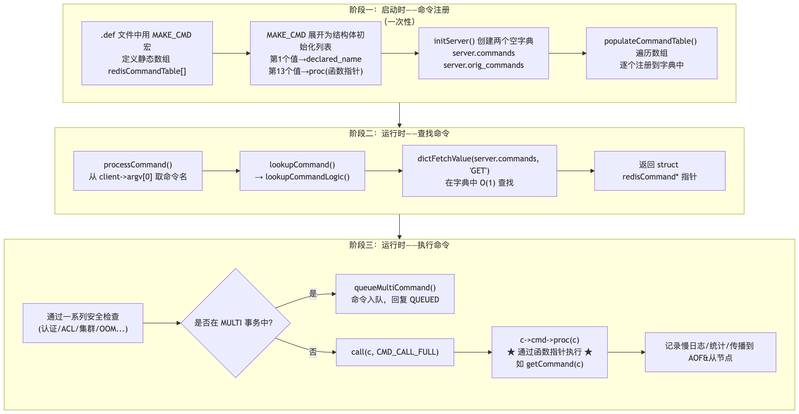
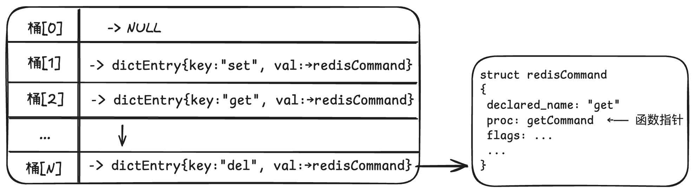

# Redis 命令执行流程


redis 服务端接受客户端发送过来的命令，通过事件分发机制将对应的命令分发到不同的执行函数，由各具体的执行函数执行对应命令

# 1、主流程



分为三个阶段：

1、启动时，将 .def 文件中包含的命令信息加载到内存中，以数组形式存放。

2、运行时，接受客户端发送过来的命令，在完成网络 io 和事件分发后，在 processCommand 中调用 lookupCommand 查询对应命令的 redisCommand 结构体。事件分发实现详见：xxx

3、执行命令，在 processCommand 中，执行完一系列检查后调用 call，执行 c->cmd->proc(c)，真正走到实现命令的函数中。


这里的整个核心设计思想：

Redis 利用 函数指针 + 哈希表 实现了一个高效的命令分发系统。所有命令在编译时就通过宏定义绑定了名称和处理函数，启动时注册到字典中，运行时通过 O(1) 的字典查找定位到命令结构体，再通过函数指针直接调用——整个过程没有任何 if-else 或 switch-case 分支判断，极其高效。


# 2、命令注册

## 2.1 命令是怎么组织的

所有的命令相关的信息都通过静态数组定义（编译时），这些信息都存在 command.def 文件中。
在 commands.def 中，所有 Redis 命令被定义为一个静态数组：

```c++
struct redisCommand redisCommandTable[] = {
    {MAKE_CMD("get", "Get the value of a key", "2.0.0", ..., getCommand, ...)},
    {MAKE_CMD("set", "Set the string value of a key", "1.0.0", ..., setCommand, ...)},
    // ... 数百个命令 ...
    {0}  // 哨兵元素，标记数组结束
};

struct redisCommand {
    const char *declared_name; // 命令名字
    const char *summary;	// 概览
    const char *complexity; // 时间复杂度
    const char *since; // 版本
    int doc_flags;
    ...
    redisCommandProc *proc; /* Command implementation */
    struct redisCommand *subcommands;
    struct redisCommandArg *args;
    sds fullname; /* A SDS string representing the command fullname. */
    dict *subcommands_dict;
};
```

MAKE_CMD 宏展开后，每个元素按字段顺序初始化 struct redisCommand 结构体，其中：
第 1 个值 → declared_name 字段（命令名，如 "get"）
第 13 个值 → proc 字段（函数指针，如 getCommand）
这意味着命令名和处理函数在编译时就已经绑定好了，此时所有命令的对应的信息都写到了 redisCommandTable 数组中了，相当于 redisCommandTable 数组被赋值了。


## 2.2 函数调用：

在 server.c 的 main 函数中:

```main() -> initServerConfig() -> populateCommandTable()```


populateCommandTable() 函数的作用是：

遍历一个静态的命令数组 redisCommandTable[]，把每个命令注册到 server.commands 和 server.orig_commands 这两个字典（dict/哈希表）中，以便后续通过命令名快速查找到对应的命令结构体


```c
extern struct redisCommand redisCommandTable[];

/* Populates the Redis Command Table dict from the static table in commands.c
 * which is auto generated from the json files in the commands folder. */
void populateCommandTable(void) {
    int j;
    struct redisCommand *c;

    for (j = 0;; j++) {
        c = redisCommandTable + j;	// 指针算术，等价于 &redisCommandTable[j]
        if (c->declared_name == NULL) // 遇到哨兵元素，结束
            break;

        int retval1, retval2;

        c->fullname = sdsnew(c->declared_name);	// 转为string sds形式
        if (populateCommandStructure(c) == C_ERR)
            continue;
				// 以命令名为 key，redisCommand* 为 value，插入字典(server.commands, server是一个全局变量)
        retval1 = dictAdd(server.commands, sdsdup(c->fullname), c);
        /* Populate an additional dictionary that will be unaffected
         * by rename-command statements in redis.conf. */
        retval2 = dictAdd(server.orig_commands, sdsdup(c->fullname), c);
        serverAssert(retval1 == DICT_OK && retval2 == DICT_OK);
    }
}
```


注册后，内存结构类似于下图：

server.commands (dict 哈希表)


具体的 dictAdd 就是寻找插入位置，根据哈希函数得到 key 的哈希值，然后对数组桶进行索引，得到桶位置，再挂在对应桶的链表中。采用的是链表头插法。


# 3、查找命令

当客户端发来 GET key1 时，在 processCommand() 中会执行 `cmd = lookupCommand(c->argv, c->argc)`

而 lookupCommand() → lookupCommandLogic():

```c
/* Look up a command by argv and argc
 *
 * If `strict` is not 0 we expect argc to be exact (i.e. argc==2
 * for a subcommand and argc==1 for a top-level command)
 * `strict` should be used every time we want to look up a command
 * name (e.g. in COMMAND INFO) rather than to find the command
 * a user requested to execute (in processCommand).
 */
struct redisCommand *lookupCommandLogic(dict *commands, robj **argv, int argc, int strict) {
    struct redisCommand *base_cmd = dictFetchValue(commands, argv[0]->ptr);
    int has_subcommands = base_cmd && base_cmd->subcommands_dict;
    if (argc == 1 || !has_subcommands) {	// 判断是不是还有子命令
        if (strict && argc != 1)
            return NULL;
        /* Note: It is possible that base_cmd->proc==NULL (e.g. CONFIG) */
        return base_cmd;
    } else { /* argc > 1 && has_subcommands */
        if (strict && argc != 2)
            return NULL;
        /* Note: Currently we support just one level of subcommands */
        return lookupSubcommand(base_cmd, argv[1]->ptr);
    }
}

struct redisCommand *lookupCommand(robj **argv, int argc) {
    return lookupCommandLogic(server.commands,argv,argc,0);
}
```

底层 dictFetchValue() 的查找过程：

1、用大小写不敏感的哈希函数（dictSdsCaseHash）计算 "GET" 的哈希值

2、对哈希表大小取模，定位到桶索引

3、遍历桶中的链表，用大小写不敏感比较（dictSdsKeyCaseCompare）匹配 key

4、找到后返回 dictEntry->val，即 struct redisCommand * 指针


# 4、执行命令

```c
if (c->flags & CLIENT_MULTI && /* 在事务中且不是 EXEC/DISCARD 等 */) {
    queueMultiCommand(c, cmd_flags);  // 入队等待 EXEC
    addReply(c, shared.queued);       // 回复 "+QUEUED"
} else {
    call(c, CMD_CALL_FULL);           // 正常执行
}
```

call 函数：

```c
void call(client *c, int flags) {
    dirty = server.dirty;                  // 记录执行前脏数据计数
    monotonic_start = getMonotonicUs();    // 记录开始时间

    c->cmd->proc(c);                      // 核心：通过函数指针调用
    //  GET → getCommand(c)
    //  SET → setCommand(c)

    duration = getMonotonicUs() - monotonic_start;  // 计算耗时
    real_cmd->calls++;                              // 更新调用次数统计
    // ... 慢日志 / AOF 传播 / 从节点同步 ...
}

```

为什么执行 c->cmd->proc(c) 能够找到正确的函数执行？

这是因为 getCommand 这个函数指针是作为 MAKE_CMD 宏的第 13 个参数（function）传入的，宏展开后它成为结构体初始化列表中的第 13 个值，正好对应 redisCommand 结构体的 proc 字段。

所以当 Redis 执行 c->cmd->proc(c) 时，实际调用的就是 getCommand(c)。在 .def 文件中看到的 getCommand 不是"命令名字"，它是真正的 C 函数名，在编译时被当作函数指针赋给了 proc 字段，即函数的起始地址赋给了 proc 字段。

函数类型 redisCommandProc 的定义是:

```c
typedef void redisCommandProc(client *c);
```

 getCommand 的签名完全匹配

```c
void getCommand(client *c);
```

